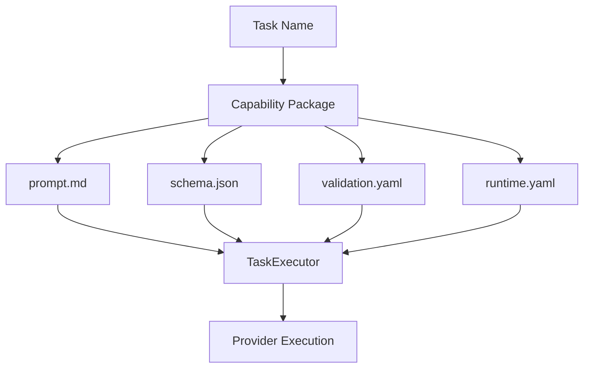

# AI Capability Library

Permanent source of truth for every AI capability executed through the AI Runtime.

## Architecture



### Before (legacy internal flow)

```
Task → Prompt Registry → Schema Registry → Validation → Execution
```

### After (current internal flow)

```
Task → Capability → Prompt → Schema → Validation → Runtime Config → Execution
```

The **public runtime API is unchanged** (`get_runtime()`, `run_task()`, `AIRuntime.run_task()`). Task names map 1:1 to capability IDs.

## Directory Layout

```
ai/capabilities/
├── README.md
├── MIGRATION.md
├── registry_index.yaml
├── models.py
├── loader.py
├── resume_parsing/
├── jd_parsing/
├── bulk_resume_parsing/
├── candidate_matching/
├── resume_summary/
├── interview_generation/
└── hr_chat/
```

Each capability folder is self-contained:

| File / Folder | Purpose |
|---------------|---------|
| `capability.yaml` | Metadata, versioning, tags, file references |
| `prompt.md` | Versioned prompt template (placeholders, not HRMS copies) |
| `schema.json` | Real JSON Schema (Draft 2020-12) for runtime validation |
| `validation.yaml` | Required fields, enums, regex, length, dates, confidence, business hooks |
| `runtime.yaml` | Provider preference, model alias, temperature, timeout, retries, output mode |
| `examples/` | Templates only (`good/`, `bad/`, `edge_cases/`) — no production HR data |
| `benchmarks/` | Evaluation definitions with latency/accuracy targets |
| `tests/` | Capability package validation tests |
| `README.md` | Capability-specific documentation |

## Registered Capabilities

| Capability ID | Schema | Model Alias | Output Mode |
|---------------|--------|-------------|-------------|
| `resume_parsing` | `resume_v1` | `resume-parser` | json |
| `jd_parsing` | `jd_v1` | `jd-parser` | json |
| `bulk_resume_parsing` | `resume_v1` | `resume-parser` | json |
| `candidate_matching` | `candidate_match_v1` | `matching-engine` | json |
| `resume_summary` | `resume_summary_v1` | `summarizer` | text |
| `interview_generation` | `interview_v1` | `interview-generator` | json |
| `hr_chat` | `chat_v1` | `hr-chat` | text |

## Capability Loading Workflow

1. **Startup** — `AIRuntime` reads `capabilities_dir` from `runtime.default.yaml` (default: `ai/capabilities`).
2. **Discovery** — `CapabilityRegistry` scans subdirectories containing `capability.yaml`.
3. **Load** — Each package loads `prompt.md`, `schema.json`, `validation.yaml`, and `runtime.yaml`.
4. **Index** — Active capabilities populate `TaskRegistry`, `PromptRegistry`, and `SchemaRegistry` facades.
5. **Execute** — `TaskExecutor` resolves prompt, schema, validation rules, and runtime config from the capability.
6. **Reload** — `runtime.reload_registries()` hot-reloads all capability packages.

```python
from runtime import get_runtime

runtime = get_runtime()
package = runtime.capabilities.get("resume_parsing")
task = runtime.tasks.get("resume_parsing")
result = runtime.run_task("resume_parsing", "resume text...")
```

## Validation Workflow

1. Provider returns raw content.
2. `OutputValidator` parses JSON when `schema_validate: true`.
3. JSON Schema validation runs against `schema.json` (Draft 2020-12).
4. `validation.yaml` rules apply in order:
   - Required / optional field checks
   - Enum constraints
   - Regex patterns (e.g. email format)
   - Length bounds (strings and array item counts)
   - Date token validation (`YYYY`, `YYYY-MM`, `Present`)
   - Confidence thresholds (overall and per-field)
5. Business hooks are declared for future HRMS integration (not executed in runtime v1).
6. On failure, runtime retries per `runtime.yaml` / global retry config.

## Benchmark Workflow

Each capability defines `benchmarks/benchmark.yaml`:

```yaml
benchmark:
  capability: resume_parsing
  dataset: datasets/evaluation/resume_parsing
  expected_schema: resume_v1
  success_criteria:
    - schema_validation_pass_rate >= 0.95
  latency_target_ms: 8000
  accuracy_target: 0.85
  future_metrics:
    - field_level_f1
    - human_review_agreement
```

Benchmarks are definitions only — execution is handled by the Dataset Factory / evaluation pipeline.

## Adding a New Capability

1. Create `ai/capabilities/<capability_id>/` with all required files.
2. Ensure `capability.yaml` `id` matches the directory name.
3. Register model alias in `ai/runtime/config/models.default.yaml` if needed.
4. Call `runtime.run_task("<capability_id>", input)` — no runtime code changes required.

## Runtime Integration

- **Registry**: `ai/runtime/registry/capability_registry.py`
- **Config**: `capabilities_dir: ../../capabilities` in `runtime.default.yaml`
- **Legacy paths** (`prompts/definitions`, `schemas/definitions`, `tasks.default.yaml`) remain for backward compatibility when `capabilities_dir` is unset.

See [MIGRATION.md](./MIGRATION.md) for upgrade notes from the legacy registry model.
