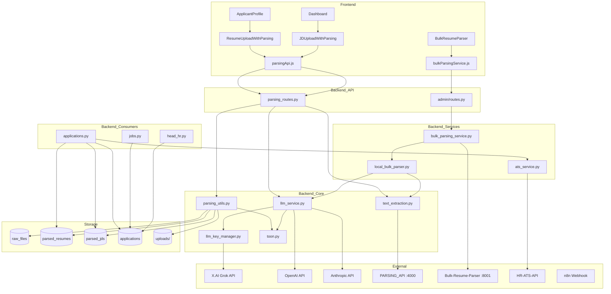

# Current Dependencies — Module Dependency Graph

**Status:** Reverse-engineered from production code  
**Scope:** Parsing pipeline and TOON consumers

---

## High-Level System Graph

---

## Backend Module Dependencies

### `parsing_routes.py`

| Imports | Role |
|---------|------|
| `utils.authenticate_token` | JWT gate |
| `toon.toon_loads_flex` | GET endpoints |
| `parsing_utils.*` | Hash, store, validate, cache |
| `text_extraction.extract_text` | Text stage |
| `llm_service.call_llm, classify_document` | LLM stage |

**Registered in:** `app.py` → `/api`

---

### `parsing_utils.py`

| Imports | Role |
|---------|------|
| `toon.toon_dumps, toon_loads_flex` | Serialize/deserialize |
| `db.db_run, db_get` | Persistence |
| `requests` | `call_parsing_api` (unused by routes) |

**Env:** `PARSING_API_URL`, `PARSING_API_KEY`, `UPLOAD_FOLDER`

---

### `text_extraction.py`

| Imports | Role |
|---------|------|
| `PyPDF2` | PDF extraction |
| `docx.Document` | DOCX extraction |
| `requests` | PDF API fallback |

**No imports from** `llm_service` or `parsing_utils`.

---

### `llm_service.py`

| Imports | Role |
|---------|------|
| `toon.toon_loads_flex` | Response parsing |
| `llm_key_manager` | X.AI key rotation (dynamic import) |
| `requests` | HTTP to providers |

**Env:** `LLM_PROVIDER`, `XAI_MODEL`, `LLM_REQUEST_TIMEOUT`, `LLM_MAX_INPUT_CHARS`, `OPENAI_API_KEY`, `ANTHROPIC_API_KEY`

---

### `llm_key_manager.py`

| Imports | Role |
|---------|------|
| `os`, `threading`, `logging` | Key pool, cooldown |

**Env:** `HRMS_API_KEY_1..9`, `XAI_API_KEY`, `LLM_KEY_COOLDOWN_SECONDS`

**Used by:** `llm_service.call_xai_grok` only

---

### `toon.py`

| Imports | Role |
|---------|------|
| `typing`, `json` (lazy in flex loader) | Pure serialization |

**No backend dependencies** — leaf module.

---

### `services/bulk_parsing_service.py`

| Imports | Role |
|---------|------|
| `requests` | External bulk API |
| `services.local_bulk_parser` | Fallback |

**Env:** `BULK_PARSER_URL`

---

### `services/local_bulk_parser.py`

| Imports | Role |
|---------|------|
| `text_extraction.extract_text` | Per-file |
| `llm_service.call_llm` | Per-file |
| `openpyxl` | Excel export |

**Env:** `BULK_PARSE_MAX_WORKERS`

**State:** In-memory `_local_jobs` dict (not shared across processes)

---

### `modules/admin/routes.py`

| Imports | Role |
|---------|------|
| `services.bulk_parsing_service` | Bulk proxy |
| `utils.authenticate_token, require_recruiter` | Auth |

---

## Frontend Module Dependencies

### `parsingApi.js`

| Depends on | Purpose |
|------------|---------|
| `./api` `BASE_URL` | API host |
| `localStorage.jwtToken` | Auth header |

**Exports:** `uploadAndParseResume`, `uploadAndParseJD`, `mapResumeTOONToForm`, `mapJDTOONToForm`, `validateFileForParsing`

---

### `ResumeUploadWithParsing.jsx`

| Depends on |
|------------|
| `parsingApi.js` |
| `AppContext` (auth) |
| `tokenService` |
| `PremiumUploadOverlay` |

---

### `bulkParsingService.js`

| Depends on |
|------------|
| `utils/api.js` `apiRequest` |
| `tokenService` |

---

## Consumer Dependencies on Parsed TOON

| Module | Direct DB Read | TOON Access |
|--------|----------------|-------------|
| `applications.py` | `parsed_resumes`, `parsed_jds` | `toon_loads_flex` |
| `applications.py` | — | `_jd_toon_from_job_row` synthetic |
| `ats_service.py` | — | In-memory dict |
| `jobs.py` | `applications` | `ats_analysis` via `toon_loads_flex` |
| `head_hr.py` | `applications` | `ats_analysis` |
| `parsing_routes.py` | `parsed_*` | GET by id |

**No module** other than parsing pipeline and apply flow reads `parsed_resumes.toon` for search/analytics.

---

## Shared Types

| File | Used By |
|------|---------|
| `ai/toon/v1/types/toon.ts` | Documentation / future TS consumers |
| `ai/toon/v1/types/toon.ts` | Type declarations |

**Not imported at runtime** by Python backend.

---

## AI Workspace (Parallel, Not Runtime)

| Path | Relationship |
|------|--------------|
| `ai/capabilities/*/prompt.md*.yaml.example` | Mirrors `get_system_prompt`; not loaded |
| `ai/dataset/*` | Training pipeline; aligns with `text_extraction` behavior per docs |
| `ai/docs/HRMS_DEPENDENCY_MAP.md` | Prior milestone map (this doc supersedes for parsing detail) |

---

## External Service Dependency Matrix

| Service | Env Var | Required? | Used When |
|---------|---------|-----------|-----------|
| X.AI Grok | `HRMS_API_KEY_*` / `XAI_API_KEY` | **Yes** (default provider) | Every single/bulk local parse |
| OpenAI | `OPENAI_API_KEY` | If `LLM_PROVIDER=openai` | LLM calls |
| Anthropic | `ANTHROPIC_API_KEY` | If `LLM_PROVIDER=anthropic` | LLM calls |
| Parsing API | `PARSING_API_URL` | No | PDF text fallback only |
| Bulk-Resume-Parser | `BULK_PARSER_URL` | No | Bulk upload if reachable |
| HR-ATS-API | `ATS_API_URL`, `ATS_API_KEY` | No | Apply ATS if configured |
| n8n | `N8N_WEBHOOK_URL` | No | Manual integration (not in apply path) |

---

## Python Package Dependencies (Parsing-Related)

From backend usage:

- `PyPDF2` — PDF text
- `python-docx` — DOCX text
- `openpyxl` — bulk Excel
- `requests` — LLM HTTP, external services
- `werkzeug` — `secure_filename`
- `flask` — routing

---

## Deployment Process Boundaries

| Process | Parsing State |
|---------|---------------|
| Flask backend (port 3000) | DB + disk + LLM |
| Bulk-Resume-Parser (8001) | External; opaque |
| Parsing API (4000) | External; PDF fallback only |
| Local bulk jobs | In-memory in Flask process — **lost on restart** |
