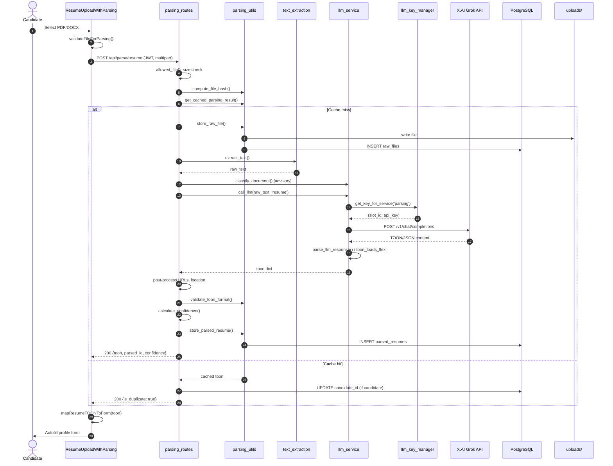
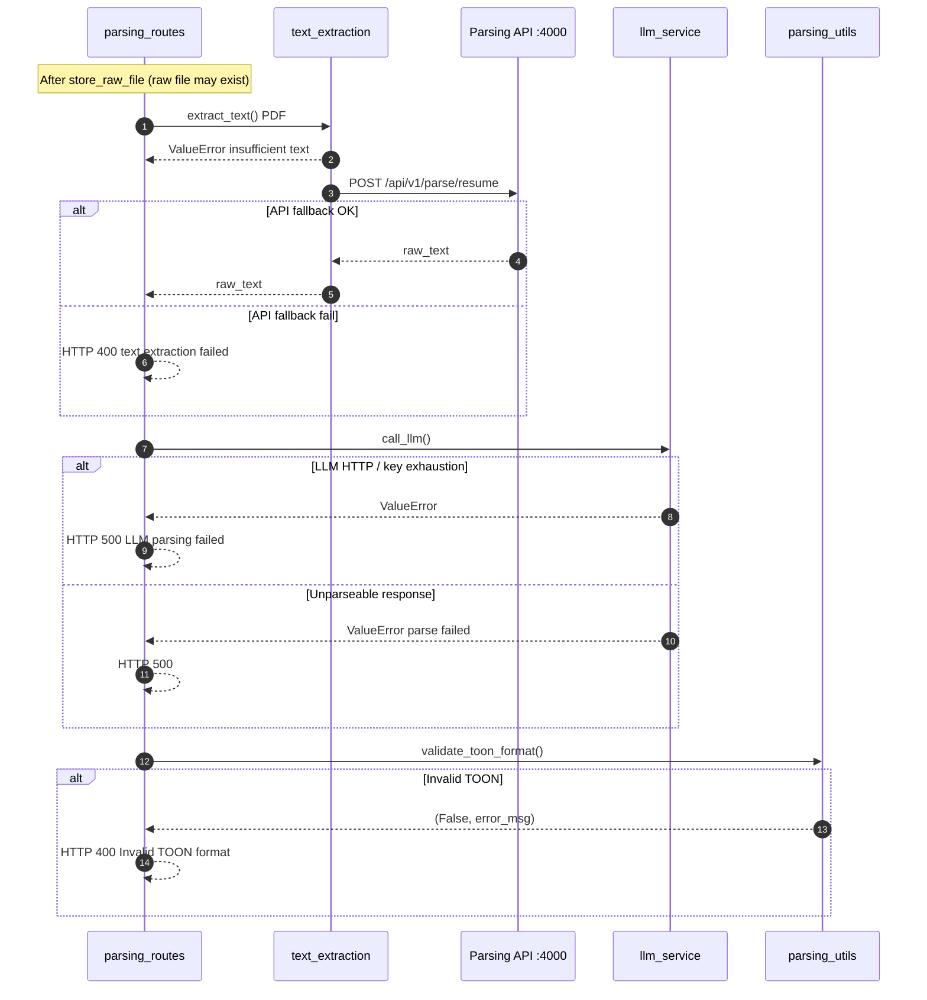
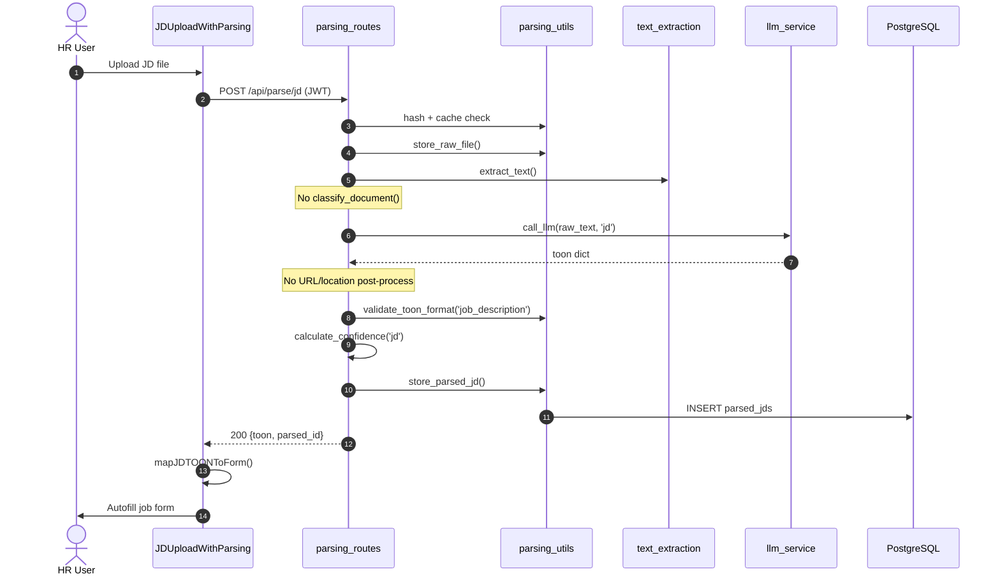
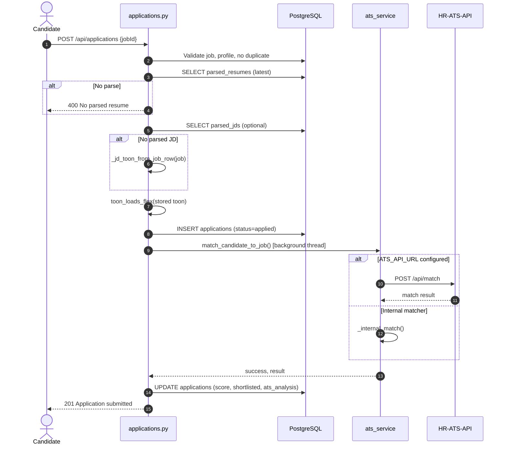
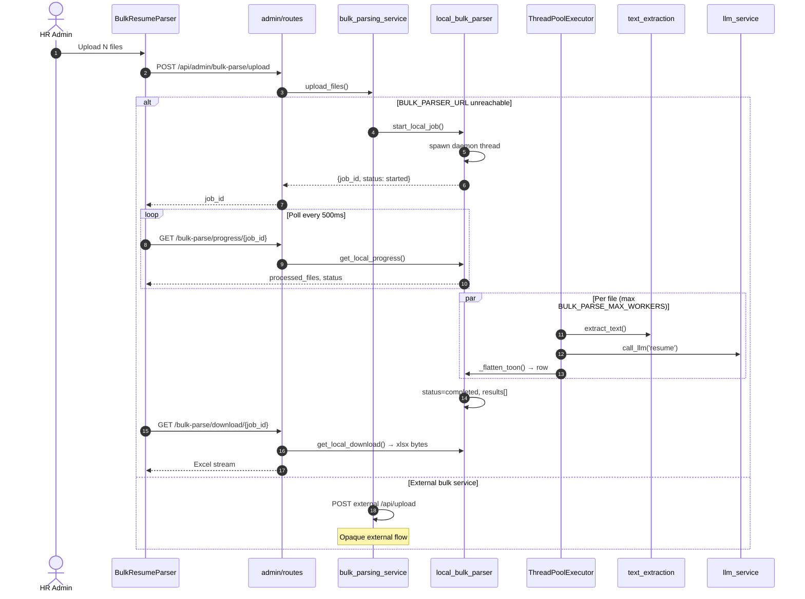
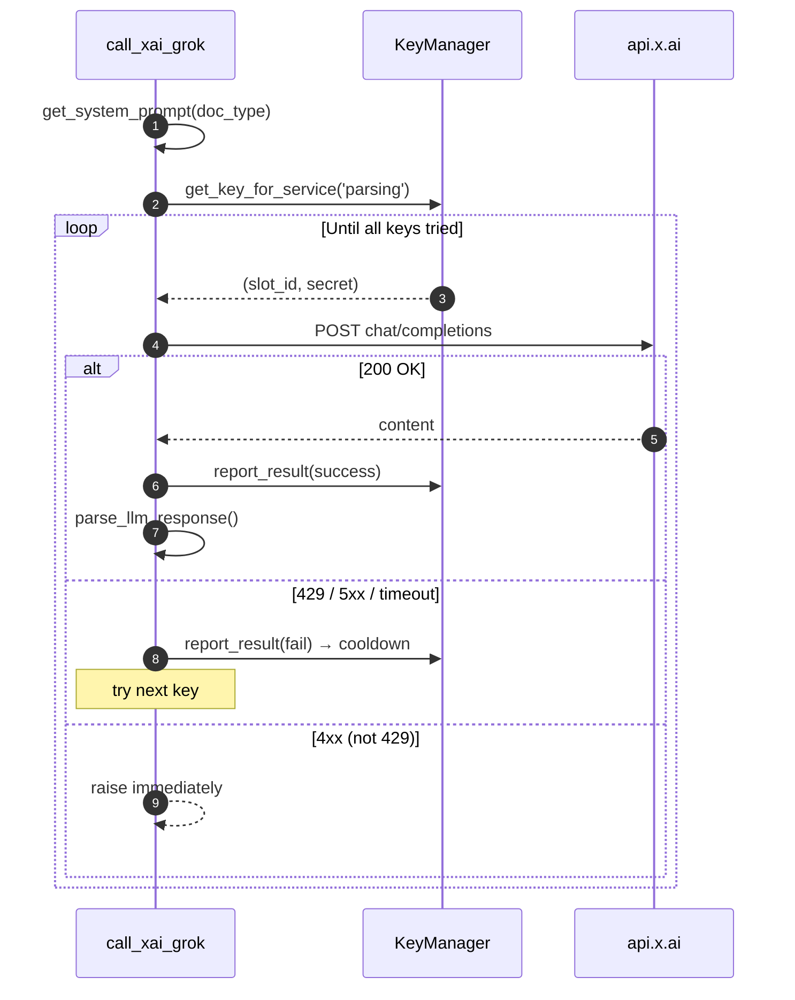
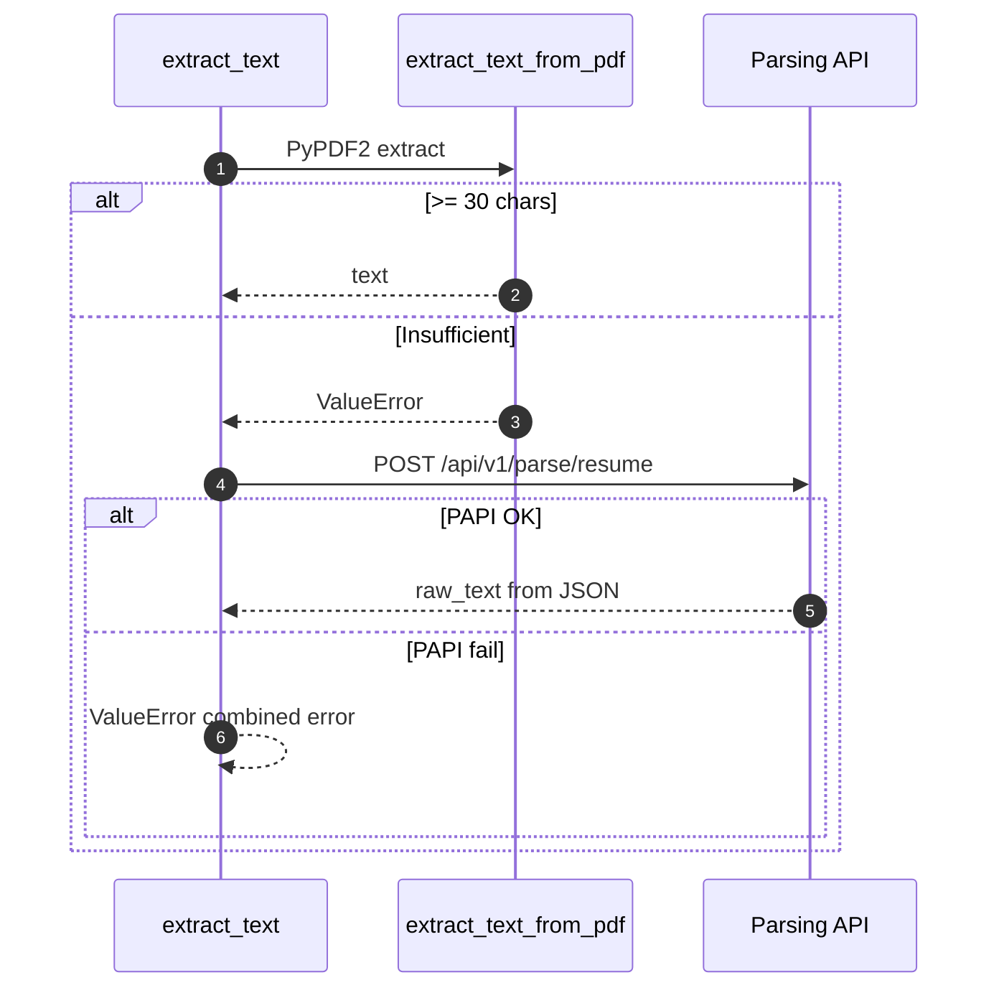

# Current Sequence Diagrams

**Status:** Reverse-engineered from production code  
**Format:** Mermaid sequence diagrams

---

## 1. Single Resume Parse (Happy Path)

---

## 2. Single Resume Parse (Failure Paths)

---

## 3. Job Description Parse

---

## 4. Apply to Job (Parsed Data Consumer)

---

## 5. Bulk Resume Parse (Local Fallback)

---

## 6. LLM Provider Call (X.AI with Key Rotation)

---

## 7. PDF Text Extraction with Fallback

---

## Timing & Async Notes

| Flow | Blocking? | Typical bottleneck |
|------|-----------|-------------------|
| Single parse | Fully synchronous in request | LLM call (45s timeout) |
| Apply | Returns 201 immediately | ATS in `threading.Thread` daemon |
| Bulk local | Upload returns immediately | Background thread + N × LLM |
| Bulk progress | Client polls 500ms | — |
