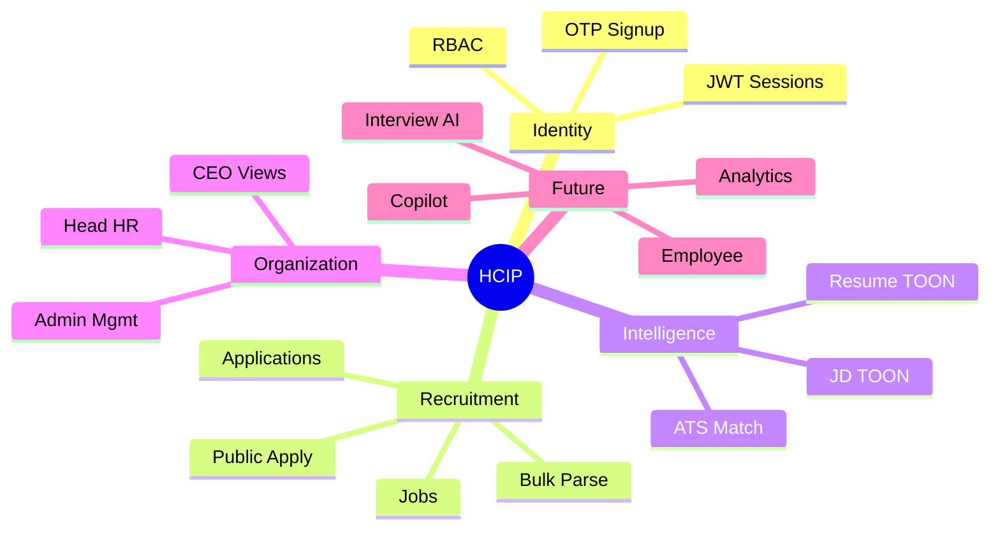
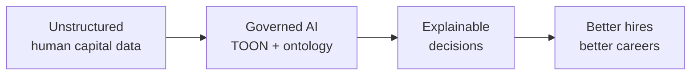
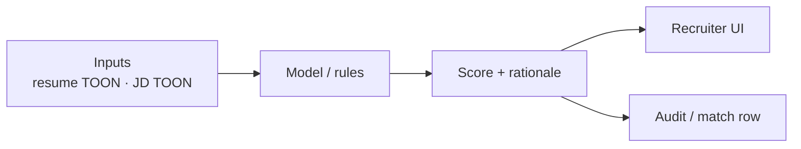

# Product Constitution

## Contents

- [Product Constitution](#product-constitution)
- [Product Vision](#product-vision)
- [Mission](#mission)
- [Product Principles](#product-principles)
- [AI Philosophy](#ai-philosophy)
- [Design Principles](#design-principles)
- [Non-Functional Requirements](#non-functional-requirements)


---

## Product Constitution

**Document ID:** HCIP-CONST-000  
**Status:** Constitutional — single source of truth for product and engineering decisions  
**Audience:** All HCIP contributors and stakeholders  
**Last aligned to codebase:** 2026-08

**Chapter docs:** [Vision](#vision) · [Mission](#mission) · [Product Principles](#product-principles) · [AI Philosophy](#ai-philosophy) · [Design Principles](#design-principles) · [NFRs](#non-functional-requirements)

---

### 1. Purpose of this constitution

This document binds product, engineering, AI, and security decisions. When conflicts arise between a feature idea and this constitution, **the constitution wins** until formally amended.

Amendments require documented rationale and updates to the [Roadmap](10-Roadmap.md).

---

### 2. Platform identity

| Item | Definition |
|------|------------|
| **Name** | Human Capital Intelligence Platform (HCIP) |
| **Current product surface** | Recruitment Intelligence (HR Job Portal / HRMS core) |
| **Repository** | HR-Intelligence-Platform monorepo (`apps/frontend`, `apps/backend`, `ai/`) |
| **Evolution path** | Recruitment → Workforce Intelligence without discarding foundation |

---

### 3. Product scope

#### In scope (current)

- Staff signup/login (OTP, JWT)
- Recruiter job management and candidate views
- Head HR org control center
- CEO read-only org views
- Public job listing and passwordless apply
- Resume / JD parsing to TOON
- ATS matching on apply
- Bulk resume parsing
- Support / feedback channels

#### In scope (future — roadmap)

- Interview & assessment intelligence
- Offer management beyond scaffold tables
- Employee lifecycle (learning, performance, goals)
- Knowledge repository & ontology runtime
- HR Copilot
- Advanced analytics

#### Out of scope (explicit)

- Full payroll / benefits ERP replacement
- Unaudited autonomous hiring decisions

---

### 4. Core business domains

| Domain | Responsibility | Current maturity |
|--------|----------------|------------------|
| **Platform** | Identity, sessions, cross-cutting APIs | Implemented |
| **Organization** | Tenancy notions, Head HR admin hierarchy | Partial (role-based org views) |
| **Recruitment** | Jobs, applications, parsing, matching | Implemented |
| **Candidate** | Profiles, education, experience, certifications | Implemented (apply-centric) |
| **Employee** | Post-hire lifecycle | Future / scaffold |
| **Intelligence** | AI pipelines, scores, explanations | Implemented (parse + match) |
| **Knowledge** | Canonical skills, titles, institutions | Future (`ai/` seeds evolving) |

Detail → [Core Actors](02-Domain-Model.md)

---

### 5. Capability map



---

### 6. Product lifecycle

| Stage | Description |
|-------|-------------|
| **Discover** | Problem framing against constitution |
| **Design** | Domain + API + UX; label Current vs Future |
| **Build** | Implement behind domain boundaries |
| **Evaluate** | Parser/matcher quality, UX completion |
| **Release** | Versioned deploy; migrate schemas additively |
| **Operate** | Monitor parse, apply, auth |
| **Retire** | Deprecate with compatibility window |

---

### 7. Versioning strategy

| Artifact | Strategy |
|----------|----------|
| Application releases | Semantic versioning for tagged releases |
| APIs | Additive paths preferred; breaking changes require versioned routes or migration notes |
| TOON schemas | Version field inside artifacts; pipelines tolerate compatible evolution |
| Database | Ordered SQL migrations under `schema_pg/` / migration runners |
| Documentation | Folder taxonomy `01`–`10` is stable; amend in place with date notes |

---

### 8. Documentation standards

1. Markdown + Mermaid for diagrams.  
2. Cross-link related docs; avoid orphan pages.  
3. Use tables for comparisons and API maps.  
4. Mark **Current implementation** vs **Future** in every workflow/AI doc.  
5. Do not invent endpoints or tables that do not exist — verify against `create_app.py` and `schema_pg/`.  
6. Entry point: [../README.md](../README.md).

---

### 9. Architectural principles

1. **Domain modules** under `apps/backend/app/domains/` own business logic.  
2. **Frontend features** under `apps/frontend/src/features/` map to product areas.  
3. **AI platform** under `ai/` is the long-term home for providers, TOON, evaluation.  
4. **Compose via artifacts** (parsed TOON, match rows), not hidden globals.  
5. **Extend, don't fork** the public apply and staff portal paths.

---

### 10. Security principles

- Least privilege RBAC (`RECRUITER`, `HEAD_HR`, `CEO`)
- JWT bearer for staff; public endpoints narrowly scoped and validated
- Secrets via environment variables
- See [Authentication](09-Security.md)

---

### 11. Privacy principles

- PII minimization on forms
- Role-scoped candidate access
- Documented retention intent for resumes and OTPs
- See [../09-Security/Compliance.md](09-Security.md)

---

### 12. Scalability principles

- Cache duplicate parses by content hash
- Bulk ingest via sessions
- Plan object storage and read scaling before multi-tenant explosion
- See [../08-Database/Scaling.md](08-Database.md)

---

### 13. Explainability principles

- Persist match analysis with applications
- Surface category scores in UI
- Prefer deterministic weight documentation alongside model outputs
- See [AI Philosophy](#ai-philosophy)

---

### 14. Amendment log

| Date | Change |
|------|--------|
| 2026-08 | Initial enterprise constitution structured under `docs/01-Product-Constitution/` |

---

## Product Vision

**Document ID:** HCIP-CONST-001  
**Status:** Constitutional  
**Audience:** Executive leadership, product, engineering, AI, security, enterprise customers  
**Related:** [Mission](#mission) · [Product Principles](#product-principles) · [AI Philosophy](#ai-philosophy) · [Product Constitution](#product-constitution)

---

### Vision statement

By 2035, the **Human Capital Intelligence Platform (HCIP)** will be the operating system for workforce intelligence at scale: from first candidate touchpoint through career growth and succession, with AI that is explainable, auditable, and continuously improving.

Today the platform delivers **Recruitment Intelligence**. Tomorrow it delivers **Workforce Intelligence**.

---

### What we are building

HCIP transforms unstructured human capital signals — resumes, job descriptions, interviews, performance evidence, learning outcomes — into governed, actionable intelligence for:

| Stakeholder | Outcome |
|-------------|---------|
| Candidates | Clear, low-friction application experience |
| Recruiters | Faster shortlists with explainable match scores |
| Head of HR / Admins | Org-wide visibility and control |
| Hiring managers *(future)* | Decision support grounded in evidence |
| Employees *(future)* | Career, learning, and performance clarity |
| Executives | Trustworthy workforce analytics |

---

### Current foundation (implemented)

The repository already operates as a recruitment-grade HRMS with AI-assisted pipelines:

- Staff authentication (OTP + JWT)
- Public candidate apply (passwordless)
- Recruiter and Head HR portals
- Resume and job-description parsing (TOON)
- In-process ATS matching
- Applications, jobs, bulk resume parsing

These capabilities are the **non-negotiable foundation**. Future domains (employee lifecycle, interview AI, HR Copilot) must **extend** this foundation — not replace it.

---

### North-star outcomes



1. **One truth** for person, job, application, and match artifacts  
2. **Intelligence over automation** — humans remain accountable  
3. **Progressive disclosure** — candidates see simplicity; HR sees depth; architects see extensibility  

---

### Explicit non-goals (near term)

- Replacing payroll, benefits administration, or full ERP suites
- Opaque black-box hiring scores without rationale
- Breaking existing recruiter / Head HR / public apply contracts without versioned migration

---

### Cross references

- Mission → [Mission.md](#mission)  
- Principles → [Product-Principles.md](#product-principles)  
- Capability map → [Product-Constitution.md](#product-constitution)  
- Roadmap → [../10-Roadmap/Product-Roadmap.md](10-Roadmap.md)

---

## Mission

**Document ID:** HCIP-CONST-002  
**Status:** Constitutional  
**Related:** [Vision](#vision) · [Product Constitution](#product-constitution)

---

### Mission statement

Give organizations a **single, AI-native platform** to understand, acquire, develop, and retain talent — turning resumes, jobs, applications, and future employee signals into **explainable intelligence** that HR professionals can trust and act on.

---

### How we fulfill the mission today

| Mission pillar | Current delivery |
|----------------|------------------|
| **Acquire** | Public job board, apply modal, resume AI autofill, ATS match on apply |
| **Understand** | Parsed resume/JD TOON, match breakdown (skills, experience, education, location) |
| **Govern** | Role-based portals (Recruiter, Head HR, CEO), JWT auth, org-scoped Head HR APIs |
| **Operate** | Job CRUD, application tracking, bulk resume parsing |

### How we will fulfill it tomorrow

| Mission pillar | Planned extension |
|----------------|-------------------|
| **Develop** | Learning, goals, competencies |
| **Retain** | Performance intelligence, career paths |
| **Advise** | HR Copilot over governed knowledge |
| **Assure** | Audit trails, retention policies, deeper privacy controls |

---

### Success measures

| Metric class | Examples |
|--------------|----------|
| Product | Time-to-shortlist, apply completion rate, parse success rate |
| Quality | Match explainability coverage, false-positive shortlist rate |
| Reliability | API uptime, parse p95 latency, duplicate-apply prevention |
| Trust | % decisions with visible rationale, audit completeness |

---

### Commitment to continuity

Every mission advancement must preserve:

1. Existing public apply contract (`POST /api/jobs/:id/apply`)
2. Existing staff auth and RBAC roles (`RECRUITER`, `HEAD_HR`, `CEO`)
3. Existing TOON parse + match artifact model

See [Architectural Principles](#product-constitution).

---

## Product Principles

**Document ID:** HCIP-CONST-003  
**Status:** Constitutional  
**Related:** [Vision](#vision) · [Design Principles](#design-principles) · [AI Philosophy](#ai-philosophy)

---

### Guiding principles

#### 1. AI-native, not AI-bolted-on

Intelligence is embedded in parsing, matching, and (future) interviewing and coaching. New AI capabilities plug into a governed runtime without rewriting domain boundaries.

#### 2. Intelligence over automation

Automation executes tasks. Intelligence informs decisions. Every AI output must be traceable to inputs, models, and reasoning. HR remains accountable.

#### 3. Domain-first, technology-second

Business domains (Organization, Recruitment, Employee, Intelligence) own entities and lifecycle rules. Stack choices serve domains.

#### 4. Progressive disclosure of complexity

| Audience | Experience |
|----------|------------|
| Candidate | Simple apply, clear confirmation |
| Recruiter | Jobs, candidates, scores, actions |
| Head HR | Org-wide control and admin management |
| Architect | Extensible domains, TOON, ontology |

#### 5. Longevity over velocity

Optimize for clarity and extensibility across years. Prefer additive evolution of APIs and schemas.

#### 6. Continuity of the foundation

Do not redesign working recruitment flows. Extend them. Document **Current** vs **Future** explicitly in every major design doc.

#### 7. Explainability by default

Match scores, parse confidence, and future interview evaluations must surface rationale suitable for HR review and audit.

#### 8. Security and privacy as product features

Least privilege, JWT staff sessions, passwordless public apply with validated payloads, secrets outside source control.

---

### Decision filters

Before shipping a change, ask:

1. Does this preserve the public apply and staff portals?
2. Is the AI output explainable to a recruiter?
3. Is Current vs Future labeled if this is aspirational?
4. Does RBAC still hold for CEO (read), Head HR (write org), Recruiter (own scope)?

---

### Cross references

- Design → [Design-Principles.md](#design-principles)  
- AI → [AI-Philosophy.md](#ai-philosophy)  
- Security → [Authentication](09-Security.md)

---

## AI Philosophy

**Document ID:** HCIP-CONST-004  
**Status:** Constitutional  
**Related:** [Product Principles](#product-principles) · [Resume Parser](06-AI.md)

---

### Philosophy statement

HCIP treats AI as a **governed capability layer**, not a black box. Models extract structure (TOON), score fit (ATS), and — in the future — assist interviews and HR decisions. Humans remain the decision-makers; AI accelerates evidence gathering and ranking.

---

### Current AI posture (implemented)

| Capability | Approach | Artifact |
|------------|----------|----------|
| Resume parsing | LLM + repair/canonicalize/enrich pipeline | `parsed_resumes` TOON |
| JD parsing | Same family of pipelines | `parsed_jds` TOON |
| Matching | Weighted in-process ATS (`ats_service`) | `matches` + application score |
| Bulk parsing | Sessioned multi-file parse | `bulk_parse_*` |

Providers may include X.AI Grok, OpenAI, Anthropic, or local/gateway runtimes (`ai/` platform). Selection is configuration-driven.

---

### Principles for AI features

1. **Structured outputs** — Prefer TOON / JSON schemas over free-form prose for system state.  
2. **Confidence & fallbacks** — Degrade gracefully; never silently invent critical identity fields without validation.  
3. **Explainability** — Match breakdowns (skills, experience, education, location) must be inspectable in UI.  
4. **Human override** — Recruiters can shortlist/reject regardless of score.  
5. **No training on customer PII without contract** — Future fine-tuning requires explicit data governance.  
6. **Separation of concerns** — Parsing ≠ Matching ≠ Interviewing; compose via artifacts, not monolith prompts.  
7. **Current vs Future** — Interview AI and HR Copilot are roadmap items; interview APIs are not registered in the live app factory today.

---

### Explainability principles



Every production AI decision path should answer:

- What evidence was used?
- What categories contributed to the score?
- What is missing or low-confidence?

---

### Future AI directions (not current product surface)

| Area | Intent |
|------|--------|
| Interview Intelligence | Structured AI or hybrid interviews with scored transcripts |
| HR Copilot | Retrieval over knowledge + org policies |
| Embeddings / vector search | Semantic skill and role retrieval |
| Knowledge graph | Canonical skills, titles, institutions |
| Evaluation harness | Golden sets, regression for parsers and matchers |

Detail: [../06-AI/Resume-Parser.md](06-AI.md) · [../10-Roadmap/Product-Roadmap.md](10-Roadmap.md)

---

## Design Principles

**Document ID:** HCIP-CONST-005  
**Status:** Constitutional  
**Related:** [Product Principles](#product-principles) · [../03-System-Architecture/Frontend-Architecture.md](03-System-Architecture.md)

---

### Experience principles

| Principle | Application in HCIP |
|-----------|---------------------|
| **Clarity first** | Apply form and Head HR glass shell prioritize task completion over novelty |
| **One job per surface** | Public apply = submit; Head HR job page = review; bulk parser = ingest |
| **Respect existing design systems** | Org enterprise shell (`org-shell`, glass cards) and light public apply modal coexist by audience |
| **Accessible contrast** | Form controls (e.g. month/year picker) must remain readable on light backgrounds |
| **Feedback loops** | Parse progress, validation errors, toast/auth errors must be visible |

---

### Interaction principles

1. **Passwordless apply** — Candidates should not need an account to apply.  
2. **Parse-before-submit** — Application requires a completed public resume parse (`parsedId`).  
3. **Job-centric Head HR UX** — Candidate and application deep links route through jobs.  
4. **Role-appropriate chrome** — Hide marketing navbar on Head HR / CEO shells.  
5. **Destructive actions require intent** — Deletes and admin removals must be deliberate.

---

### Information architecture

```mermaid
flowchart TB
  subgraph Public
    Jobs[/jobs]
    Apply[Apply modal]
  end
  subgraph Recruiter
    Dash[/dashboard]
    Cand[/candidates]
    BulkR[/admin/bulk-resume-parser]
  end
  subgraph HeadHR
    HH[/head-hr/*]
  end
  subgraph CEO
    CEO[/ceo/* read-only]
  end
  Jobs --> Apply
  Dash --> Cand
  HH --> JobsDeep[Job → Candidate detail]
```

---

### Visual & motion guidance

- Prefer the established enterprise org theme for staff control centers.  
- Prefer clean light forms for candidate apply.  
- Motion should clarify hierarchy (modals, page transitions), not distract.  
- Avoid introducing a third unrelated visual system without product approval.

---

### Cross references

- Frontend structure → [../03-System-Architecture/Frontend-Architecture.md](03-System-Architecture.md)  
- Workflows → [Platform Workflow](04-Workflow.md)

---

## Non-Functional Requirements

**Document ID:** HCIP-CONST-006  
**Status:** Constitutional  
**Related:** [Product Constitution](#product-constitution) · [Authentication](09-Security.md)

---

### Summary

| Category | Requirement | Current posture |
|----------|-------------|-----------------|
| **Availability** | Staff and public apply available during business operations | Single-region Flask + SPA deployment typical for current stage |
| **Performance** | Apply UX responsive; parse may be async/longer | Parse is request-bound; bulk uses sessions/progress |
| **Scalability** | Vertical first; horizontal later | PostgreSQL; hash cache for duplicate parses |
| **Security** | JWT staff auth; validated public endpoints | Implemented; see Security docs |
| **Privacy** | Minimize PII exposure; control resume access | Role-scoped APIs; public parse rate-limited |
| **Reliability** | Idempotent-safe apply (reject duplicates) | Duplicate application blocked per candidate+job |
| **Observability** | Logs for parse/ATS/auth | Server logs; deepen metrics on roadmap |
| **Explainability** | Match rationale visible | Score breakdown in Head HR / recruiter UIs |
| **Maintainability** | Domain-oriented backend; feature folders FE | `apps/backend/app/domains/*`, `apps/frontend/src/features/*` |
| **Compliance readiness** | Audit & retention foundations | Partial; expand in Security & Roadmap |

---

### Scalability principles

1. Keep **parse artifacts** immutable once linked to applications.  
2. Prefer **append + version** for match re-runs rather than silent overwrite (future hardening).  
3. Use **bulk sessions** for large ingest instead of synchronous multi-upload in one HTTP request where possible.  
4. Plan **read replicas** and object storage for resumes as volume grows (future).

---

### Privacy principles

1. Collect only fields needed for hiring decisions on apply.  
2. Staff access to candidate data must follow RBAC.  
3. Secrets and API keys never committed to git.  
4. Define retention for resumes, OTPs, and parse caches (see [../09-Security/Compliance.md](09-Security.md)).

---

### Reliability targets (aspirational SLOs)

| Flow | Target |
|------|--------|
| Public apply API success (valid payload) | ≥ 99% excluding dependency outages |
| Parse success for supported PDF/DOCX | Track & regress via evaluation harness |
| Staff login | OTP delivery within email provider SLA |

---

### Cross references

- Deployment → [../03-System-Architecture/Deployment-Architecture.md](03-System-Architecture.md)  
- Database scaling → [../08-Database/Scaling.md](08-Database.md)
