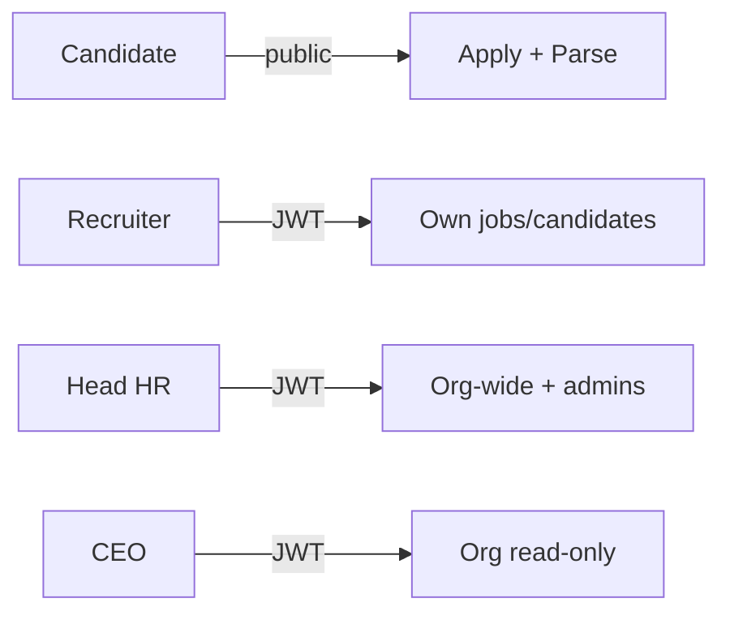
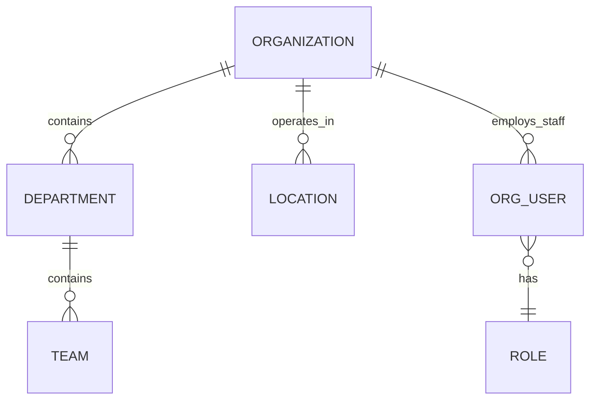
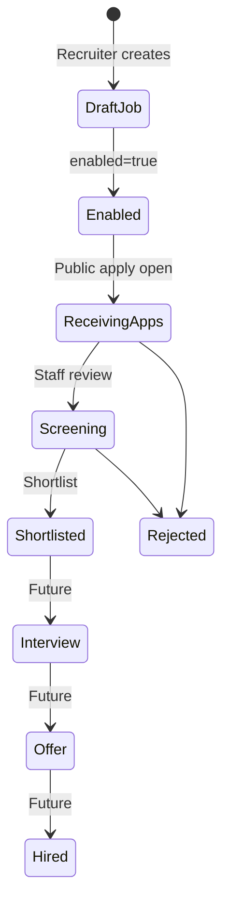
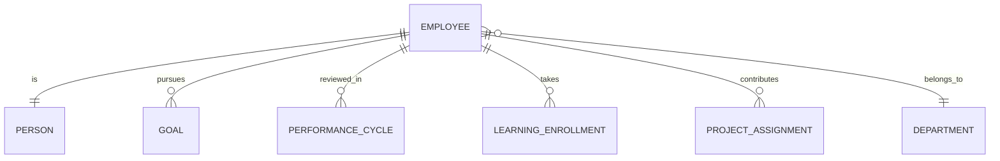
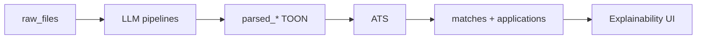
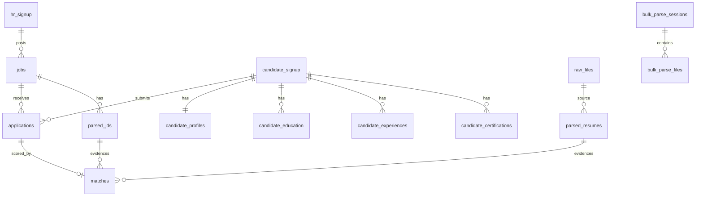
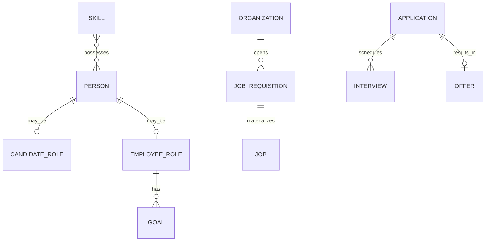

# Domain Model

## Contents

- [Core Actors](#core-actors)
- [Organization Domain](#organization-domain)
- [Recruitment Domain](#recruitment-domain)
- [Employee Domain](#employee-domain)
- [Intelligence Domain](#intelligence-domain)
- [Entity Relationships](#entity-relationships)

---

## Core Actors

**Document ID:** HCIP-DOM-001  
**Related:** [Entity Relationships](#entity-relationships) · [Authorization](09-Security.md#authorization)

---

### Actor catalog

| Actor | Current in product? | Primary interface |
|-------|---------------------|-------------------|
| Candidate | Yes (public apply) | `/jobs` apply modal |
| Recruiter | Yes (`RECRUITER`) | `/dashboard`, `/candidates` |
| Head HR / HR Manager | Yes (`HEAD_HR`) | `/head-hr/*` |
| CEO / Organization Owner (exec view) | Yes (`CEO`) | `/ceo/*` read-only |
| Admin (recruiter admin) | Yes (managed by Head HR) | Same as recruiter |
| Super Admin | Conceptual / Head HR elevated | Head HR admin management |
| Employee | Future | Future employee portal |
| Hiring Manager | Future | Future approval surfaces |
| Interviewer | Future | Future interview console |
| AI Agent | Future | Copilot / interview agent |

---

### Candidate

| Aspect | Description |
|--------|-------------|
| **Responsibilities** | Discover jobs, upload resume, complete apply form, submit application |
| **Permissions** | Public parse + apply only; no staff APIs |
| **Interactions** | Jobs listing, ApplyJobModal, resume parser |
| **Lifecycle** | Visit → parse → apply → (status visible to staff). No candidate login required for apply |

---

### Recruiter

| Aspect | Description |
|--------|-------------|
| **Responsibilities** | Create/manage own jobs, review applicants, run bulk parse, act on own candidates |
| **Permissions** | `jobs:write_own`, `candidates:act_own`, `bulk_parse:run` (see RBAC) |
| **Interactions** | Dashboard, candidates, JD/resume parse, match panels |
| **Lifecycle** | Signup OTP → login → operate → logout |

---

### Head HR (HR Manager)

| Aspect | Description |
|--------|-------------|
| **Responsibilities** | Org-wide jobs/candidates visibility, manage admins, settings, bulk parse, stats |
| **Permissions** | `jobs:write_any`, `candidates:act_any`, `hr_users:manage`, `settings:configure`, analytics |
| **Interactions** | OrgPanelLayout control center |
| **Lifecycle** | Elevated staff identity; manages recruiter accounts |

---

### CEO (Organization Owner — executive)

| Aspect | Description |
|--------|-------------|
| **Responsibilities** | Read org recruitment health and job/candidate detail |
| **Permissions** | Read-all jobs/candidates/analytics; **no** write |
| **Interactions** | `/ceo` shell mirroring Head HR navigation in read-only mode |
| **Lifecycle** | Staff login with CEO role |

---

### Admin / Super Admin

In the current codebase, **Head HR** creates and manages **admin (recruiter) users**. “Super Admin” is treated as the Head HR governance role rather than a separate enum.

---

### Future actors

#### Employee

Post-hire person with learning, goals, performance — extends candidate profile identity.

#### Hiring Manager

Approves reqs, interviews, offers — collaborates with recruiter.

#### Interviewer

Conducts human or hybrid interviews; consumes interview packs.

#### Future AI Agent

Assists within policy: drafting JD language, summarizing matches, running structured AI interviews. Must log actions and remain overridable by humans ([../01-Product-Constitution/AI-Philosophy.md](01-Product-Constitution.md)).

---

### Permission overview (current)

Source: `apps/frontend/src/core/permissions/rbac.js` and backend RBAC module.

---

## Organization Domain

**Document ID:** HCIP-DOM-002  
**Maturity:** Partial (role-based org views; not full multi-tenant org graph)  
**Related:** [Core Actors](#core-actors) · [Recruitment Domain](#recruitment-domain)

---

### Purpose

Represent the employing organization, its leadership views, and administrative hierarchy over recruiters.

---

### Current implementation

| Concept | How it appears today |
|---------|----------------------|
| Organization | Implicit: Head HR / CEO see org-wide jobs & candidates via `/api/head-hr` |
| Departments / Teams / Locations | Not first-class entities; location is a job/candidate string field |
| Organization Owner | Approximated by `CEO` role (read-only) and `HEAD_HR` (operational control) |
| Admin hierarchy | Head HR creates/manages admin (recruiter) users |

#### APIs & UI

- UI: `/head-hr`, `/ceo`
- API: `/api/head-hr/*` (stats, admins, jobs, candidates, applications)
- Layout: `OrgPanelLayout.jsx`

---

### Future organization model

Planned entities: Organization, Department, Team, Location, Cost Center, OrgUser membership.

---

### Business rules (current)

1. Head HR may manage admins and configure settings.
2. CEO may read org recruitment data, not mutate.
3. Recruiters operate primarily on owned jobs.

---

### Cross references

- Actors → [Core-Actors.md](#core-actors)
- Security → [Authorization](09-Security.md#authorization)

---

## Recruitment Domain

**Document ID:** HCIP-DOM-003  
**Maturity:** Strong  
**Related:** [Entity Relationships](#entity-relationships) · [../04-Workflow/Matching-Workflow.md](04-Workflow.md)

---

### Purpose

Own the hiring funnel: jobs, applications, parsing inputs, and match outcomes.

---

### Core entities (current)

| Entity | Storage | Notes |
|--------|---------|-------|
| Job | `jobs` | `jdid`, title, company, location, description, `posted_by`, `enabled` |
| Application | `applications` | Status, match_score, shortlist flags, links to match |
| Match | `matches` | Score, rationale/analysis JSON, parsed doc links |
| Parsed Resume | `parsed_resumes` | TOON + confidence |
| Parsed JD | `parsed_jds` | TOON + job link |
| Raw File | `raw_files` | Upload bytes metadata |
| Bulk Session | `bulk_parse_sessions` / `bulk_parse_files` | Multi-resume ingest |
| Interview | `interviews` | **Scaffold only** — API not registered |
| Offer | `offers` | Scaffold |
| Saved Job | `saved_jobs` | Schema may exist; **Jobs UI bookmark/save removed** — not a current product surface |

### Integration entities (current — provider-agnostic)

| Entity | Storage | Notes |
|--------|---------|-------|
| Integration Provider | `integration_provider` | Per-company job-board config (`company_key`, credentials encrypted, auto_publish / auto_sync) |
| External Job | `external_jobs` | Maps internal `job_id` → provider `external_job_id` + sync status |
| Sync Log | `sync_logs` | Audit of provider calls |
| Provider Event | `provider_events` | Durable domain events (JobCreated, etc.) |
| Webhook Event | `webhook_events` | Scaffold for inbound provider webhooks |
| OAuth Token | `oauth_tokens` | Scaffold for future OAuth |

HCIP is the **system of record**. External boards (LinkedIn, Naukri, and company-defined HTTP platforms) are distribution channels only. Provider plugins live under `domains/integrations/` — the Job module never imports provider-specific logic.

---

### Lifecycle

Statuses used in product language include: Applied, Screening, Matched, Shortlisted, Interview, Rejected, Offer, Hired, Withdrawn.

---

### Current implementation highlights

- Public apply: `POST /api/jobs/<job_id>/apply`
- Requires prior `POST /api/parse/resume/public` (`parsedId`)
- ATS via `ats_service.match_candidate_to_job`
- Head HR job-centric navigation
- Job lifecycle events (`JobCreated` / `JobUpdated` / `JobClosed`) enqueue external publish via the Integration Framework (credentials-gated adapters)

---

### Future improvements

- First-class interview & offer workflows wired to APIs
- Requisition approvals (Hiring Manager)
- Live LinkedIn / Naukri official APIs (replace staging builtins); ATS ingest from `external_applications`
- Multi-stage pipelines configurable per org

---

### Cross references

- Workflows → [../04-Workflow/Recruiter-Workflow.md](04-Workflow.md)

---

## Employee Domain

**Document ID:** HCIP-DOM-004  
**Maturity:** Future (light scaffold / feedback only)  
**Related:** [Organization Domain](#organization-domain) · [../10-Roadmap/Product-Roadmap.md](10-Roadmap.md)

---

### Purpose

Manage the person **after hire**: profile continuity from candidate, learning, performance, goals, projects, and career pathways.

---

### Current implementation

| Capability | Status |
|------------|--------|
| Candidate → Employee conversion | Not a first-class workflow yet |
| Employee portal | Not shipped |
| Feedback | Feedback API exists for HRMS testing feedback |
| Learning / Performance / Goals | Roadmap |

---

### Future entity set

---

### Design rule

Employee identity should **extend** person/candidate identity rather than duplicate PII silos — see [../05-Ontology/Human-Capital-Ontology.md](05-Ontology.md).

---

### Workflow (future)

See [../04-Workflow/Employee-Workflow.md](04-Workflow.md).

---

## Intelligence Domain

**Document ID:** HCIP-DOM-005  
**Maturity:** Strong for parse + match; future for interview/copilot  
**Related:** [Resume Parser](06-AI.md) · [../05-Ontology/Knowledge-Repository.md](05-Ontology.md)

---

### Purpose

Produce structured intelligence artifacts from unstructured documents and comparative scoring between candidates and jobs.

---

### Capabilities

| Capability | Current | Future |
|------------|---------|--------|
| Resume Intelligence | Yes — TOON pipeline | Ontology-normalized skills |
| Job Intelligence | Yes — JD TOON | Competency frameworks |
| Matching Intelligence | Yes — weighted ATS | Embeddings + rerank |
| Interview Intelligence | Scaffold table only | Full AI/human flows |
| HR Copilot | No | RAG over knowledge |
| Evaluation | Partial / AI docs | Golden-set CI |

---

### Artifact flow

---

### Ownership

- Runtime entry: `apps/backend/app/domains/recruitment/api/parsing.py`, `ats_service.py`
- Long-term platform: `ai/` (providers, TOON, evaluation, ADRs)

---

### Principles

Inherited from [../01-Product-Constitution/AI-Philosophy.md](01-Product-Constitution.md).

---

## Entity Relationships

**Document ID:** HCIP-DOM-006  
**Related:** [../08-Database/Current-Schema.md](08-Database.md)

---

### Current ER (implemented core)

---

### Identity & staff

| Table | Role |
|-------|------|
| `hr_signup` / `hr_login` / `HRAuth` | Staff identity & OTP staging |
| `login_history` | Auth audit trail |

---

### Future overlay (conceptual)

Canonical naming: [../05-Ontology/Human-Capital-Ontology.md](05-Ontology.md).

---

### Notes

- `interviews` and `offers` tables exist as scaffolds in `schema_pg/04_domain_freeze.sql` but interview blueprints are **not** registered in `create_app.py`.
- Prefer additive migrations when promoting scaffolds to product features.
