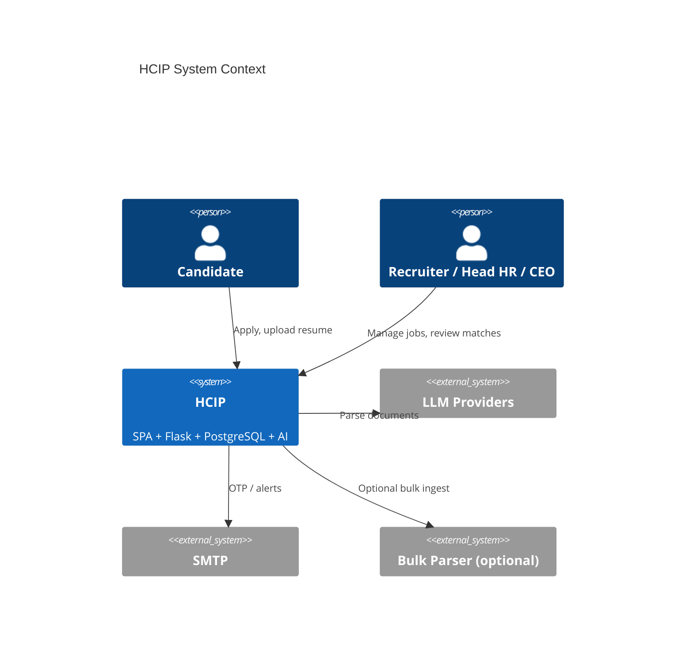
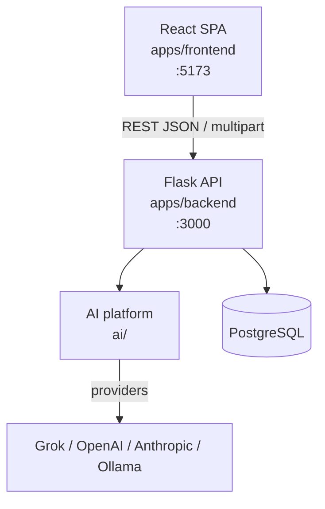
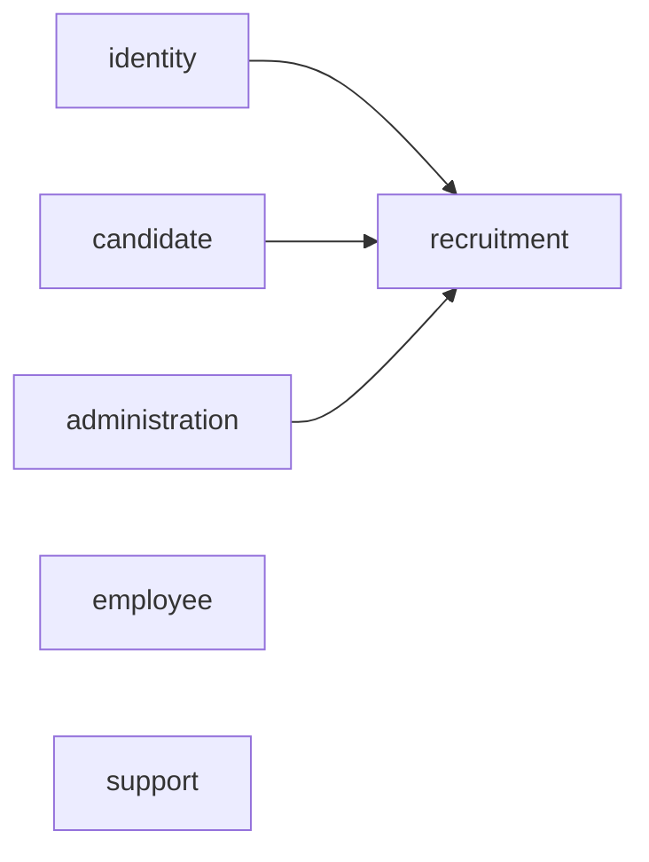
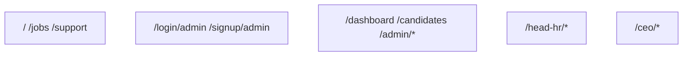
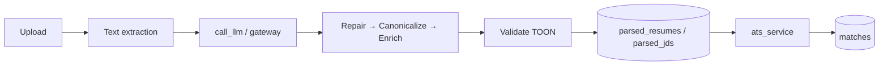
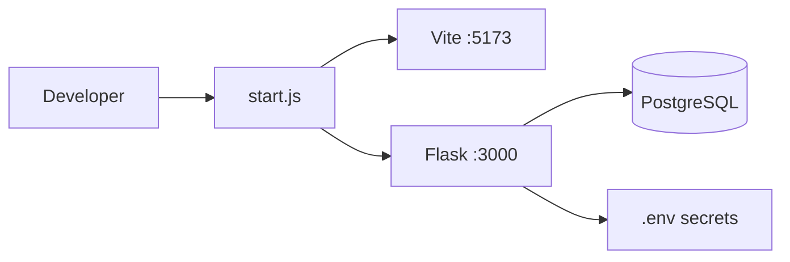

# System Architecture

## Contents

- [Overall Architecture](#overall-architecture)
- [Backend Architecture](#backend-architecture)
- [Frontend Architecture](#frontend-architecture)
- [Database Architecture](#database-architecture)
- [AI Architecture](#ai-architecture)
- [Deployment Architecture](#deployment-architecture)

---

## Overall Architecture

**Document ID:** HCIP-ARCH-001

---

### System context

---

### Container view

---

### Current vs future

| Layer | Current | Future |
|-------|---------|--------|
| App | Monolith API + SPA | Modular services only if scale demands |
| AI | In-process pipelines + `ai/` runtime | Stronger evaluation, embeddings, copilot |
| Tenancy | Role-scoped single deployment | Explicit org tenancy |
| Storage | DB-centric files | Object storage for resumes |

---

### Cross references

- Backend → [Backend-Architecture.md](#backend-architecture)
- Frontend → [Frontend-Architecture.md](#frontend-architecture)

---

## Backend Architecture

**Document ID:** HCIP-ARCH-002  
**Code root:** `apps/backend/`

---

### Application factory

`app/bootstrap/create_app.py` registers:

| Blueprint | Prefix |
|-----------|--------|
| auth | `/api` |
| jobs | `/api/jobs` |
| candidate | `/api/candidate` |
| applications | `/api/applications` |
| sessions | `/api/sessions` |
| parsing | `/api` |
| support | `/api/support` |
| feedback | `/api/feedback` |
| admin | `/api/admin` |
| head_hr | `/api/head-hr` |

---

### Domain packages

---

### Cross-cutting

| Concern | Location |
|---------|----------|
| Auth middleware / JWT | `app/api/middleware/auth.py` |
| DB access | database helpers under `app/database/` |
| Email | `app/integrations/email/` |
| LLM | `app/integrations/openai/llm_service.py` |
| ATS | `app/domains/recruitment/services/ats_service.py` |

---

### Principles

1. Keep business rules in domain services, not only route handlers.
2. Public endpoints remain explicitly validated (`validate_public_apply_payload`).
3. Do not register unfinished domains (e.g. interview) until product-ready.

---

## Frontend Architecture

**Document ID:** HCIP-ARCH-003  
**Code root:** `apps/frontend/`

---

### Stack

React 18 · Vite · React Router 6 · Tailwind · Framer Motion · Radix (selected)

---

### Source layout

| Path | Role |
|------|------|
| `src/app/` | App shell |
| `src/routes/` | Route table + lazy pages |
| `src/features/` | Product features (jobs, organization, admin, auth, …) |
| `src/core/` | API client, auth guards, RBAC, parsing helpers |
| `src/shared/` | Reusable UI (PremiumInput, MonthYearPicker, …) |
| `src/styles/` | Global + org enterprise theme |

---

### Route audiences

Guards: `RecruiterGuard`, `HeadHrGuard`, `CeoGuard`.

---

### Design systems in play

1. **Public / apply** — light modal forms  
2. **Org control center** — dark glass `org-shell` for Head HR / CEO  

Both are intentional; do not force one theme onto the other without product decision.

---

## Database Architecture

**Document ID:** HCIP-ARCH-004  
**Schemas:** `apps/backend/schema_pg/`  
**Detail:** [Current Schema](08-Database.md)

---

### Engine

PostgreSQL via psycopg-oriented helpers.

---

### Logical areas

| Area | Tables (examples) |
|------|-------------------|
| Identity | `hr_signup`, `hr_login`, `HRAuth`, `login_history` |
| Candidate | `candidate_signup`, `candidate_profiles`, education/experience/certs |
| Recruitment | `jobs`, `applications`, `matches` (`saved_jobs` table may exist; UI save removed) |
| Parsing | `raw_files`, `parsed_resumes`, `parsed_jds`, bulk_* |
| Scaffolds | `interviews`, `offers` |

---

### Design rules

1. Additive migrations only for production safety.  
2. Application uniqueness: one application per candidate+job.  
3. Parse artifacts retained for explainability and re-link.  
4. Scaffold tables may exist before APIs are registered.

---

## AI Architecture

**Document ID:** HCIP-ARCH-005  
**Related:** [Resume Parser](06-AI.md) · [../ai/docs/ARCHITECTURE.md](../ai/docs/ARCHITECTURE.md)

---

### Runtime path (current)

---

### Components

| Component | Path |
|-----------|------|
| Parsing API | `domains/recruitment/api/parsing.py` |
| Resume/JD pipelines | `app/ai/parser/pipelines/` |
| LLM service | `app/integrations/openai/llm_service.py` |
| ATS | `domains/recruitment/services/ats_service.py` |
| AI workspace | `ai/` providers, TOON, evaluation, ADRs |

---

### Future architecture

- Knowledge repository consumption during canonicalize  
- Embeddings + vector retrieval for skills/titles  
- Interview & Copilot services as separate capabilities  
- Evaluation harness in CI  

Clearly label experimental paths in ADRs under `ai/docs/adr/`.

---

## Deployment Architecture

**Document ID:** HCIP-ARCH-006  
**Related:** [DEVELOPMENT.md](DEVELOPMENT.md) · `infrastructure/`

---

### Local development (current)

---

### Typical deployment topology

| Component | Notes |
|-----------|-------|
| Static SPA | Build `apps/frontend` → CDN or reverse proxy |
| API | WSGI/ASGI-capable host for Flask |
| Database | Managed PostgreSQL |
| Email | SMTP credentials via env |
| LLM | Provider API keys via env; optional gateway |

Optional: Docker assets under `infrastructure/`, Electron desktop for bulk UI (`apps/desktop/`).

---

### Configuration

Never commit secrets. Use `apps/backend/.env` / `.env.example` patterns. CORS via `FRONTEND_URL` / `FRONTEND_URLS`.

---

### Future

- Horizontal API replicas behind load balancer  
- Object storage for resume binaries  
- Observability stack (metrics, tracing)  
- Blue/green or staged migrations
