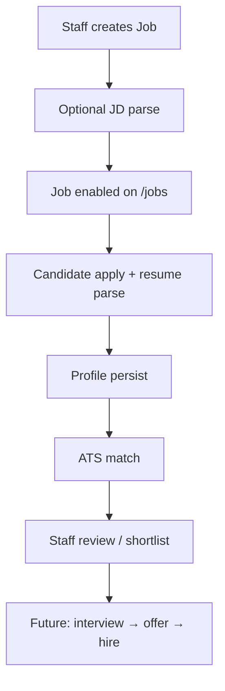
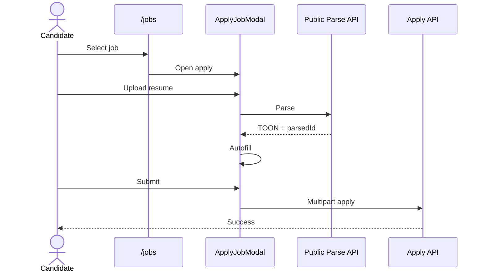
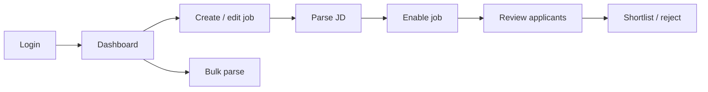
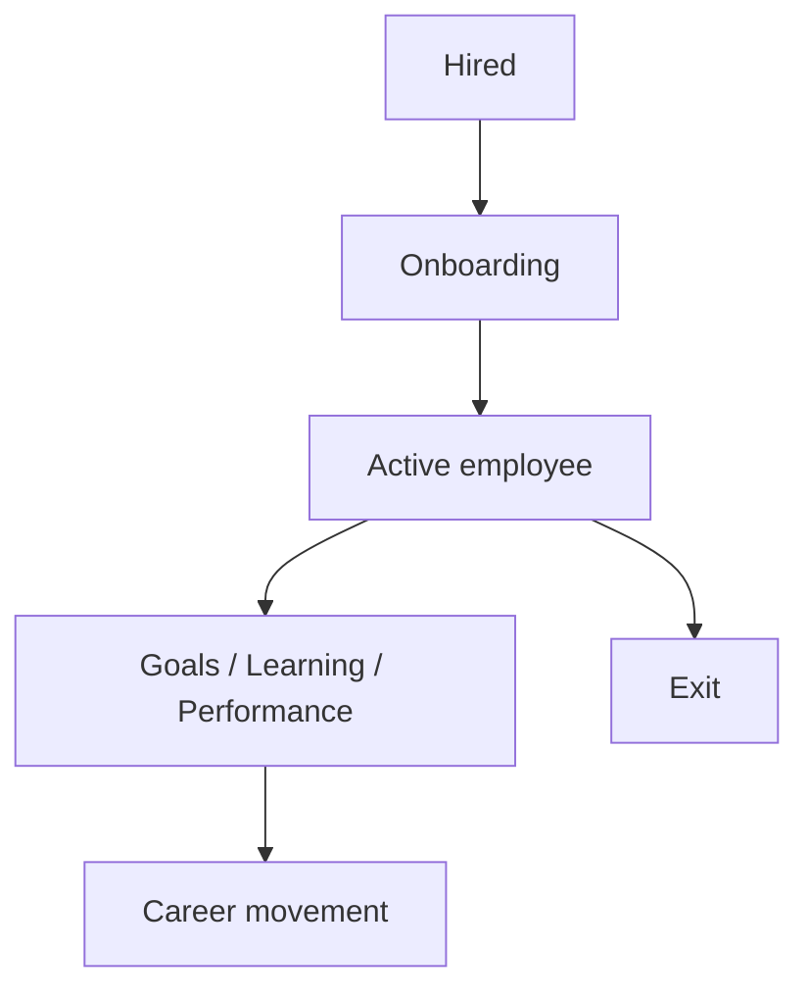
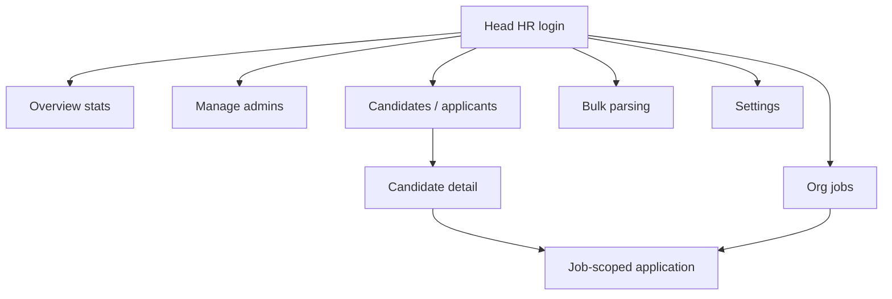
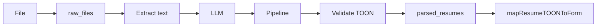
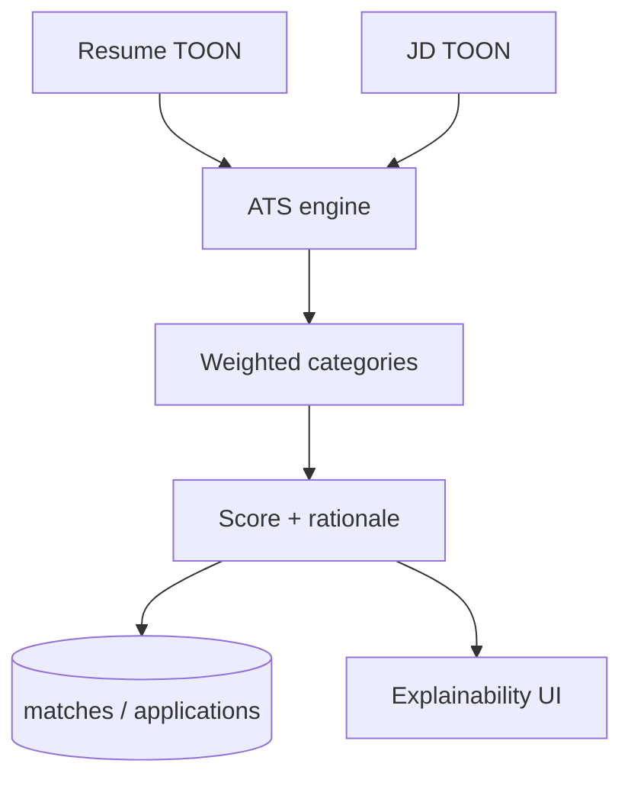

# Workflows

## Contents

- [Platform Workflow](#platform-workflow)
- [Candidate Workflow](#candidate-workflow)
- [Recruiter Workflow](#recruiter-workflow)
- [Employee Workflow](#employee-workflow)
- [Admin / Head HR Workflow](#admin-head-hr-workflow)
- [Resume Parsing Workflow](#resume-parsing-workflow)
- [Job Description Parsing Workflow](#job-description-parsing-workflow)
- [Matching Workflow](#matching-workflow)

---

## Platform Workflow

**Document ID:** HCIP-WF-001  
**Related:** [Candidate](#candidate-workflow) · [Matching](#matching-workflow)

---

### Purpose

Describe how value moves end-to-end from job creation through apply, parse, match, and staff review.

---

### Inputs

- Staff credentials
- Job content / JD file
- Candidate resume & profile fields

---

### Outputs

- Enabled job
- Application + match score
- Staff-visible candidate dossier

---

### Business rules

1. Jobs must be enabled to accept applies.
2. Apply requires successful public resume parse.
3. Duplicate applications for same candidate+job are rejected.
4. RBAC scopes staff actions.

---

### Current implementation

Implemented across jobs, parsing, apply, ATS, Head HR/recruiter UIs. See monorepo `apps/`.

---

### Flow

---

### Future improvements

- Interview & offer stages
- Employee conversion
- Org tenancy & analytics dashboards

---

## Candidate Workflow

**Document ID:** HCIP-WF-002  
**Related:** [Resume Workflow](#resume-workflow) · [Matching](#matching-workflow)

---

### Purpose

Enable a candidate to discover a role and submit a complete, AI-assisted application without creating a staff account. Landing **Get Started** opens `/jobs` (not login). Public `/jobs` always lists **enabled** openings (even if a recruiter is logged in). Staff dashboards use `/api/jobs/all` for **company/org** postings.

---

### Inputs

- Job id / listing
- Resume file (PDF/DOC/DOCX)
- Profile fields (contact, locations, education, experience, …)

---

### Outputs

- Passwordless candidate record
- Profile + education/experience/certs
- Application + match

---

### Business rules

1. Resume AI parse must finish (`parsedId`). Parse failures show the **server error detail** (e.g. text extraction / validation), not a generic “parse resume error”.
2. Required fields validated client & server.
3. Education autofill includes 10th/12th **if present in resume**.
4. Experienced candidates: notice period; last working date when serving notice = yes.
5. One apply per job per candidate email identity. Duplicate submit returns **Applicant already applied**. Apply stays available so a different applicant (different email) can apply to the same job.

---

### Current implementation

`ApplyJobModal.jsx`, `ResumeUploadWithParsing.jsx`, `POST /api/parse/resume/public`, `POST /api/jobs/:id/apply`.

---

### Flow

---

### Future improvements

- Candidate status portal login
- Multi-job cart / saved jobs UX expansion
- Offer response flows

---

## Recruiter Workflow

**Document ID:** HCIP-WF-003  
**Related:** [Platform Workflow](#platform-workflow)

---

### Purpose

Allow recruiters to publish jobs, attract applicants, and act on match intelligence for roles they own.

---

### Inputs

- Staff JWT
- Job fields / JD document
- Application events

---

### Outputs

- Job records
- Parsed JD (optional but preferred)
- Reviewed applications / shortlists

---

### Business rules

1. Recruiters see **company/org** job postings (not only jobs they personally created).
2. Recruiters on the same company/team can **enable/disable**, **edit**, and **delete** those org jobs (same operational controls as Head HR for company postings).
3. **Enable/disable** and **delete** update the public portal (`/jobs`): disabled jobs disappear from the board; deleted jobs are removed from the dashboard and portal (cascade removes applications/matches for that job).
4. CEO is read-only; Head HR may act across the org.
5. Bulk parse available for high-volume ingest.

---

### Current implementation

`/dashboard`, `/candidates`, `/admin/bulk-resume-parser`, `/admin/feedback`, `/api/jobs/*`, parse JD endpoints. Staff UI uses the shared `org-shell` theme (Dark/Light toggle in the navbar; preference stored as `hcip-theme`).

---

### Flow

---

### Future improvements

- Hiring manager collaboration
- Structured interview kits
- Pipeline analytics

---

## Employee Workflow

**Document ID:** HCIP-WF-004  
**Related:** [Employee Domain](02-Domain-Model.md)

---

### Purpose

Define the post-hire lifecycle for people who transition from candidate to employee.

---

### Inputs

- Hired application / offer acceptance (future)
- HRIS attributes (future)

---

### Outputs

- Employee profile
- Goals, learning, performance artifacts (future)

---

### Business rules

1. Preserve person identity continuity from candidate.
2. Separate employee permissions from candidate public apply.
3. Manager hierarchies respect organization domain.

---

### Current implementation

**Future.** Feedback collection exists; full employee portal is not shipped. See Employee domain doc.

---

### Flow

---

### Future improvements

- Onboarding checklists
- Goals & performance cycles
- Learning enrollments
- Career pathing with ontology skills

---

## Admin / Head HR Workflow

**Document ID:** HCIP-WF-005  
**Related:** [Platform Workflow](#platform-workflow)

---

### Purpose

Provide organization-level control: admins, jobs, stats, bulk parsing, and settings.

---

### Inputs

- Head HR JWT
- Admin user payloads
- Org job/candidate data

---

### Outputs

- Managed recruiter accounts
- Org dashboards
- Configured settings

---

### Business rules

1. Only Head HR manages HR users (`hr_users:manage`).
2. Overview links to org sections: Admins, Candidates (applicants), Jobs, Bulk Parsing, Settings.
3. CEO views are read-only siblings of Head HR routes.

---

### Current implementation

`/head-hr/*`, `/api/head-hr/*`, `OrgPanelLayout.jsx`, bulk parsing embed.

- **Candidates** nav (`/head-hr/candidates`) — lists people with at least one `applications` row; detail shows profile + applications (open job-scoped match view).
- CEO: `/ceo/candidates` (read-only).

Overview metric cards (`GET /api/head-hr/stats`):

- **HR Admins** — `COUNT(*)` of `hr_signup` (same population as the Admins page).
- **Candidates** — distinct `candidate_id` values on `applications` (applicants who applied), not raw `candidate_signup` rows (orphans from parse/apply drafts are excluded).
- **Active / Draft Jobs** — from `jobs.enabled`.

---

### Flow

---

### Future improvements

- Explicit multi-org tenancy
- Audit exports
- Policy packs for Copilot

---

## Resume Parsing Workflow

**Document ID:** HCIP-WF-006  
**Related:** [../06-AI/Resume-Parser.md](06-AI.md)

---

### Purpose

Convert an uploaded resume into a validated TOON artifact and optional form autofill.

---

### Inputs

- Resume binary
- Mode: public or authenticated

---

### Outputs

- `raw_files` row
- `parsed_resumes` TOON + confidence + id
- Mapped form fields (apply)

---

### Business rules

1. Unsupported/corrupt files fail with clear errors.
2. Public parse is rate-limited.
3. Apply must link a real `parsedId`.
4. Education entries from resume (including school-level if present) map into autofill.

---

### Current implementation

`parsing.py` → text extract → LLM → resume_toon_pipeline → storage. FE: `parsingApi.js`, `ResumeUploadWithParsing.jsx`.

---

### Flow

---

### Future improvements

- Ontology normalization of skills/degrees
- Evaluation golden sets in CI
- Async parse jobs for large files

---

## Job Description Parsing Workflow

**Document ID:** HCIP-WF-007  
**Related:** [../06-AI/JD-Parser.md](06-AI.md)

---

### Purpose

Convert a JD document into TOON for matching and job intelligence.

---

### Inputs

- JD file or job text
- Staff JWT + recruiter privileges

---

### Outputs

- `parsed_jds` linked to `job_id`
- Structured requirements for ATS

---

### Business rules

1. Prefer storing JD TOON before heavy apply volume.
2. If missing at apply time, backend may synthesize JD TOON from job row fields.
3. Staff-only parse endpoint.

---

### Current implementation

`POST /api/parse/jd`, `jd_toon_pipeline.py`, recruiter dashboard job flows.

---

### Flow

---

### Future improvements

- Competency frameworks
- Salary band linking via knowledge repo
- Diffing JD versions

---

## Matching Workflow

**Document ID:** HCIP-WF-008  
**Related:** [../06-AI/Matching-Engine.md](06-AI.md)

---

### Purpose

Score candidate fit to a job using structured resume and JD intelligence and persist an explainable result.

---

### Inputs

- Parsed resume TOON
- Parsed JD TOON (or synthesized)
- Application context

---

### Outputs

- Overall score
- Category breakdown (skills, experience, education, location)
- `matches` row + `applications.match_score`

---

### Business rules

1. Matching runs on successful public apply path.
2. Humans may shortlist independent of score.
3. Weights are product-defined in ATS service (skills-heavy).

---

### Current implementation

`ats_service.match_candidate_to_job`; UI match panels under Head HR / recruiter views. Optional n8n path exists but public apply uses in-process ATS.

---

### Flow

---

### Future improvements

- Embedding retrieval + rerank
- Fairness monitoring
- Recalculation versioning
