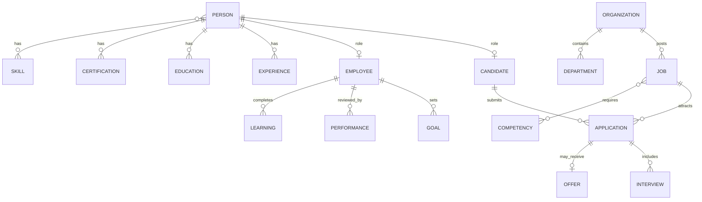
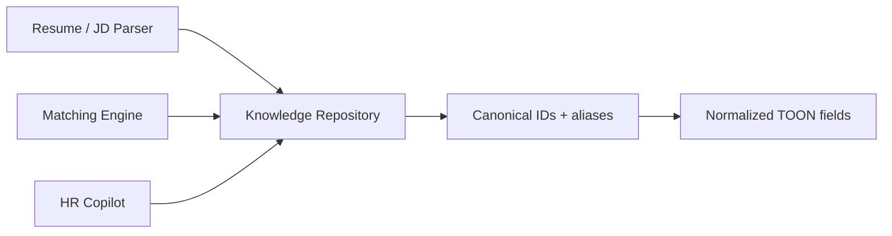

# Ontology

> **Status:** Mostly **Future / target architecture**. Current product stores recruitment entities in PostgreSQL + TOON; a productized `knowledge/` runtime is not shipped yet. See [10-Roadmap.md](10-Roadmap.md) phases 3–4.

## Contents

- [Human Capital Ontology](#human-capital-ontology)
- [Knowledge Repository](#knowledge-repository)
- [Entity Taxonomy](#entity-taxonomy)


---

## Human Capital Ontology

**Document ID:** HCIP-ONT-001  
**Status:** Target architecture (extends current recruitment schema)

---

### Design intent

Provide a stable conceptual model so parsers, matchers, analytics, and copilots share meaning for *Person*, *Skill*, *Job*, *Application*, and related concepts.

---

### Core entities

| Entity | Description | Current mapping |
|--------|-------------|-----------------|
| Person | Human identity | `candidate_signup` (+ future employee) |
| Candidate | Hiring-stage role of Person | apply / applications |
| Employee | Post-hire role of Person | Future |
| Organization | Employer | Implicit org via Head HR scope |
| Department / Team | Org structure | Future |
| Job | Open role | `jobs` |
| Application | Person×Job pursuit | `applications` |
| Resume | Document + TOON | `raw_files` / `parsed_resumes` |
| Experience | Work history entry | `candidate_experiences` |
| Education | Academic / school history | `candidate_education` |
| Certification | Credential | `candidate_certifications` |
| Skill / Competency | Capability | Inside TOON / future tables |
| Interview / Assessment | Evaluation events | Scaffold / future |
| Offer | Employment offer | Scaffold |
| Goal / Performance / Learning / Project / Career | Employee lifecycle | Future |

---

### Relationship diagram



---

### Governance

- Ontology changes require ADR in `ai/docs/adr/` when they affect TOON contracts.
- Parsers should emit IDs/links into knowledge repo where possible (future).

---

## Knowledge Repository

**Document ID:** HCIP-ONT-002  
**Status:** Future platform capability (seeds may exist under `ai/`)

---

### Purpose

A versioned, curated repository of reference entities that **every parser and AI system** can consume to normalize free text into canonical concepts.

---

### Proposed layout

```text
knowledge/
  skills/
  companies/
  degrees/
  universities/
  industries/
  certifications/
  languages/
  locations/
  job_titles/
  competencies/
  salary_bands/
  behavioral_traits/
  employment_types/
  work_modes/
```

---

### Consumption pattern



| Consumer | Use of knowledge |
|----------|------------------|
| Resume parser | Map skill synonyms, institutions, titles |
| JD parser | Normalize requirements & seniority |
| Matching | Compare canonical skill graphs |
| Copilot | Ground answers in approved catalogs |
| Analytics | Stable dimensions over time |

---

### Current state

Today normalization is largely LLM-driven inside pipelines without a fully productized `knowledge/` runtime. Moving to an explicit repository is **Phase 4** on the [roadmap](10-Roadmap.md).

---

### Quality rules

1. Every entry has stable ID, display name, aliases, locale, status.  
2. Changes are versioned; parsers pin a knowledge version.  
3. Customer-specific extensions layer atop global catalogs.

---

## Entity Taxonomy

**Document ID:** HCIP-ONT-003

---

### Controlled vocabularies (target)

| Taxonomy | Examples |
|----------|----------|
| Employment type | Full-time, Part-time, Contract, Intern |
| Work mode | Onsite, Hybrid, Remote |
| Seniority | Intern, Junior, Mid, Senior, Lead, Executive |
| Application status | Applied → … → Hired / Rejected / Withdrawn |
| Education level | Secondary, Diploma, Bachelor, Master, Doctorate |
| Skill category | Technical, Domain, Soft, Tool |
| Interview type | Human, AI, Panel, Take-home |

---

### Current enums in product

| Area | Values in use |
|------|----------------|
| Staff roles | `RECRUITER`, `HEAD_HR`, `CEO` |
| Experience level (apply) | `fresher`, `experienced` |
| Serving notice | `yes`, `no` |
| Notice period | `<30 days`, `<60 days`, `<90 days` |
| Job enabled | boolean |

---

### Mapping rule

Taxonomy codes are stable; labels may be localized. Parsers store codes when known, else raw text + low confidence pending human/knowledge resolution.
