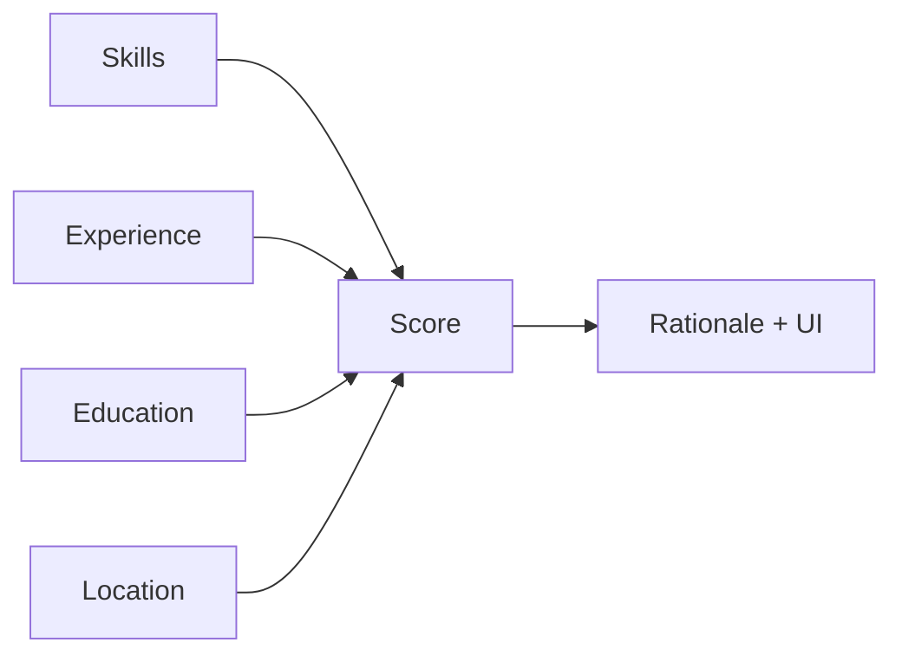
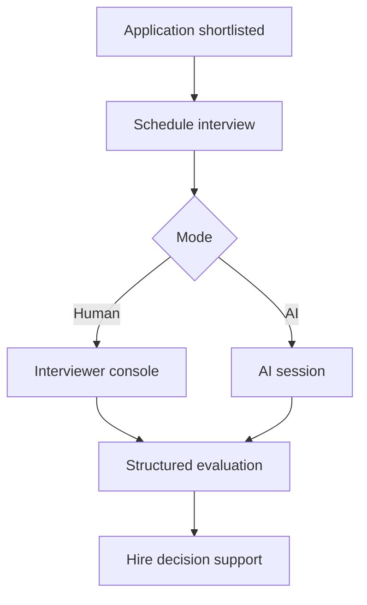
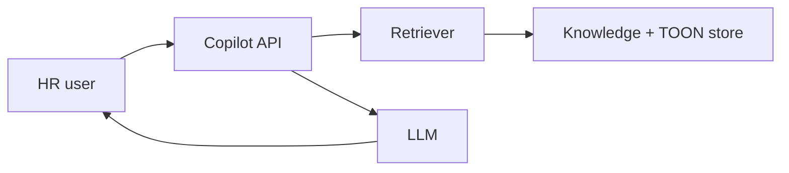

# AI

> **Status mix:** Resume/JD parsing and ATS matching are **Current**. Interview Intelligence and HR Copilot are **Future** (schema scaffolds may exist; interview APIs are not registered in `create_app.py`). Evaluation harness is partial — see [10-Roadmap.md](10-Roadmap.md).

## Contents

- [Resume Parser (Resume Intelligence)](#resume-parser-resume-intelligence)
- [JD Parser (Job Intelligence)](#jd-parser-job-intelligence)
- [Matching Engine](#matching-engine)
- [Interview Intelligence](#interview-intelligence)
- [HR Copilot](#hr-copilot)
- [Evaluation & Model Strategy](#evaluation-model-strategy)

---

## Resume Parser (Resume Intelligence)

**Document ID:** HCIP-AI-001

---

### Purpose

Extract structured person, skills, education, experience, and certifications from resume documents into TOON.

---

### Current implementation

- Entry: `POST /api/parse/resume` (JWT), `POST /api/parse/resume/public` (apply)
- Pipeline: extract → LLM → repair/canonicalize/enrich → validate → store
- FE mapping: `mapResumeTOONToForm` including education present on resume (e.g. 10th/12th)

---

### Outputs

| Field group | Examples |
|-------------|----------|
| Person | name, email, phone, links, location |
| Skills | list / string |
| Education | degree, institution, dates, scores |
| Experience | company, title, dates, current |
| Certifications | name, issuer, validity |

---

### Future

Ontology linking, knowledge aliases, async jobs, stronger evaluation — see [Evaluation.md](#evaluation).

---

## JD Parser (Job Intelligence)

**Document ID:** HCIP-AI-002

---

### Purpose

Structure job requirements, responsibilities, and preferences into TOON for matching and search.

---

### Current implementation

- `POST /api/parse/jd` (staff)
- Stored in `parsed_jds`
- Apply path can synthesize JD TOON from job row if parse missing
- **Deterministic-first accuracy:** title/skills/experience extractors reject section labels (`Role Overview`, `Job Summary`, `PUBLIC`), allow `Jr.`/`Sr.` abbreviations, require `years`/`yrs` for experience (ignore `24x7`), and normalize skills via keyword filters + tech backfill
- **JD layout (Current):** `JD_LAYOUT_ENABLED` (default true) structures headers via `enhance_jd_text`; PDF tables serialize to `Label: Value` lines; OCR uses layout-aware reading order when enabled
- **Coverage gate (Current):** after parse/repair, evidence in source vs filled fields is checked; missing-but-present fields are recovered from the JD text only (no invention). Statuses (`filled` / `recovered` / `missing_with_evidence` / `missing_no_evidence`) are returned on form `coverage` and API `missing_fields`
- **Structural repair** (`repair_jd_toon`) always runs on API and in-memory parse paths
- **LLM residual only:** semantic enrichment is skipped when title passes strict plausibility and skills look skill-like; otherwise LLM may run with `DOCUMENT_INTELLIGENCE_SEMANTIC_TIMEOUT_SEC` (default 25s) so parse never hangs
- Keywords/autofill stay grounded in JD text (skills + tech tokens that appear in source)
- Golden regression: `tests/backend/test_jd_golden_accuracy.py` (+ `fixtures/jd_gold/` including table KV, multi-column, unlabeled paragraph)

---

### Future

Competency frameworks, salary band attachment, versioning of JD intelligence per requisition.

---

## Matching Engine

**Document ID:** HCIP-AI-003

---

### Purpose

Produce explainable fit scores between candidate resume TOON and job TOON.

---

### Current implementation

- Service: `ats_service.py`
- Typical weights: Skills ~60%, Experience ~25%, Education ~10%, Location ~5%
- Persisted on `matches` and `applications`
- Surfaced in recruiter / Head HR match UIs

---

### Future

Embeddings, vector search, reranking, fairness monitors, match versioning. Optional external ATS/`n8n` remains integration-capable.

---

## Interview Intelligence

**Document ID:** HCIP-AI-004  
**Status:** Future / scaffold

---

### Purpose

Support structured interviews (human, AI, or hybrid) with question generation, scoring, and audit trails.

---

### Current implementation

- `interviews` table scaffold exists in schema freeze.
- Interview HTTP blueprints are **not** registered in `create_app.py`.
- No production candidate interview session UI in the current app routes.

---

### Future design

Must obey AI Philosophy: explainability, human override, privacy.

---

## HR Copilot

**Document ID:** HCIP-AI-005  
**Status:** Future

---

### Purpose

Assist HR users with grounded answers and drafting over org policies, job data, and the knowledge repository.

---

### Capabilities (planned)

| Capability | Example |
|------------|---------|
| Retrieval | “Summarize top matches for Job X” |
| Drafting | JD paragraph suggestions |
| Guidance | Policy Q&A |
| Navigation | Jump to candidate dossiers |

---

### Architecture sketch

Grounding and citation are mandatory before production.

---

## Evaluation & Model Strategy

**Document ID:** HCIP-AI-006  
**Related:** [../ai/docs/BENCHMARK_STRATEGY.md](../ai/docs/BENCHMARK_STRATEGY.md)

---

### Current

- Manual/operational monitoring of parse success and apply completion
- AI workspace docs describe reproducibility and benchmarks

---

### Target evaluation framework

| Layer | Method |
|-------|--------|
| Parsing | Golden resumes/JDs; field-level F1 |
| Matching | Labeled pairs; rank quality |
| Copilot | Groundedness / refusal tests |
| Regression | CI gates on golden sets |

---

### Model strategy

| Concern | Approach |
|---------|----------|
| Providers | Config-swappable (Grok/OpenAI/Anthropic/Ollama) |
| Embeddings | Future — dedicated embedding models |
| Vector search | Future — skill/title retrieval |
| Reranking | Future — cross-encoder or LLM rerank |
| Knowledge graph | Future — ontology edges |
| Explainability | Required on match & future interview scores |
| Fine-tuning | Only with contractual PII governance |

---

### Current vs future

Document experimental work in `ai/docs/adr/`. Do not break production apply/parse contracts for experiments.
