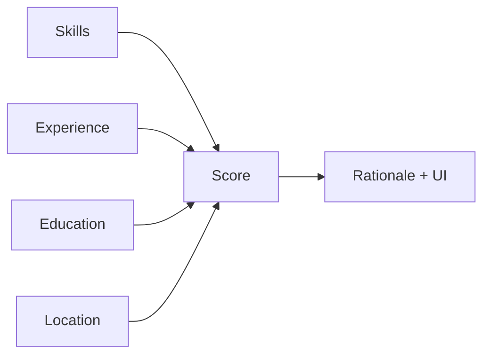
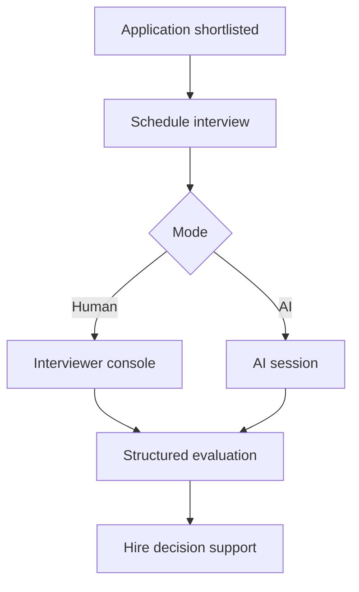
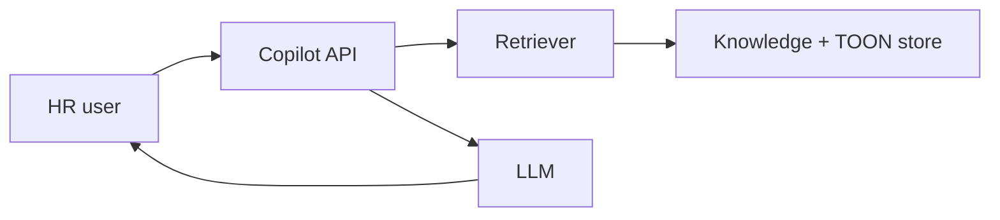

# AI

> **Status mix:** Resume/JD parsing and ATS matching are **Current**. Interview Intelligence and HR Copilot are **Future** (schema scaffolds may exist; interview APIs are not registered in `create_app.py`). Evaluation harness is partial — see [10-Roadmap.md](10-Roadmap.md).

## Contents

- [Resume Parser (Resume Intelligence)](#resume-parser-resume-intelligence)
- [JD Parser (Job Intelligence)](#jd-parser-job-intelligence)
- [Matching Engine](#matching-engine)
- [Interview Intelligence](#interview-intelligence)
- [HR Copilot](#hr-copilot)
- [Evaluation & Model Strategy](#evaluation-model-strategy)
- [Pipeline timing & Developer Mode (Current)](#pipeline-timing--developer-mode-current)

---

## Resume Parser (Resume Intelligence)

**Document ID:** HCIP-AI-001

---

### Purpose

Extract structured person, skills, education, experience, and certifications from resume documents into TOON.

---

### Current implementation

- Entry: `POST /api/parse/resume` (JWT), `POST /api/parse/resume/public` (apply)
- Pipeline (Current): cache → store raw → extract (+ OCR DPI retry on thin/failed/garbage PDF/image) → layout → sections → deterministic parsers → **resume coverage recovery** (email/phone/location/education/**experience** from source only) → residual semantic LLM → knowledge → validate → Form DTO + TOON → `parsed_resumes`
- **Form autofill (Current):** backend `map_candidate_to_form` → `ApplicationFormDTO` (includes **`coverage`** statuses); FE uses `takeResumeFormDTO`. `preferredLocation` falls back to `currentLocation` when preferred is empty (apply requires both). Notice period / LWD remain user-entered. Education rows require grounded degree+institution (no invented `Education` placeholder). Location must pass `validate_location` (rejects skill/summary pollution). When core fields remain `missing_with_evidence`, upload shows an incomplete-fields review warning (JD parity).
- **Contact / location recall (Current):** labeled email/phone/location/address lines; pipe-header city; City, Region only when geo-plausible; whole-doc phone scan rejects year-digit soup; broken-email heal; footer contact when header is thin; polluted location cleared + re-extracted
- **Education (Current):** multi-line institution↔degree coalesce; table/KV rows (`Degree | Institution`); stronger section end bounds; duty-line pollution filters; academic/internship header aliases
- **Experience (Current):** `Internship` / `Industrial Training` / `Internship / Training…` headers map to Experience; Company\|City + role-next-line and date-first blocks; coverage recovers when section evidence exists but rows empty; LLM `allow_experience_fill` follows **section evidence** (not only already-parsed rows)
- **Experience quality (Current):** sanitize drops edu-table headers, geo-only / institution-as-job rows, duty-bleed roles (aligned verb list); **Phase 6:** noun-led KPI/duty fragments (`Trends, and Revenue KPIs…`) rejected by `is_plausible_job_title` / `_is_bullet_or_duty_line` / `validate_role`; wrap leftovers (`for multiple services.`, `and visualization`) are not titles; `Role —/–/- Company` and Company\|City → `ExperienceEntry.location`; years recomputed after sanitize from dated ranges and grounded prose (`Total Experience: N years`); Excel flatten always recomputes years from Form DTO dates / description ranges when `total_experience_years` is empty
- **Location quality (Current):** reject pipe/phone/section-header / skill-summary pollution; reject document titles (`Curriculum Vitae`) and ops/soft-skill pairs (`Patching, Ansible`, `Business Communication, Financial`); comma-pairs require a known city or region; heal `Company | City` and `+91…⋄City` → city; **Phase 6:** shared city allowlist (`known_location_cities`) + aliases (`Nasik`→`Nashik`); recovery peels `experience[].location` → education institution cities → institute map (VIT→`Vellore`); section-aware early-body recovery (not from Skills/Summary)
- **Coverage gate (Current):** after deterministic parse (and again after repair), evidence in source vs filled fields is checked for `fullName` / email / phone / location / education / experience; statuses (`filled` / `recovered` / `missing_with_evidence` / `missing_no_evidence`) are returned on form `coverage` and API `missing_fields`. Residual LLM skipped only when no core evidence gaps remain.
- **Structural repair (Current):** DI path always runs `repair_resume_toon` after semantic/sanitize, then a final coverage pass (mirrors JD `_apply_jd_repair`).
- **Bulk formats (Current):** staging accepts **pdf / docx / png / jpg / jpeg / webp / tif / tiff**; legacy `.doc` is rejected with `unsupported_format` (convert to PDF/DOCX). Scanned PDF + image resumes use the same RapidOCR path and `BULK_OCR_RETRY_DPI` garbage/thin-text retry as single parse (DPI retry also runs when first extract raises). Install OCR via `pip install -r requirements.txt` (`rapidocr-onnxruntime`; Python 3.10–3.12 recommended). Excel stores **Form DTO** columns (same healed values as Apply autofill), not raw TOON. Failed files still get a **Resumes** row with `ParseStatus=failed` and `ParseNotes` (`insufficient_text`, `not_processed`, …) so row count matches files uploaded. Workbook includes a **Field Trace** sheet (per file+field: ExcelValue, InResume, Coverage, Verdict `ok` / `weak_missing` / `weak_ungrounded` / `absent` / `fallback`). `ParseStatus=partial` when coverage still has evidence gaps **or** Field Trace is `weak_missing` / `weak_ungrounded`. Residual LLM skip uses the same closed-world gate as single parse (`resume_deterministic_is_strong` + `experience_is_incomplete(raw_text)` + coverage gaps); `validate_toon_format_bulk` `partial` alone never skips LLM. **Phase 6 bulk gate:** refuse deterministic skip when experience titles fail `is_plausible_job_title` or the Experience slice looks OCR-mushy. Bulk does **not** write into the single-parse `parsed_resumes` cache.
- **Cache tag (Current):** default `DOCUMENT_INTELLIGENCE_CACHE_TAG=canonical-v7-resume-coverage` so Form DTO coverage shape is not masked by stale `parsed_resumes` cache hits.

---

### Outputs

| Field group | Examples |
|-------------|----------|
| Person | name, email, phone, links, location |
| Skills | list / string |
| Education | degree, institution, dates, scores |
| Experience | company, title, dates, current |
| Certifications | name, issuer, validity |

---

### Future

Ontology linking, knowledge aliases, async jobs, stronger evaluation — see [Evaluation.md](#evaluation).

---

## JD Parser (Job Intelligence)

**Document ID:** HCIP-AI-002

---

### Purpose

Structure job requirements, responsibilities, and preferences into TOON for matching and search.

---

### Current implementation

- `POST /api/parse/jd` (staff)
- Stored in `parsed_jds`
- Apply path can synthesize JD TOON from job row if parse missing
- **Deterministic-first accuracy:** title/skills/experience extractors reject section labels (`Role Overview`, `Job Summary`, `PUBLIC`, `Key Responsibilities`, `Certifications`), allow `Jr.`/`Sr.` / `.NET` abbreviations, require `years`/`yrs` for experience (ignore `24x7`), and normalize skills via keyword filters + tech backfill
- **Title normalization (Current):** `normalize_title_candidate` strips bullets, `JD:` / `Role Category:` / `Job Description:` prefixes, trailing `– Job Description`, and marketing adjectives (`motivated`, `results-driven`); labeled patterns accept `Job Description – Role` (en-dash) and wrapped multiline titles; prose hiring lines skip adjective noise and accept `.NET` roles
- **Skills section capture (Current):** Required/Preferred Skills are read as full section blocks (not a single line); skill-section phrases up to ~8 words are kept; longer skill sentences contribute embedded tech tokens from that section only (no whole-document invention)
- **Keywords grounding (Current):** Keywords are derived from the **overall JD** (tech/domain terms across the document, then preferred skills, with mandatory only as fill). They are **not** a copy of Required / Mandatory Skills. Recruiter UI keeps Keywords and Required Skills as independent fields.
- **Description bullets (Current):** overview stays prose; soft-wrapped PDF lines are merged; `•` bullets are emitted only for real list items under a responsibilities heading
- **JD layout (Current):** `JD_LAYOUT_ENABLED` (default true) structures headers via `enhance_jd_text`; PDF tables serialize to `Label: Value` lines; OCR uses layout-aware reading order when enabled
- **Coverage gate (Current):** after deterministic parse (and again after repair), evidence in source vs filled fields is checked; missing-but-present fields are recovered from the JD text only (no invention). Location accepts unlabeled forms (`Location Mumbai`, title-line `– Mumbai`) and known-city fallbacks. Skills reject garbage (`JOB`), strip PDF `o ` letter-bullets, prefer Primary Technology labels, and replace non-skill-like tokens. Salary rejects currency-only noise (`rs`). Statuses (`filled` / `recovered` / `missing_with_evidence` / `missing_no_evidence`) are returned on form `coverage` and API `missing_fields`
- **Structural repair** (`repair_jd_toon`) always runs on API and in-memory parse paths
- **LLM residual only:** semantic enrichment runs when title/skills fail plausibility **or** core coverage still has `missing_with_evidence` after the first recovery pass; skipped when title + skill-like skills + no core gaps. `force` never bypasses `DOCUMENT_INTELLIGENCE_SEMANTIC_AI=false`. Timeout via `DOCUMENT_INTELLIGENCE_SEMANTIC_TIMEOUT_SEC` (default 90s; one attempt)
- **Recruiter UI (Current):** autofill from Form DTO; when core fields remain `missing_with_evidence`, upload shows an incomplete-fields review warning instead of full success
- **Cache tag (Current):** default `DOCUMENT_INTELLIGENCE_CACHE_TAG=canonical-v6-jd-coverage` so parser accuracy fixes are not masked by stale `parsed_jds` cache hits
- Golden regression: `tests/backend/test_jd_golden_accuracy.py` (+ `fixtures/jd_gold/` including table KV, multi-column, unlabeled paragraph, title cases, detailed skills / soft-wrap bullets, unlabeled `Location Mumbai`, video-editor tool skills, wireframing `o` bullets)
- PDF batch acceptance: `apps/data/jd_parse_eval/run_eval.py` over `/JD` — fails on core `missing_with_evidence`, garbage skills, and non-skill-like tokens (not soft title-overlap alone)

---

### Future

Competency frameworks, salary band attachment, versioning of JD intelligence per requisition.

---

## Matching Engine

**Document ID:** HCIP-AI-003

---

### Purpose

Produce explainable fit scores between candidate resume TOON and job TOON.

---

### Current implementation

- Service: `ats_service.py`
- Typical weights: Skills ~60%, Experience ~25%, Education ~10%, Location ~5%
- **Mandatory skills gate:** mandatory match &lt; 60% → Not a Match (auto-disqualify)
- **Verdicts:** ≥75% Strong Match; 60–74% Potential Match (recruiter review); &lt;60% Not a Match
- **Auto-shortlist:** only Strong Match (overall ≥75%, default `ATS_THRESHOLD` / `ATS_AUTO_SHORTLIST_MIN`). Potential Match is **not** auto-shortlisted.
- Persisted on `matches` and `applications`
- Surfaced in recruiter / Head HR match UIs

---

### Future

Embeddings, vector search, reranking, fairness monitors, match versioning. Optional external ATS/`n8n` remains integration-capable.

---

## Interview Intelligence

**Document ID:** HCIP-AI-004  
**Status:** Future / scaffold

---

### Purpose

Support structured interviews (human, AI, or hybrid) with question generation, scoring, and audit trails.

---

### Current implementation

- `interviews` table scaffold exists in schema freeze.
- Interview HTTP blueprints are **not** registered in `create_app.py`.
- No production candidate interview session UI in the current app routes.

---

### Future design

Must obey AI Philosophy: explainability, human override, privacy.

---

## HR Copilot

**Document ID:** HCIP-AI-005  
**Status:** Future

---

### Purpose

Assist HR users with grounded answers and drafting over org policies, job data, and the knowledge repository.

---

### Capabilities (planned)

| Capability | Example |
|------------|---------|
| Retrieval | “Summarize top matches for Job X” |
| Drafting | JD paragraph suggestions |
| Guidance | Policy Q&A |
| Navigation | Jump to candidate dossiers |

---

### Architecture sketch

Grounding and citation are mandatory before production.

---

## Evaluation & Model Strategy

**Document ID:** HCIP-AI-006  
**Related:** [../ai/docs/BENCHMARK_STRATEGY.md](../ai/docs/BENCHMARK_STRATEGY.md)

---

### Current

- Manual/operational monitoring of parse success and apply completion
- AI workspace docs describe reproducibility and benchmarks

---

### Target evaluation framework

| Layer | Method |
|-------|--------|
| Parsing | Golden resumes/JDs; field-level F1 |
| Matching | Labeled pairs; rank quality |
| Copilot | Groundedness / refusal tests |
| Regression | CI gates on golden sets |

---

### Model strategy

| Concern | Approach |
|---------|----------|
| Providers | Config-swappable (Grok/OpenAI/Anthropic/Ollama) |
| Embeddings | Future — dedicated embedding models |
| Vector search | Future — skill/title retrieval |
| Reranking | Future — cross-encoder or LLM rerank |
| Knowledge graph | Future — ontology edges |
| Explainability | Required on match & future interview scores |
| Fine-tuning | Only with contractual PII governance |

---

### Current vs future

Document experimental work in `ai/docs/adr/`. Do not break production apply/parse contracts for experiments.

---

## Pipeline timing & Developer Mode (Current)

**Document ID:** HCIP-AI-TIMING

### Purpose

Instrument wall-clock duration of critical parse/match stages via `@timing` (`apps/backend/app/core/timing.py`) without changing business logic.

### Current behavior

| Mode | Behavior |
|------|----------|
| Default (`DEVELOPER_MODE=false`) | INFO `[TIMING]` logs only — no in-memory collection, no Admin APIs, no UI |
| Developer Mode (`DEVELOPER_MODE=true`) | Same INFO logs **plus** in-memory request-scoped collection for Admin Performance Dashboard |

Instrumented stages (examples): `extract_text`, `enrich_resume_semantic` / `enrich_jd_semantic`, `store_raw_file`, `run_document_intelligence`, `match_candidate_to_job`, `_internal_match`, `_optional_llm_narrative`, `_persist_application_atomic`, `public_apply_to_job`.

### Admin surface

- **Who:** `HEAD_HR` only (permission `developer:performance`)
- **UI toggle:** Head of HR → **Settings** → **Developer Mode** switch (Admin only). When on, sidebar shows **Developer Mode** → Performance Dashboard (`/head-hr/developer`)
- **APIs:** `/api/admin/developer/performance/*` (404 when `DEVELOPER_MODE` env is off)
- **Storage:** process-local ring buffer (no DB). Restart clears history. Optional `DEVELOPER_MODE_MAX_SESSIONS` (default 500).

Both are required to use the dashboard: backend `DEVELOPER_MODE=true` (collector + APIs) **and** the Admin Settings toggle ON (nav visibility).

**Resume parse checklist (always listed, in order):** Cache Check → Store Raw File → Extract Text → Layout Analysis → Section Detection → Deterministic Parse → Coverage Check → Semantic Enrichment (LLM) → Knowledge Enrichment → Validation → Save Parsed Result. Optional sub-row: LLM Inference (AI Runtime) when `parse_via_runtime` ran.

**Duration display (Current):** Step times use wall-clock `perf_counter` ms. Values under 1 ms show as `<1 ms` (not `0 ms`). Layout is timed separately from text extraction. Completing a stage twice never replaces a real measurement with a later 0 ms row.

**Bulk resume parse (Current):** One dashboard row per bulk job — **Bulk Parse · N resumes** (Bulk filter only). The list row has a chevron to preview filenames; the detail panel lists each resume with an expandable dropdown showing the **same pipeline steps as a single resume parse**. Cache lookup is skipped for throughput. **Layout runs when `RESUME_LAYOUT_ENABLED`** (default true). Extract strips NUL bytes; OCR DPI retry covers PDF + image extensions (`png/jpg/jpeg/webp/tif/tiff`) aligned with single parse. Accepted uploads: PDF, DOCX, and those images — **not** legacy `.doc`. Excel stores Form DTO columns (same as Apply) plus a **Field Trace** sheet; failed files still appear as Resumes rows with `ParseStatus=failed`. `ParseStatus=partial` + named coverage gaps / `trace_weak=` in ParseNotes when evidence remains unfilled or values are ungrounded. Residual LLM skip matches single parse (`resume_deterministic_is_strong` + coverage gaps). **Phase 6:** refuse deterministic skip on implausible experience titles or OCR-mushy Experience slices; LLM calls use `_llm_semaphore` (`OLLAMA_MAX_CONCURRENT`). Bulk does **not** write into the single-parse `parsed_resumes` cache — re-uploading the same PDF on Apply / single parse always runs a fresh parse (existing bulk-seeded rows are ignored by cache lookup).

**Clear timings (Current):** Dashboard **Clean** (beside Refresh) calls `POST /api/admin/developer/performance/clear` and wipes the in-memory recent-parse buffer on this process.

**JD parse checklist (always listed, in order):** Cache Check → Store Raw File → Extract Text → Layout Analysis → Section Detection → Deterministic Parse → Knowledge Enrichment → Coverage Check → Semantic Enrichment (LLM) → Validation → Save Parsed Result.

**Apply submit checklist (Current):** Validate Payload → Create Candidate → Save Profile → Link Parsed Resume → Load Job Description → ATS Matching → Database Save. Optional detail rows: ATS Score Computation; **ATS Narrative (LLM) is skipped on public apply** (`skip_narrative=True`) so submit uses deterministic rationale and stays fast. Submit does **not** re-upload/re-store the PDF when `parsedId` is present (resume already catalogued at parse time). Shortlist email + interview scheduling run in a **background thread** after the application is persisted. When `ATS_API_URL` is set, ATS Matching is the external API call (timeout via `ATS_API_TIMEOUT_SEC`, default **25s**, capped at 60s).

See [07-API.md](07-API.md), [09-Security.md](09-Security.md), and [DEVELOPMENT.md](DEVELOPMENT.md).
