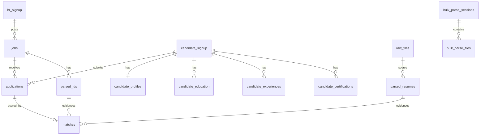

# Database

## Contents

- [Authority](#authority)
- [Engine](#engine)
- [Schema sources](#schema-sources)
- [Current schema (table groups)](#current-schema-table-groups)
- [Key columns & constraints](#key-columns--constraints)
- [Relationships](#relationships)
- [Indexes (from domain freeze)](#indexes-from-domain-freeze)
- [Product drift notes](#product-drift-notes)
- [Scaling considerations](#scaling-considerations)
- [Future growth](#future-growth)

**Schemas:** `apps/backend/schema_pg/`  
**Related:** [02-Domain-Model.md](02-Domain-Model.md) · [03-System-Architecture.md](03-System-Architecture.md)

---

## Authority

| Layer | Role |
|-------|------|
| **SQL under `schema_pg/`** | Runtime / migration truth |
| **This document** | Canonical HCIP database overview |
| **HISTORY.md / ARCHITECTURE.md (under `legacy/`)** | Historical narrative — may lag product UI |

Documentation only — this file does not modify schema.

---

## Engine

PostgreSQL (psycopg-oriented helpers in the Flask app).

---

## Schema sources

Refresh the file list with `python scripts/sync_docs_from_code.py`.

<!-- BEGIN:GENERATED-SCHEMA-FILES -->
_Auto-generated on 2026-08-03 by `scripts/sync_docs_from_code.py`. Do not hand-edit this block._

| File | Purpose (from filename / header) |
|------|-----------------------------------|
| `apps/backend/schema_pg/01_schema.sql` | ============================================================================= |
| `apps/backend/schema_pg/03_employee_feedback.sql` | ----------------------------------------------------------------------------- |
| `apps/backend/schema_pg/04_domain_freeze.sql` | ============================================================================= |
| `apps/backend/schema_pg/05_remove_legacy_rbac.sql` | ============================================================================= |
| `apps/backend/schema_pg/06_seed_admin_accounts.sql` | Seed Head of HR account. Edit DECLARE block before deploy. |
| `apps/backend/schema_pg/07_seed_ceo_account.sql` | Seed CEO executive account (read-only analytics). Edit DECLARE block before deploy. |
| `apps/backend/schema_pg/08_public_apply_purge_candidate_auth.sql` | ----------------------------------------------------------------------------- |
| `apps/backend/schema_pg/09_interview_ai_scheduling.sql` | Interview scheduling + AI interviewer support (extends interviews scaffold) |
<!-- END:GENERATED-SCHEMA-FILES -->

---

## Current schema (table groups)

### Identity
`hr_signup`, `hr_login`, `"HRAuth"`, `login_history`

### Candidate
`candidate_signup`, `candidate_profiles`, `candidate_education`, `candidate_experiences`, `candidate_certifications`

### Recruitment
`jobs`, `applications`, `matches`

### Parsing & bulk
`raw_files`, `parsed_resumes`, `parsed_jds`, `bulk_parse_sessions`, `bulk_parse_files`

### Scaffolds / adjacent
| Table | Status |
|-------|--------|
| `interviews` | Scaffold (+ optional cols in `09_*.sql`); **no interview blueprint in `create_app.py`** |
| `offers` | Scaffold |
| `saved_jobs` | Table may exist; **public Jobs UI no longer exposes bookmark/save** |
| Support / feedback | As present in migrations (`employee_feedback`, support tables) |

---

## Key columns & constraints

### Apply-related profile (`candidate_profiles`)
Includes (among others): experience level, serving notice, notice period, last working day, contact/location fields used by public apply.

### Jobs
`jdid` (PK), title, company, location, description, poster/owner fields, `enabled` (public apply requires enabled job).

### Applications
Links `candidate_id` + `job_id`; status; `match_score`; shortlist / ATS fields; `latest_match_id`.  
**Business rule:** one application per candidate+job (enforced in apply path).

### Matches
Score, analysis/rationale JSON, links to parsed resume/JD, `is_latest` style indexing for retrieval.

### Parsed artifacts
TOON payload + confidence + linkage to `raw_files` / job / candidate / bulk session as applicable.

---

## Relationships

### Integrity expectations

| Rule | Enforcement |
|------|-------------|
| One application per candidate+job | Apply API check |
| Job enabled for public apply | Apply API check |
| Parse must exist to apply | `link_parsed_resume` |
| Org-scoped Head HR reads | `/api/head-hr` + RBAC |

---

## Indexes (from domain freeze)

Confirm live DB matches migration files. Intended indexes include:

| Area | Index intent (examples) |
|------|-------------------------|
| Jobs | status/posted, created_by/status |
| Applications | `(job_id, status)`, `(candidate_id, status)`, `latest_match_id` |
| Matches | `(candidate_id, job_id, is_latest)`, `(job_id, match_score)` |
| Bulk | sessions by owner/status; files by session/status |
| Interviews / offers | application_id; status/schedule (scaffold) |
| Saved jobs | `(candidate_id, saved_at)` — legacy/scaffold |

Also: `hr_signup(role)` after RBAC cleanup migration.

---

## Product drift notes

| Topic | Doc stance |
|-------|-------------|
| **Bookmark / save job UI** | Removed from `JobCard` / public `/jobs`. Do not document as a current candidate feature. |
| **`saved_jobs` table** | May remain in schema; treat as unused/scaffold until a product decision restores save UX or drops the table. |
| **Interview AI** | Schema extensions may exist; HTTP APIs are **not** registered. |
| **Candidate auth tables** | Public apply is passwordless; see `08_public_apply_purge_candidate_auth.sql`. |

---

## Scaling considerations

| Stage | Action |
|-------|--------|
| Now | Connection pooling; parse content-hash cache; bulk sessions for large ingest |
| Next | Object storage for resume binaries; archive old `raw_files` |
| Later | Read replicas; tenancy keys (`org_id`); partition high-volume telemetry |

Ensure hot-path indexes remain for job applicant lists and apply duplicate checks.

---

## Future growth

1. Promote `interviews` / `offers` with additive migrations **and** registered APIs together.  
2. Add knowledge/ontology ID columns rather than rewriting history.  
3. Drop or wire `saved_jobs` intentionally — avoid silent half-features.  
4. Formal retention jobs for OTPs, parse caches, and rejected applications.
