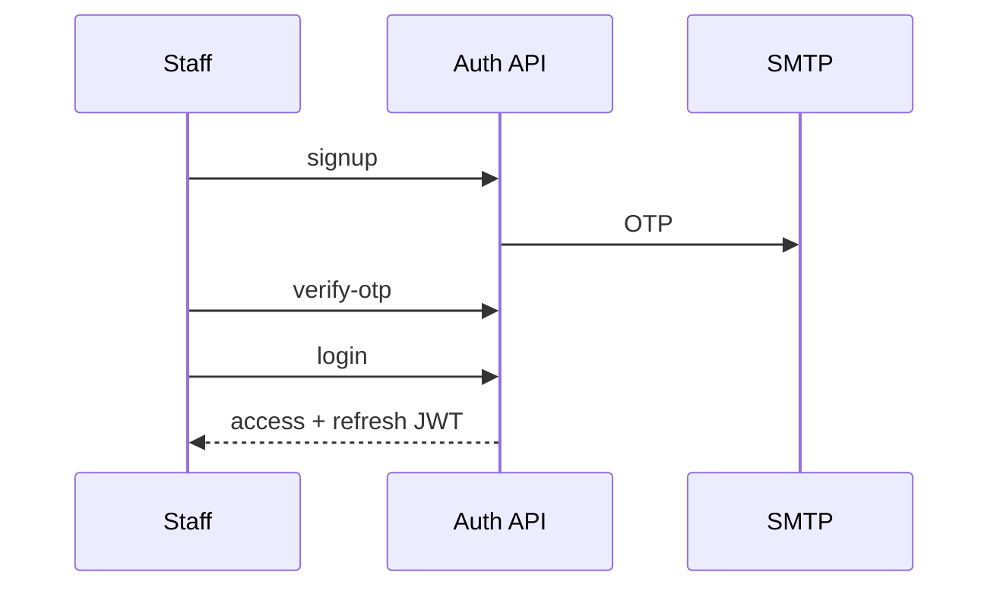

# Security

## Contents

- [Authentication](#authentication)
- [Authorization](#authorization)
- [Compliance, Privacy & Audit](#compliance-privacy-audit)

---

## Authentication

**Document ID:** HCIP-SEC-001

---

### Staff authentication (current)

- Passwords hashed (bcrypt family as implemented)
- JWT HS256; bearer header on FE (`jwtToken` storage)
- Login history recorded

---

### Candidate authentication

Public apply is **passwordless**. Identity is established via validated email + profile on apply; dedicated candidate login portal is not required for the core apply path.

---

### Secrets

JWT secret, mail credentials, LLM keys via environment — never commit.

**Integration provider credentials** (client secret, access/refresh tokens) are encrypted at rest with Fernet (`INTEGRATION_SECRETS_KEY`, or derived from `JWT_SECRET` in local dev). API responses never return plaintext secrets (masked / `*Configured` flags only).

---

## Authorization

**Document ID:** HCIP-SEC-002  
**Source:** `apps/frontend/src/core/permissions/rbac.js` (+ backend RBAC)

---

### Roles

| Role | Capabilities (summary) |
|------|------------------------|
| `RECRUITER` | Own jobs/candidates; bulk parse; no org admin mgmt |
| `HEAD_HR` | Org-wide read/write; manage HR users; settings |
| `CEO` | Org-wide read; analytics read; no write |

---

### Permission examples

| Permission | Roles |
|------------|-------|
| `jobs:write_own` | Recruiter, Head HR |
| `jobs:write_any` | Head HR |
| `jobs:read_all` | Head HR, CEO |
| `hr_users:manage` | Head HR |
| `settings:configure` | Head HR |
| `analytics:read` | Head HR, CEO |
| `bulk_parse:run` | Recruiter, Head HR |

---

### UI enforcement

Route guards + OrgPanelLayout role menus. Backend must still enforce — UI checks are not sufficient alone.

---

## Compliance, Privacy & Audit

**Document ID:** HCIP-SEC-003

---

### Privacy principles (product)

1. Minimize PII on apply forms.  
2. Restrict candidate dossier access by RBAC.  
3. Prefer purpose limitation (hiring).  
4. Plan retention for resumes, OTPs, parse caches.

---

### Audit

| Signal | Current |
|--------|---------|
| Login history | Table supported |
| Application events | Application rows / statuses |
| AI decisions | Match analysis JSON |

Future: immutable audit log stream for admin actions and Copilot tool use.

---

### Encryption

| Layer | Expectation |
|-------|-------------|
| In transit | TLS in deployed environments |
| At rest | Managed DB encryption where offered |
| Secrets | Env / secret manager |

---

### Data retention (policy intent)

| Data class | Intent |
|------------|--------|
| OTP codes | Short-lived |
| Rejected applications | Org-defined retention |
| Parse cache | Reclaimable by hash policy |
| Hired employee data | Longer HR retention |

Formal legal schedules should be approved by the customer’s compliance owners.
