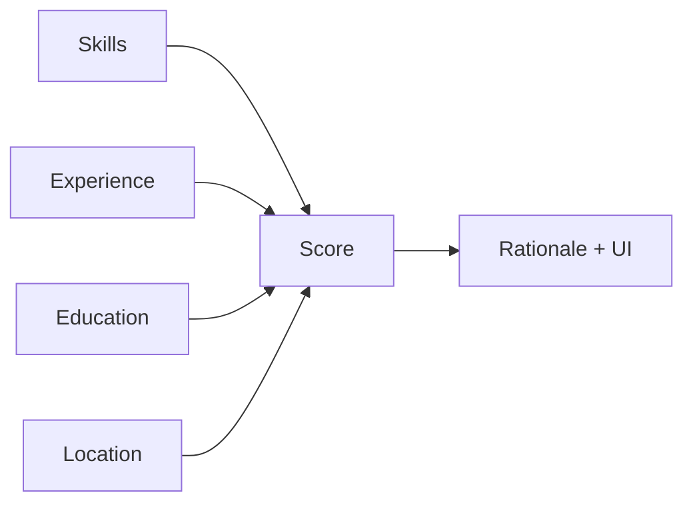
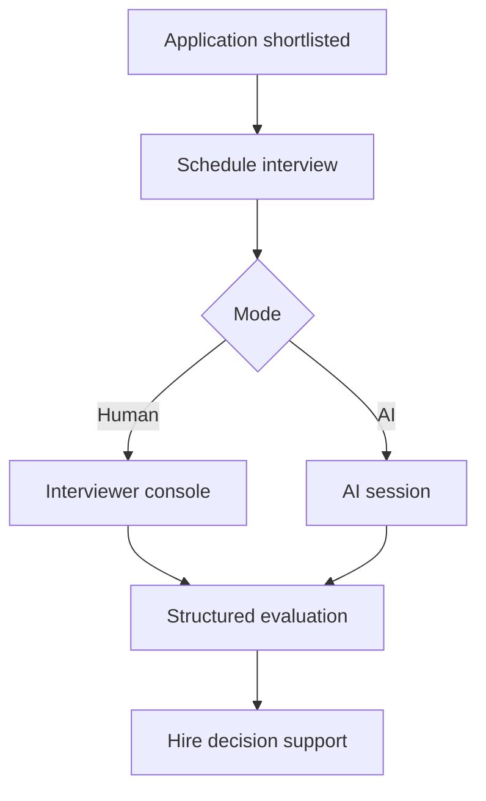
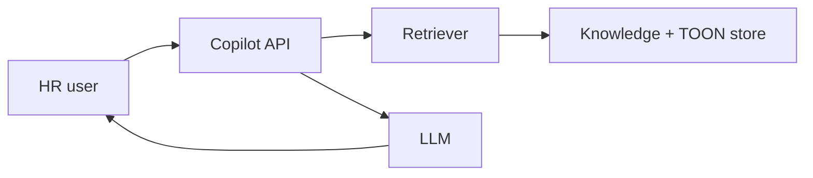

# AI Platform

Single reference for document intelligence, production AI features, engineering workflow, data pipeline, and architecture decisions. Prefer live code when docs disagree.

## Contents

- [Product status](#product-status)
- [Document intelligence](#document-intelligence)
- [Production AI features](#production-ai-features)
- [Engineering workflow](#engineering-workflow)
- [Data pipeline](#data-pipeline)
- [Architecture decision records](#architecture-decision-records)
- [Resume / JD parsing](#resume-parser-resume-intelligence) · [Matching](#matching-engine) · [Developer Mode timing](#pipeline-timing--developer-mode-current)

---

## Product status

<a id="product-status"></a>

## Productized vs capability packs

| Surface | Status |
|---------|--------|
| Resume / JD parsing (+ ATS via HRMS adapter) | **Production HRMS path** |
| Matching, chat, interview-generation, ranking/summary | **Capability packs** in `ai/` — not fully productized app services |

Market and roadmap claims should match this table. See [Production AI features](#production-ai-features) and [ADR-006](#adr-006-ai-platform-vision).

---

## Document intelligence

<a id="document-intelligence"></a>

Production document understanding subsystem for HCIP.

## Pipeline

```
Document → Extraction → Layout → Sections → Independent Section Parsers
  → Canonical Model → Knowledge → Validation → Confidence
  → Form Mapper → Form DTO → Frontend
  → Canonical→TOON → DB/ATS
```

**Critical rule:** React never consumes raw AI/TOON. Clients receive Form DTOs only.

## Package layout

```
app/ai/document_intelligence/
  pipeline.py       # sole production entry (run_document_intelligence)
  contracts/        # FieldContract registry
  deterministic/    # email/phone/URL/dates (never AI)
  sections/         # typed SectionSpan isolation
  parsers/resume/   # personal, contact, experience, education, skills, …
  parsers/jd/       # title, responsibilities, skills, salary, …
  semantic/         # section-scoped AI for unresolved gaps only
  knowledge/        # skill/title normalization on canonical models
  validation/       # validators + anti-contamination
  mapping/          # explicit Form DTO mappers
  serialize/toon.py # Canonical → TOON for ATS only
  models/           # CandidateProfile, JobProfile, Form DTOs
  response.py       # client payloads (Form DTO only)
```

## Clients

- Parse APIs: `domains/recruitment/api/parsing.py`
- Frontend: `takeResumeFormDTO` / `takeJDFormDTO` in `parsingApi.js`

## Eval / gold lake

- Gold lake: `ai/dataset/lake/benchmark/parsing/v1`
- Regenerate / report (writes `ai/eval/reports/`):

```bash
python3 ai/eval/upgrade_gold_canonical.py
python3 ai/eval/run_field_accuracy_report.py
pytest tests/backend/document_intelligence/ -q
```

---

## Production AI features

<a id="production-ai-features"></a>

> **Status mix:** Resume/JD parsing and ATS matching are **Current**. Interview Intelligence and HR Copilot are **Future** (schema scaffolds may exist; interview APIs are not registered in `create_app.py`). Evaluation harness is partial — verify against code and tests.

## Resume Parser (Resume Intelligence)

**Document ID:** HCIP-AI-001

---

### Purpose

Extract structured person, skills, education, experience, and certifications from resume documents into TOON.

---

### Current implementation

- Entry: `POST /api/parse/resume` (JWT), `POST /api/parse/resume/public` (apply)
- Pipeline (Current): cache → store raw → extract (+ OCR DPI retry on thin/failed/garbage PDF/image) → layout → sections → deterministic parsers → **resume coverage recovery** (email/phone/location/education/**experience** from source only) → residual semantic LLM → knowledge → validate → Form DTO + TOON → `parsed_resumes`
- **Form autofill (Current):** backend `map_candidate_to_form` → `ApplicationFormDTO` (includes **`coverage`** statuses); FE uses `takeResumeFormDTO`. `preferredLocation` falls back to `currentLocation` when preferred is empty (apply requires both). Notice period / LWD remain user-entered. Education rows require grounded degree+institution (no invented `Education` placeholder). Location must pass `validate_location` (rejects skill/summary pollution). When core fields remain `missing_with_evidence`, upload shows an incomplete-fields review warning (JD parity).
- **Contact / location recall (Current):** labeled email/phone/location/address lines; pipe-header city; City, Region only when geo-plausible; whole-doc phone scan rejects year-digit soup; broken-email heal; footer contact when header is thin; polluted location cleared + re-extracted
- **Education (Current):** multi-line institution↔degree coalesce; table/KV rows (`Degree | Institution`); stronger section end bounds; duty-line pollution filters; academic/internship header aliases
- **Experience (Current):** `Internship` / `Industrial Training` / `Internship / Training…` headers map to Experience; Company\|City + role-next-line and date-first blocks; coverage recovers when section evidence exists but rows empty; LLM `allow_experience_fill` follows **section evidence** (not only already-parsed rows)
- **Experience quality (Current):** sanitize drops edu-table headers, geo-only / institution-as-job rows, duty-bleed roles (aligned verb list); **Phase 6:** noun-led KPI/duty fragments (`Trends, and Revenue KPIs…`) rejected by `is_plausible_job_title` / `_is_bullet_or_duty_line` / `validate_role`; wrap leftovers (`for multiple services.`, `and visualization`) are not titles; `Role —/–/- Company` and Company\|City → `ExperienceEntry.location`; years recomputed after sanitize from dated ranges and grounded prose (`Total Experience: N years`); Excel flatten always recomputes years from Form DTO dates / description ranges when `total_experience_years` is empty
- **Location quality (Current):** reject pipe/phone/section-header / skill-summary pollution; reject document titles (`Curriculum Vitae`) and ops/soft-skill pairs (`Patching, Ansible`, `Business Communication, Financial`); comma-pairs require a known city or region; heal `Company | City` and `+91…⋄City` → city; **Phase 6:** shared city allowlist (`known_location_cities`) + aliases (`Nasik`→`Nashik`); recovery peels `experience[].location` → education institution cities → institute map (VIT→`Vellore`); section-aware early-body recovery (not from Skills/Summary)
- **Coverage gate (Current):** after deterministic parse (and again after repair), evidence in source vs filled fields is checked for `fullName` / email / phone / location / education / experience; statuses (`filled` / `recovered` / `missing_with_evidence` / `missing_no_evidence`) are returned on form `coverage` and API `missing_fields`. Residual LLM skipped only when no core evidence gaps remain.
- **Structural repair (Current):** DI path always runs `repair_resume_toon` after semantic/sanitize, then a final coverage pass (mirrors JD `_apply_jd_repair`).
- **Bulk formats (Current):** staging accepts **pdf / docx / png / jpg / jpeg / webp / tif / tiff**; legacy `.doc` is rejected with `unsupported_format` (convert to PDF/DOCX). Scanned PDF + image resumes use the same RapidOCR path and `BULK_OCR_RETRY_DPI` garbage/thin-text retry as single parse (DPI retry also runs when first extract raises). Install OCR via `pip install -r requirements.txt` (`rapidocr-onnxruntime`; Python 3.10–3.12 recommended). Excel stores **Form DTO** columns (same healed values as Apply autofill), not raw TOON. Failed files still get a **Resumes** row with `ParseStatus=failed` and `ParseNotes` (`insufficient_text`, `not_processed`, …) so row count matches files uploaded. Workbook includes a **Field Trace** sheet (per file+field: ExcelValue, InResume, Coverage, Verdict `ok` / `weak_missing` / `weak_ungrounded` / `absent` / `fallback`). `ParseStatus=partial` when coverage still has evidence gaps **or** Field Trace is `weak_missing` / `weak_ungrounded`. Residual LLM skip uses the same closed-world gate as single parse (`resume_deterministic_is_strong` + `experience_is_incomplete(raw_text)` + coverage gaps); `validate_toon_format_bulk` `partial` alone never skips LLM. **Phase 6 bulk gate:** refuse deterministic skip when experience titles fail `is_plausible_job_title` or the Experience slice looks OCR-mushy. Bulk does **not** write into the single-parse `parsed_resumes` cache.
- **Cache tag (Current):** default `DOCUMENT_INTELLIGENCE_CACHE_TAG=canonical-v7-resume-coverage` so Form DTO coverage shape is not masked by stale `parsed_resumes` cache hits.

---

### Outputs

| Field group | Examples |
|-------------|----------|
| Person | name, email, phone, links, location |
| Skills | list / string |
| Education | degree, institution, dates, scores |
| Experience | company, title, dates, current |
| Certifications | name, issuer, validity |

---

### Future

Ontology linking, knowledge aliases, async jobs, stronger evaluation — see [Evaluation.md](#evaluation).

---

## JD Parser (Job Intelligence)

**Document ID:** HCIP-AI-002

---

### Purpose

Structure job requirements, responsibilities, and preferences into TOON for matching and search.

---

### Current implementation

- `POST /api/parse/jd` (staff)
- Stored in `parsed_jds`
- Apply path can synthesize JD TOON from job row if parse missing
- **Deterministic-first accuracy:** title/skills/experience extractors reject section labels (`Role Overview`, `Job Summary`, `PUBLIC`, `Key Responsibilities`, `Certifications`), allow `Jr.`/`Sr.` / `.NET` abbreviations, require `years`/`yrs` for experience (ignore `24x7`), and normalize skills via keyword filters + tech backfill
- **Title normalization (Current):** `normalize_title_candidate` strips bullets, `JD:` / `Role Category:` / `Job Description:` prefixes, trailing `– Job Description`, and marketing adjectives (`motivated`, `results-driven`); labeled patterns accept `Job Description – Role` (en-dash) and wrapped multiline titles; prose hiring lines skip adjective noise and accept `.NET` roles
- **Skills section capture (Current):** Required/Preferred Skills are read as full section blocks (not a single line); skill-section phrases up to ~8 words are kept; longer skill sentences contribute embedded tech tokens from that section only (no whole-document invention)
- **Keywords grounding (Current):** Keywords are derived from the **overall JD** (tech/domain terms across the document, then preferred skills, with mandatory only as fill). They are **not** a copy of Required / Mandatory Skills. Recruiter UI keeps Keywords and Required Skills as independent fields.
- **Description bullets (Current):** overview stays prose; soft-wrapped PDF lines are merged; `•` bullets are emitted only for real list items under a responsibilities heading
- **JD layout (Current):** `JD_LAYOUT_ENABLED` (default true) structures headers via `enhance_jd_text`; PDF tables serialize to `Label: Value` lines; OCR uses layout-aware reading order when enabled
- **Coverage gate (Current):** after deterministic parse (and again after repair), evidence in source vs filled fields is checked; missing-but-present fields are recovered from the JD text only (no invention). Location accepts unlabeled forms (`Location Mumbai`, title-line `– Mumbai`) and known-city fallbacks. Skills reject garbage (`JOB`), strip PDF `o ` letter-bullets, prefer Primary Technology labels, and replace non-skill-like tokens. Salary rejects currency-only noise (`rs`). Statuses (`filled` / `recovered` / `missing_with_evidence` / `missing_no_evidence`) are returned on form `coverage` and API `missing_fields`
- **Structural repair** (`repair_jd_toon`) always runs on API and in-memory parse paths
- **LLM residual only:** semantic enrichment runs when title/skills fail plausibility **or** core coverage still has `missing_with_evidence` after the first recovery pass; skipped when title + skill-like skills + no core gaps. `force` never bypasses `DOCUMENT_INTELLIGENCE_SEMANTIC_AI=false`. Timeout via `DOCUMENT_INTELLIGENCE_SEMANTIC_TIMEOUT_SEC` (default 90s; one attempt)
- **Recruiter UI (Current):** autofill from Form DTO; when core fields remain `missing_with_evidence`, upload shows an incomplete-fields review warning instead of full success
- **Cache tag (Current):** default `DOCUMENT_INTELLIGENCE_CACHE_TAG=canonical-v6-jd-coverage` so parser accuracy fixes are not masked by stale `parsed_jds` cache hits
- Golden regression: `tests/backend/test_jd_golden_accuracy.py` (+ `fixtures/jd_gold/` including table KV, multi-column, unlabeled paragraph, title cases, detailed skills / soft-wrap bullets, unlabeled `Location Mumbai`, video-editor tool skills, wireframing `o` bullets)
- PDF batch acceptance: `apps/data/jd_parse_eval/run_eval.py` over `/JD` — fails on core `missing_with_evidence`, garbage skills, and non-skill-like tokens (not soft title-overlap alone)

---

### Future

Competency frameworks, salary band attachment, versioning of JD intelligence per requisition.

---

## Matching Engine

**Document ID:** HCIP-AI-003

---

### Purpose

Produce explainable fit scores between candidate resume TOON and job TOON.

---

### Current implementation

- Service: `ats_service.py`
- Typical weights: Skills ~60%, Experience ~25%, Education ~10%, Location ~5%
- **Mandatory skills gate:** mandatory match &lt; 60% → Not a Match (auto-disqualify)
- **Verdicts:** ≥75% Strong Match; 60–74% Potential Match (recruiter review); &lt;60% Not a Match
- **Auto-shortlist:** only Strong Match (overall ≥75%, default `ATS_THRESHOLD` / `ATS_AUTO_SHORTLIST_MIN`). Potential Match is **not** auto-shortlisted.
- Persisted on `matches` and `applications`
- Surfaced in recruiter / Head HR match UIs



---

### Future

Embeddings, vector search, reranking, fairness monitors, match versioning. Optional external ATS/`n8n` remains integration-capable.

---

## Interview Intelligence

**Document ID:** HCIP-AI-004  
**Status:** Future / scaffold

---

### Purpose

Support structured interviews (human, AI, or hybrid) with question generation, scoring, and audit trails.

---

### Current implementation

- `interviews` table scaffold exists in schema freeze.
- Interview HTTP blueprints are **not** registered in `create_app.py`.
- No production candidate interview session UI in the current app routes.

---

### Future design



Must obey AI Philosophy: explainability, human override, privacy.

---

## HR Copilot

**Document ID:** HCIP-AI-005  
**Status:** Future

---

### Purpose

Assist HR users with grounded answers and drafting over org policies, job data, and the knowledge repository.

---

### Capabilities (planned)

| Capability | Example |
|------------|---------|
| Retrieval | “Summarize top matches for Job X” |
| Drafting | JD paragraph suggestions |
| Guidance | Policy Q&A |
| Navigation | Jump to candidate dossiers |

---

### Architecture sketch



Grounding and citation are mandatory before production.

---

## Evaluation & Model Strategy

**Document ID:** HCIP-AI-006  
**Related:** `ai/dataset/lake/benchmark/`

---

### Current

- Manual/operational monitoring of parse success and apply completion
- AI workspace docs describe reproducibility and benchmarks

---

### Target evaluation framework

| Layer | Method |
|-------|--------|
| Parsing | Golden resumes/JDs; field-level F1 |
| Matching | Labeled pairs; rank quality |
| Copilot | Groundedness / refusal tests |
| Regression | CI gates on golden sets |

---

### Model strategy

| Concern | Approach |
|---------|----------|
| Providers | Config-swappable (Grok/OpenAI/Anthropic/Ollama) |
| Embeddings | Future — dedicated embedding models |
| Vector search | Future — skill/title retrieval |
| Reranking | Future — cross-encoder or LLM rerank |
| Knowledge graph | Future — ontology edges |
| Explainability | Required on match & future interview scores |
| Fine-tuning | Only with contractual PII governance |

---

### Current vs future

Document experimental work in `ai/docs/adr/`. Do not break production apply/parse contracts for experiments.

---

## Pipeline timing & Developer Mode (Current)

**Document ID:** HCIP-AI-TIMING

### Purpose

Instrument wall-clock duration of critical parse/match stages via `@timing` (`apps/backend/app/core/timing.py`) without changing business logic.

### Current behavior

| Mode | Behavior |
|------|----------|
| Default (`DEVELOPER_MODE=false`) | INFO `[TIMING]` logs only — no in-memory collection, no Admin APIs, no UI |
| Developer Mode (`DEVELOPER_MODE=true`) | Same INFO logs **plus** in-memory request-scoped collection for Admin Performance Dashboard |

Instrumented stages (examples): `extract_text`, `enrich_resume_semantic` / `enrich_jd_semantic`, `store_raw_file`, `run_document_intelligence`, `match_candidate_to_job`, `_internal_match`, `_optional_llm_narrative`, `_persist_application_atomic`, `public_apply_to_job`.

### Admin surface

- **Who:** `HEAD_HR` only (permission `developer:performance`)
- **UI toggle:** Head of HR → **Settings** → **Developer Mode** switch (Admin only). When on, sidebar shows **Developer Mode** → Performance Dashboard (`/head-hr/developer`)
- **APIs:** `/api/admin/developer/performance/*` (404 when `DEVELOPER_MODE` env is off)
- **Storage:** process-local ring buffer (no DB). Restart clears history. Optional `DEVELOPER_MODE_MAX_SESSIONS` (default 500).

Both are required to use the dashboard: backend `DEVELOPER_MODE=true` (collector + APIs) **and** the Admin Settings toggle ON (nav visibility).

**Resume parse checklist (always listed, in order):** Cache Check → Store Raw File → Extract Text → Layout Analysis → Section Detection → Deterministic Parse → Coverage Check → Semantic Enrichment (LLM) → Knowledge Enrichment → Validation → Save Parsed Result. Optional sub-row: LLM Inference (AI Runtime) when `parse_via_runtime` ran.

**Duration display (Current):** Step times use wall-clock `perf_counter` ms. Values under 1 ms show as `<1 ms` (not `0 ms`). Layout is timed separately from text extraction. Completing a stage twice never replaces a real measurement with a later 0 ms row.

**Bulk resume parse (Current):** One dashboard row per bulk job — **Bulk Parse · N resumes** (Bulk filter only). The list row has a chevron to preview filenames; the detail panel lists each resume with an expandable dropdown showing the **same pipeline steps as a single resume parse**. Cache lookup is skipped for throughput. **Layout runs when `RESUME_LAYOUT_ENABLED`** (default true). Extract strips NUL bytes; OCR DPI retry covers PDF + image extensions (`png/jpg/jpeg/webp/tif/tiff`) aligned with single parse. Accepted uploads: PDF, DOCX, and those images — **not** legacy `.doc`. Excel stores Form DTO columns (same as Apply) plus a **Field Trace** sheet; failed files still appear as Resumes rows with `ParseStatus=failed`. `ParseStatus=partial` + named coverage gaps / `trace_weak=` in ParseNotes when evidence remains unfilled or values are ungrounded. Residual LLM skip matches single parse (`resume_deterministic_is_strong` + coverage gaps). **Phase 6:** refuse deterministic skip on implausible experience titles or OCR-mushy Experience slices; LLM calls use `_llm_semaphore` (`OLLAMA_MAX_CONCURRENT`). Bulk does **not** write into the single-parse `parsed_resumes` cache — re-uploading the same PDF on Apply / single parse always runs a fresh parse (existing bulk-seeded rows are ignored by cache lookup).

**Clear timings (Current):** Dashboard **Clean** (beside Refresh) calls `POST /api/admin/developer/performance/clear` and wipes the in-memory recent-parse buffer on this process.

**JD parse checklist (always listed, in order):** Cache Check → Store Raw File → Extract Text → Layout Analysis → Section Detection → Deterministic Parse → Knowledge Enrichment → Coverage Check → Semantic Enrichment (LLM) → Validation → Save Parsed Result.

**Apply submit checklist (Current):** Validate Payload → Create Candidate → Save Profile → Link Parsed Resume → Load Job Description → ATS Matching → Database Save. Optional detail rows: ATS Score Computation; **ATS Narrative (LLM) is skipped on public apply** (`skip_narrative=True`) so submit uses deterministic rationale and stays fast. Submit does **not** re-upload/re-store the PDF when `parsedId` is present (resume already catalogued at parse time). Shortlist email + interview scheduling run in a **background thread** after the application is persisted. When `ATS_API_URL` is set, ATS Matching is the external API call (timeout via `ATS_API_TIMEOUT_SEC`, default **25s**, capped at 60s).

See [DEVELOPMENT.md](DEVELOPMENT.md).

---

## Engineering workflow

<a id="engineering-workflow"></a>

## Standard workflow

### 1. Research (optional)

```
experiments/{YYYY-MM-DD}_{slug}/
  → hypothesis, config, notes
  → registry/experiments/{id}.yaml on completion
```

### 2. Acquire raw data

```bash
# Manual
cp resumes/*.pdf ai/dataset/lake/raw/resumes/

# Future: HRMS export
python scripts/export_hrms_dataset.py --output dataset/lake/raw/
```

### 3. Run preprocessing pipeline

```
raw/ → extract/ → cleaned/ → normalized/ → validate/ → jsonl/
```

Each stage writes `manifest.yaml`. Register dataset version in `registry/datasets/`.

### 4. Curate benchmark (parallel)

```
dataset/lake/benchmark/parsing/v1/   # frozen, never train on this
registry/benchmarks/parsing-v1.yaml
```

### 5. Train

```bash
# Snapshot config
cp configs/training.yaml training/configs/{run_id}.yaml

# Future
python scripts/train_qlora.py --config training/configs/{run_id}.yaml
```

Promote: `models/adapters/` → `models/merged/` → `models/gguf/`

### 6. Deploy locally

```bash
# Future
python scripts/deploy_ollama.py --model hrms-parsing-v1
```

Modelfile: `exports/modelfiles/hrms-parsing-v1.Modelfile`

### 7. Evaluate

```bash
# Future
python scripts/benchmark_providers.py --config configs/evaluation.yaml
```

Review: `evaluation/reports/{eval_id}/summary.json`
Compare: `evaluation/comparisons/`
Gate: `evaluation/regression/baseline.yaml`

### 8. Register and promote

```yaml
# registry/models/hrms-parsing-v1.yaml
status: staging  # → production after HRMS integration
```

---

## Review checklist

- [ ] No secrets committed
- [ ] Dataset version in registry with checksums
- [ ] Training config snapshot exists
- [ ] Benchmark not mutated (new version if needed)
- [ ] Prompt version bumped if text changed
- [ ] Eval report linked in registry
- [ ] No `backend/` or `frontend/` changes (until M5)

---

## Data pipeline

<a id="data-pipeline"></a>

**This is the authoritative document for the HRMS AI platform data and model pipeline.** All other docs reference this flow. If a procedure conflicts with this document, this document wins.

---

## End-to-end pipeline

```
Resume / Job Description (raw file)
        │
        ▼
┌───────────────────┐
│  TEXT EXTRACTION  │  dataset/extraction/  →  dataset/lake/extracted/
└─────────┬─────────┘
          ▼
┌───────────────────┐
│     CLEANING      │  dataset/factory/ (clean stage — planned)    →  dataset/lake/cleaned/
└─────────┬─────────┘
          ▼
┌───────────────────┐
│   NORMALIZATION   │  dataset/factory/normalizer/ →  dataset/lake/normalized/
└─────────┬─────────┘
          ▼
┌───────────────────┐
│    VALIDATION     │  dataset/factory/validator/ →  gate (≥95% pass)
└─────────┬─────────┘
          ▼
┌───────────────────┐
│      JSONL        │  dataset/factory/exporter/    →  dataset/lake/jsonl/{version}/
└─────────┬─────────┘
          │
          ├──────────────────────────────────────┐
          ▼                                      ▼
┌───────────────────┐                 ┌───────────────────┐
│ TRAINING DATASET  │                 │    BENCHMARK      │
│  (train/val/test) │                 │  (frozen, never   │
│                   │                 │   used for train) │
└─────────┬─────────┘                 └─────────┬─────────┘
          ▼                                      │
┌───────────────────┐                            │
│      QLoRA        │  training/runs/            │
└─────────┬─────────┘                            │
          ▼                                      │
┌───────────────────┐                            │
│  MERGED MODEL     │  models/merged/            │
└─────────┬─────────┘                            │
          ▼                                      │
┌───────────────────┐                            │
│      GGUF         │  models/gguf/              │
└─────────┬─────────┘                            │
          ▼                                      │
┌───────────────────┐                            │
│     OLLAMA        │  exports/modelfiles/       │
└─────────┬─────────┘                            │
          ▼                                      ▼
┌───────────────────┐                 ┌───────────────────┐
│   EVALUATION      │◀────────────────│  REGRESSION GATES │
│  (all providers)  │                 │  evaluation/      │
└─────────┬─────────┘                 │  regression/      │
          ▼                           └───────────────────┘
┌───────────────────┐
│   PRODUCTION      │  registry/models/ status → production
│  (HRMS integrate) │  future: backend provider adapter
└───────────────────┘
```

---

## Stage reference

### Stage 0: Raw ingestion

| Attribute | Value |
|-----------|-------|
| **Directory** | `dataset/lake/raw/resumes/`, `dataset/lake/raw/job_descriptions/` |
| **Input** | PDF, DOC, DOCX files |
| **Output** | Same files, immutable |
| **Module** | Manual copy or HRMS export script (future) |
| **Registry** | `registry/datasets/` provenance field |

**Rules:** Never modify raw files in place. Deduplicate by SHA-256 hash before extraction.

---

### Stage 1: Text extraction

| Attribute | Value |
|-----------|-------|
| **Module** | `dataset/extraction/` |
| **Input** | `dataset/lake/raw/` |
| **Output** | `dataset/lake/extracted/{doc_type}/{id}.json` |
| **Key fields** | `raw_text`, `source_hash`, `extraction.method` |

Extractors: PyPDF, pdfplumber, python-docx. Behavior aligned with `backend/text_extraction.py`.

---

### Stage 2: Cleaning

| Attribute | Value |
|-----------|-------|
| **Module** | `dataset/factory/ (clean stage — planned)` |
| **Input** | `dataset/lake/extracted/` |
| **Output** | `dataset/lake/cleaned/{doc_type}/{id}.json` |
| **Key fields** | `text` (cleaned), `cleaning.rules_applied` |

No semantic structuring at this stage — text only.

---

### Stage 3: Normalization

| Attribute | Value |
|-----------|-------|
| **Module** | `dataset/factory/normalizer/` |
| **Input** | `dataset/lake/cleaned/` |
| **Output** | `dataset/lake/normalized/{doc_type}/{id}.json` |
| **Key fields** | `toon` (structured dict), `labeling.source` |

Produces TOON-compatible records. Label sources: human, grok, openai, synthetic.

---

### Stage 4: Validation

| Attribute | Value |
|-----------|-------|
| **Module** | `dataset/factory/validator/` |
| **Input** | `dataset/lake/normalized/` |
| **Output** | Pass → split; Fail → quarantine |
| **Gate** | ≥ 95% pass rate |

Validates TOON schema, cross-field consistency, duplicate hashes.

---

### Stage 5: JSONL splits

| Attribute | Value |
|-----------|-------|
| **Module** | `dataset/factory/exporter/` |
| **Input** | Validated `dataset/lake/normalized/` |
| **Output** | `dataset/lake/jsonl/{version}/train.jsonl`, `val.jsonl`, `test.jsonl` |
| **Registry** | `registry/datasets/{version}.yaml` |

Split: 80/10/10 stratified by `doc_type`. No hash leakage across splits.

---

### Stage 6: Benchmark (parallel track)

| Attribute | Value |
|-----------|-------|
| **Directory** | `dataset/lake/benchmark/parsing/v{N}/` |
| **Input** | Curated gold labels (never from train split) |
| **Registry** | `registry/benchmarks/parsing-v{N}.yaml` |
| **Rule** | **Frozen** — new version = new directory |

---

### Stage 7: QLoRA training

| Attribute | Value |
|-----------|-------|
| **Directory** | `training/runs/{run_id}/` |
| **Config snapshot** | `training/configs/{run_id}.yaml` |
| **Input** | `dataset/lake/jsonl/{version}/train.jsonl` |
| **Output** | `training/runs/{run_id}/adapter/` → `models/adapters/` |

---

### Stage 8: Merge

| Attribute | Value |
|-----------|-------|
| **Input** | `models/base/` + `models/adapters/{run_id}/` |
| **Output** | `models/merged/{model_id}/` |

---

### Stage 9: GGUF export

| Attribute | Value |
|-----------|-------|
| **Input** | `models/merged/{model_id}/` |
| **Output** | `models/gguf/{model_id}-{quant}.gguf` |
| **Quantization** | `q4_K_M` (production default) |

---

### Stage 10: Ollama deployment

| Attribute | Value |
|-----------|-------|
| **Modelfile** | `exports/modelfiles/{model_id}.Modelfile` |
| **Registry** | `registry/models/{model_id}.yaml` → `deployment.ollama_*` |

---

### Stage 11: Evaluation

| Attribute | Value |
|-----------|-------|
| **Directory** | `evaluation/reports/{eval_id}/` |
| **Benchmark** | `dataset/lake/benchmark/parsing/v{N}/` |
| **Providers** | Grok, Ollama, OpenAI, Claude, fine-tuned |
| **Comparisons** | `evaluation/comparisons/` |
| **Regression** | `evaluation/regression/baseline.yaml` |

---

### Stage 12: Production

| Attribute | Value |
|-----------|-------|
| **Registry status** | `production` in `registry/models/` |
| **HRMS** | Future provider adapter (M5+) — no changes in this milestone |

---

## TOON schema contract

All normalized and model outputs must conform to HRMS TOON rules.

### Resume (`type: resume`)

| Field | Required | Notes |
|-------|----------|-------|
| `person.name` | Yes | |
| `person.email` | Yes | |
| `person.phone` | No | |
| `person.location` | No | |
| `person.linkedin`, `github`, etc. | No | Empty string if absent |
| `skills` | Yes | Array or pipe-separated |
| `experience` | Yes | Array of objects |
| `education` | No | |
| `summary` | No | |
| `total_experience_years` | No | |

### Job description (`type: job_description`)

| Field | Required | Notes |
|-------|----------|-------|
| `title` | Yes | |
| `company` | Yes | |
| `location` | No | |
| `skills` | Yes | |
| `qualifications` | No | |
| `responsibilities` | No | |
| `min_experience_years` | No | |

**HRMS reference:** `backend/toon.py`, `backend/parsing_utils.py` `validate_toon_format()`.

---

## Synthetic data

`dataset/lake/synthetic/` holds LLM-generated or rule-based augmentations for edge cases (sparse resumes, non-English, multi-column layouts). Synthetic records flow through the same pipeline stages and are tagged `labeling.source: synthetic` in normalization.

---

## Feature expansion map

| HRMS AI feature | Pipeline entry | Benchmark | Model registry prefix |
|-----------------|----------------|-----------|----------------------|
| Resume parsing | `raw/resumes/` | `benchmark/parsing/` | `hrms-parsing-*` |
| JD parsing | `raw/job_descriptions/` | `benchmark/parsing/` | `hrms-parsing-*` |
| Bulk parsing | Same as resume | Same | Same |
| Resume matching | `normalized/` pairs | `benchmark/matching/` (future) | `hrms-matching-*` |
| Candidate ranking | embeddings (future) | `benchmark/ranking/` (future) | `hrms-ranking-*` |
| Summarization | `cleaned/` or `normalized/` | `benchmark/summarization/` (future) | `hrms-summary-*` |
| Interview questions | `normalized/` | `benchmark/interview/` (future) | `hrms-interview-*` |
| Skill extraction | `normalized/` skills | `benchmark/skills/` (future) | `hrms-skills-*` |
| Skill normalization | ontology mappings (future) | `benchmark/skills/` (future) | `hrms-skills-norm-*` |
| Salary intelligence | external data (future) | `benchmark/salary/` (future) | `hrms-salary-*` |
| AI chat assistant | RAG corpus (future) | `benchmark/chat/` (future) | `hrms-chat-*` |

---

## Manifest files

Every batch operation writes a `manifest.yaml`:

```yaml
stage: normalized
version: parsing-v1
created_at: "2026-06-25T12:00:00Z"
input_manifest: dataset/lake/cleaned/manifest.yaml
record_count: 1000
pass_count: 972
fail_count: 28
checksum: sha256:...
git_commit: abc1234
pipeline_version: "1.1.0"
```

Manifests enable reproducibility — see registry manifests and ADR-004 below.

---

## Architecture decision records

<a id="architecture-decision-records"></a>

Significant AI platform decisions. New ADRs: add a section as `ADR-NNN` below (do not recreate subfolders).

## Index

| ADR | Title |
|-----|-------|
| [ADR-001-ai-workspace-layout](#adr-001-ai-workspace-layout) | ADR-001: AI Workspace Layout |
| [ADR-002-dataset-pipeline](#adr-002-dataset-pipeline) | ADR-002: Dataset Pipeline |
| [ADR-003-registry-design](#adr-003-registry-design) | ADR-003: Registry Design |
| [ADR-004-artifact-lineage](#adr-004-artifact-lineage) | ADR-004: Artifact Lineage |
| [ADR-005-versioning-strategy](#adr-005-versioning-strategy) | ADR-005: Versioning Strategy |
| [ADR-006-ai-platform-vision](#adr-006-ai-platform-vision) | ADR-006: AI Platform Vision |

---

## ADR-001-ai-workspace-layout

## Status

Accepted (M1.5, refined M1.5 Architecture Review)

## Context

The HRMS needs an independent AI workspace that does not interfere with production Flask/React code. Milestone 1 created an initial folder structure. Before implementation, we must ensure the layout scales to ten+ AI features over five years.

## Problem

A flat or training-centric layout causes:
- Mixed concerns (data + models + deployment in one folder)
- Difficulty onboarding engineers ("where does X go?")
- Feature coupling (parsing changes break matching experiments)
- No home for platform services, monitoring, or governance

## Decision

Adopt a **layered platform layout** inside `ai/`:

```
ai/
├── dataset/lake/          # Data lake (staged)
├── dataset/     # Transform pipelines
├── prompts/           # Active prompt templates
├── experiments/       # Research
├── training/          # Training execution
├── models/            # Binary artifacts by lifecycle stage
├── registry/          # Committed metadata (all registries)
├── evaluation/        # Quality measurement
├── exports/           # Deployment packages (not weights)
├── platform/          # Future runtime (inference, services, monitoring)
├── docs/AI.md           # ADRs (flat under repo docs/)
├── configs/           # YAML templates
├── scripts/           # CLI (future)
├── notebooks/         # Exploration only
└── (see also docs/*.md) # Architecture + workflows
```

**Separate `runtime/` + `providers/` from `training/`.** Training produces models; platform consumes them.

**Separate `registry/` from `models/`.** Metadata in git; weights out of git.

**Add flat markdown under `docs/`** (`AI.md`) as the centralized AI docs.

## Alternatives considered

| Alternative | Rejected because |
|-------------|------------------|
| Single `ml/` folder | No separation of data, training, runtime |
| Monorepo package `hrms_ai/` | Premature; docs-first layout lower risk |
| Nest everything under `training/` | Training-centric; blocks platform services |
| Put platform in `backend/` | Violates isolation constraint until M9 |

## Consequences

**Positive:**
- Clear ownership per directory
- New features add benchmark + registry entries, not new top-level folders
- Platform runtime has defined home (`runtime/` + `providers/`)

**Negative:**
- More directories to learn (mitigated by README per folder)
- `runtime/` + `providers/` empty until M8 (documented as intentional)

## Future work

- `AI_DATA_ROOT` env var for symlinked data mount (M3)
- `docs/AI.md` for AI workflows and ADRs
- CI validation of directory conventions (M6)

---

## ADR-002-dataset-pipeline

## Status

Accepted (M1.5 Architecture Review)

## Context

Resume and JD data flows through multiple transformations before training. Milestone 1.5 introduced staged directories (`raw/` → `jsonl/`). We must confirm this supports all future features and artifact lineage.

## Problem

A single `processed/` folder:
- Cannot re-run individual stages
- Loses intermediate artifacts for debugging
- Blocks features that enter at different stages (summarization from `cleaned/`, not `normalized/`)
- Makes lineage tracing impossible

## Decision

**Seven-stage data lake** with one directory per transformation:

```
raw → extracted → cleaned → normalized → jsonl
                    ↓              ↓
               synthetic      benchmark (frozen branch)
```

**Five preprocessing modules** map 1:1 to stages: `extract/`, `clean/`, `normalize/`, `validate/`, `split/`.

Each stage produces **versioned artifacts** with manifests (see ADR-004).

## Alternatives considered

| Alternative | Rejected because |
|-------------|------------------|
| Single `processed/` JSONL | No intermediate replay |
| Database instead of files | Overkill for M2–M4; files portable to cloud |
| Skip `cleaned/` stage | Summarization and search need clean text without TOON |
| Merge `normalized/` and `jsonl/` | Different consumers (validation vs training format) |

## Consequences

**Positive:**
- Idempotent stage re-runs
- Feature-specific entry points
- Benchmark branch isolated from training data
- Aligns with artifact lineage model

**Negative:**
- More disk usage (mitigated by retention policy in AI_ENGINEERING.md)
- Manifest chain must be maintained

## Future work

- M3: Implement stage scripts with manifest generation
- M4: Validation gates block bad data before JSONL
- Artifact sidecar files (`.artifact.yaml`) per record

---

## ADR-003-registry-design

## Status

Accepted (M1.5 Architecture Review, extended)

## Context

The platform needs a single source of truth for models, datasets, prompts, providers, evaluations, and deployments. Milestone 1.5 introduced `registry/` with models, datasets, benchmarks, and experiments.

## Problem

Without extended registries:
- Prompt versions are orphaned in `prompts/` with no history
- Provider configs change without audit trail
- Evaluation runs are not linked to promotion decisions
- Deployments (Ollama tags, Modelfiles) drift from model registry

## Decision

**Unified `registry/` with six sub-registries:**

```
registry/
├── schema.yaml
├── models/          # Model versions, artifacts, status
├── dataset/lake/        # Dataset versions, checksums
├── benchmarks/      # Frozen benchmark definitions
├── experiments/     # EXP-* outcomes
├── prompts/         # PROMPT-* version history
├── providers/       # PROV-* capability and config refs
├── evaluations/     # EVAL-* run records
└── deployments/     # DEPLOY-* Ollama/gateway targets
```

All records are **committed YAML**. Binary artifacts referenced by path only.

Each registry record includes `artifact_id` (ADR-004) and `compatible:` cross-references (VERSIONING.md).

## Why each registry matters

| Registry | Why |
|----------|-----|
| **Prompts** | Prompt changes cause silent quality regression; must trace which prompt trained/evaluated each model |
| **Providers** | Multi-provider fallback requires versioned capability matrix (models supported, rate limits) |
| **Evaluations** | Promotion decisions require immutable eval record linked to benchmark version |
| **Deployments** | Ollama tag `latest` is mutable; registry records immutable deployment snapshot |

## Alternatives considered

| Alternative | Rejected because |
|-------------|------------------|
| Single `registry.json` | Merge conflicts; no per-entity history |
| MLflow only | External dependency; offline reproducibility harder |
| Metadata in WandB | Training-only; misses prompts, deployments |
| Git tags for models | No structured schema; hard to query |

## Consequences

**Positive:**
- Full platform state readable from git
- Cross-registry compatibility matrix
- Audit trail for compliance

**Negative:**
- Manual registry updates until M6 automation
- Schema evolution requires `schema.yaml` updates

## Future work

- `scripts/validate_registry.py` (M3)
- Auto-register on training/eval completion (M6)
- Prompt registry auto-sync from `prompts/` on version bump (M4)

---

## ADR-004-artifact-lineage

## Status

Accepted (M1.5 Architecture Review)

## Context

Reproducibility and audit require tracing any model or evaluation back to source documents. The platform must support "show me everything that produced `hrms-parsing-v1`" queries.

## Problem

Without artifact lineage:
- Cannot explain why a model fails on specific resume types
- Cannot reproduce training after team turnover
- Regulatory/audit requests for data provenance fail
- Duplicate documents enter training undetected

## Decision

Introduce **ML Artifacts** as first-class conceptual objects. Every pipeline stage produces an artifact with:

| Field | Purpose |
|-------|---------|
| `id` | `ART-{TYPE}-{hash8}` |
| `version` | Semantic or incremental |
| `parent_id` / `parent_ids` | Lineage graph |
| `created_at` | Timestamp |
| `metadata` | Stage-specific fields |
| `sha256` | Content checksum |
| `source.dataset_id` | Link to dataset registry |

**Manifest chain:** each batch writes `manifest.yaml` referencing parent manifest.

**Registry integration:** model/dataset registry entries store root artifact IDs per stage.

## Artifact types

`RAW` → `EXTRACT` → `CLEAN` → `NORM` → `JSONL` → `ADAPTER` → `MERGED` → `GGUF` → `EVAL` → `DEPLOY`

Parallel: `BENCH`, `SYNTH`

## Alternatives considered

| Alternative | Rejected because |
|-------------|------------------|
| DVC only | Another tool dependency; registry already planned |
| Filename conventions only | No parent linkage |
| DB lineage table | Violates file-based pipeline simplicity for M2–M4 |
| Git commit only | Insufficient granularity per document |

## Consequences

**Positive:**
- Six-month replay checklist becomes mechanical
- Duplicate detection via `source_hash` / `sha256`
- Debugging failed evals traces to source documents

**Negative:**
- Sidecar metadata per artifact (storage overhead — KB per file)
- Implementation deferred to M3–M4

## Future work

- `.artifact.yaml` sidecar convention (M3)
- `scripts/lineage_trace.py` (M4)
- CI checksum verification (M6)

Full spec: [ADR-004](#adr-004-artifact-lineage)

---

## ADR-005-versioning-strategy

## Status

Accepted (M1.5 Architecture Review)

## Context

Multiple engineers will create datasets, models, prompts, benchmarks, and experiments concurrently. Ad hoc naming causes collisions, broken reproducibility, and impossible cross-references in tickets and ADRs.

## Problem

Milestone 1.5 used mixed conventions (`parsing-v1`, `hrms-parsing-v1`, date-prefixed experiments). Without canonical rules:
- Registry entries become ambiguous
- Filenames collide across features
- GGUF files on disk are unidentifiable
- Prompt versions conflict with model versions

## Decision

Adopt **prefixed ID system** with documented rules:

| Entity | ID format | Example |
|--------|-----------|---------|
| Dataset file | `{type}_v{semver}.jsonl` | `resume_v1.0.0.jsonl` |
| Dataset registry | `DS-{FEATURE}-v{semver}` | `DS-PARSE-v1.0.0` |
| Model | `hrms-{feature}-v{N}` | `hrms-parsing-v1` |
| GGUF file | `{short}-v{N}-{base}-{quant}.gguf` | `hrparser-v1-qwen2.5-7b-q4_k_m.gguf` |
| Experiment | `EXP-{NNNN}` | `EXP-0001` |
| Prompt | `PROMPT-{NNNN}` | `PROMPT-0007` |
| Benchmark | `BENCH-{CAT}-v{N}` | `BENCH-PARSE-v1` |
| Evaluation | `EVAL-{CAT}-{YYYYMMDD}` | `EVAL-PARSE-20260625` |
| Deployment | `DEPLOY-{feature}-v{N}-{target}` | `DEPLOY-parsing-v1-ollama` |
| Provider | `PROV-{NAME}` | `PROV-GROK` |
| Artifact | `ART-{TYPE}-{hash8}` | `ART-NORM-a1b2c3d4` |

**Immutability rule:** released versions are never mutated.

**Compatibility matrix:** model registry entries declare compatible dataset, prompt, benchmark, and deployment IDs.

## Alternatives considered

| Alternative | Rejected because |
|-------------|------------------|
| Date-only IDs | Sortable but collide; hard to reference |
| Semver everywhere | Experiments don't need semver |
| UUID only | Human-opaque in logs and tickets |
| No prefix | Namespace collisions across entity types |

## Consequences

**Positive:**
- Unambiguous ticket/ADR references
- Automated validation possible
- GGUF files self-describing on disk

**Negative:**
- Migration from M1.5 informal names (document mapping in registry)
- Sequential ID allocation needs convention (lowest unallocated N)

## Future work

- `scripts/allocate_id.py` for EXP-/PROMPT- IDs (M3)
- CI check for naming compliance (M6)

Full spec: [ADR-005](#adr-005-versioning-strategy)

---

## ADR-006-ai-platform-vision

## Status

Accepted (M1.5 Architecture Review)

## Context

Early milestones risk framing the workspace as "Ollama + QLoRA for resume parsing." The HRMS roadmap includes matching, ranking, search, summarization, interview generation, chat, and salary intelligence. Architecture must reflect a **platform**, not a one-off ML project.

## Problem

Training-centric architecture leads to:
- Provider logic embedded in training scripts
- No home for inference routing, monitoring, or orchestration
- Each new feature reimplements provider calls, eval, and deployment
- HRMS integration tightly couples to one model format

## Decision

Adopt **AI Platform** paradigm with five platform subsystems:

1. **Data Platform** — contracts, staged lake, artifacts (`dataset/lake/`, `dataset/`, ``ai/contracts/``)
2. **Training Platform** — experiments, QLoRA, model registry (`training/`, `models/`, `experiments/`)
3. **Inference Platform** — LLM Gateway, provider management (`runtime/`, `providers/`)
4. **Evaluation Platform** — benchmarks, regression, comparisons (`evaluation/`, `registry/evaluations/`)
5. **Governance Platform** — registry, versioning, ADRs, engineering standards (`registry/`, `docs/AI.md`, `docs/`)

**LLM Gateway (M8)** sits between HRMS and providers — not direct Ollama calls from business logic.

**Feature services (M10)** expose parsing, matching, chat as discrete capabilities built on inference platform.

**Market-readiness note (current):** the production HRMS path is **resume/JD parsing** and **ATS via adapter**. Matching, chat, and interview-generation remain **capability packs** (library/runtime) until productized as first-class app services — do not claim them as shipped product features.

## Alternatives considered

| Alternative | Rejected because |
|-------------|------------------|
| Ollama-only architecture | Vendor lock-in; no Grok fallback |
| Embed AI in Flask immediately | Violates isolation; premature |
| Buy managed ML platform | Cost; less control over TOON contract |
| Microservices per feature now | Over-engineering before M6 eval proves patterns |

## Consequences

**Positive:**
- Each new HRMS AI feature follows same path: contract → data → benchmark → train → eval → deploy → service
- Platform team can evolve inference without retraining
- Clear M8–M11 milestones

**Negative:**
- `runtime/` + `providers/` directories empty until M8 — requires discipline not to shortcut
- More documentation upfront

## Future work

- M8: Implement LLM Gateway in `runtime/` + `providers/`
- M9: HRMS adapter calls gateway, not providers
- M10: Feature services for matching, summary, chat
- M11: Monitoring and continuous improvement loop

Full vision: AI platform vision (ADR-006 below)

---
