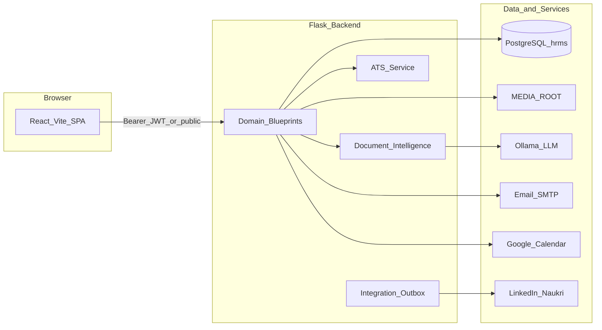
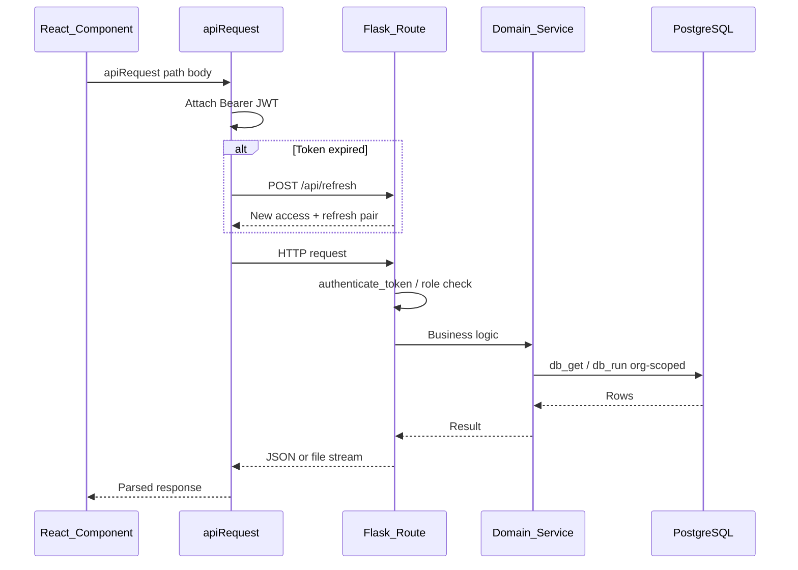
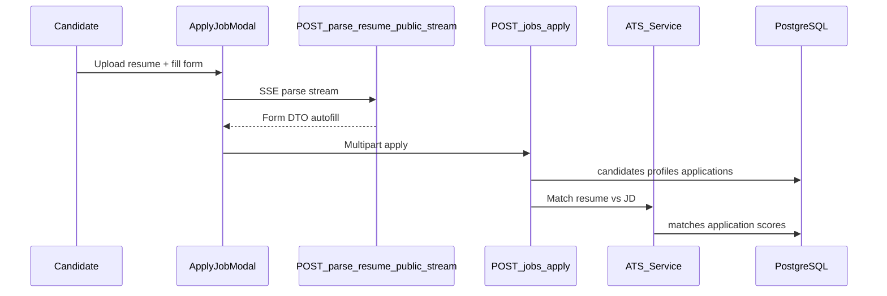
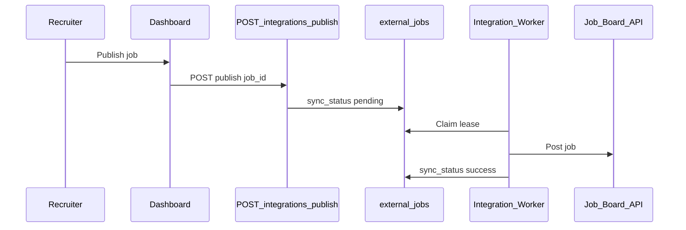
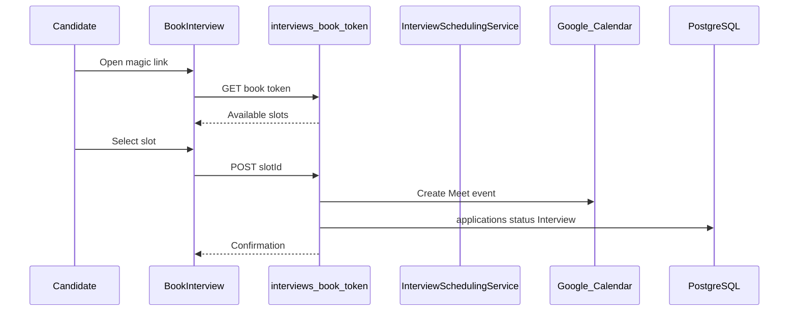
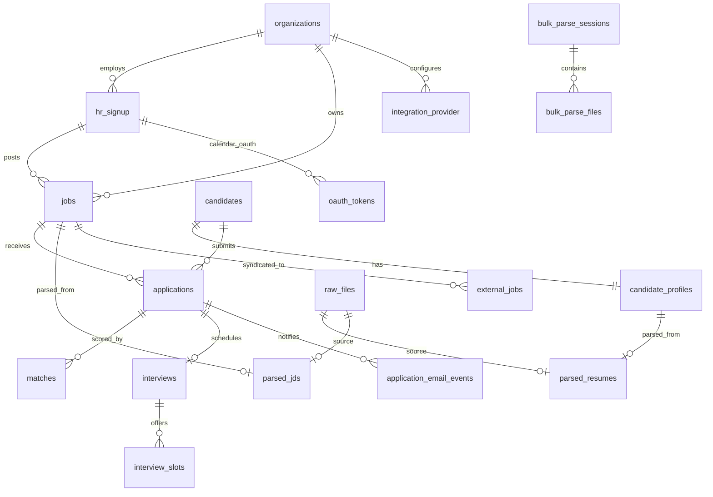
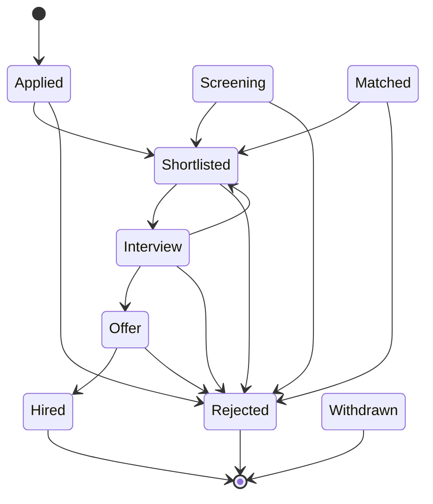
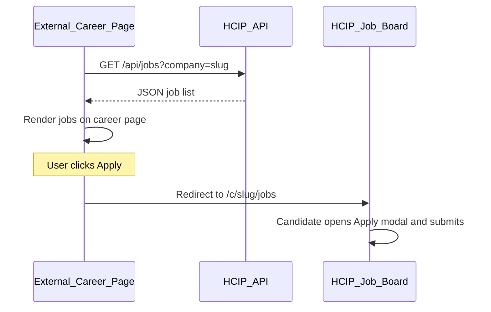

# Application Guide

Full app map: architecture, user flows, API, data model, and career page integration.

**Rule:** If this doc disagrees with code, trust live routes in `apps/backend/app/bootstrap/create_app.py` and `apps/frontend/src/routes/index.jsx`.

## Contents
- [Application overview](#application-overview)
- [User Flows](#user-flows)
- [API Reference](#api-reference)
- [Data Model](#data-model)
- [Career Page Integration](#career-page-integration)

---

## Application overview

<a id="application-overview"></a>

## What the product is

HCIP is a full-stack recruitment platform:

| Audience | What they do |
|----------|--------------|
| **Public candidates** | Browse jobs, upload a resume, apply (no login account) |
| **Recruiters** | Post jobs, review applications, run AI match scores, bulk-parse resumes, publish to job boards |
| **Head of HR** | Org-wide analytics, manage HR users, integrations, settings |
| **CEO** | Read-only org dashboard (same views as Head HR, no writes) |

**Important design choices:**

- **No candidate login accounts.** Candidates apply through public endpoints. Identity is email-based (`candidates` + `candidate_profiles`).
- **Multi-tenant.** Each organization has its own jobs, staff, and data. JWT carries `organization_id`.
- **Form DTO at the boundary.** The React app never receives raw AI output or TOON. Parsing APIs return Form DTOs; TOON is internal (DB + ATS).
- **Monolithic Flask backend + React SPA.** PostgreSQL is the system of record.

---

## Architecture



| Layer | Path | Technology |
|-------|------|------------|
| Frontend | `apps/frontend/` | React 18, Vite, React Router 6, Tailwind, Radix UI |
| Backend | `apps/backend/` | Flask, psycopg3, JWT, bcrypt, Flask-Mail |
| Desktop | `apps/desktop/` | Electron — native folder dialogs for bulk upload only |
| AI platform | `ai/` | Dataset, eval, Ollama runtime (separate from HRMS product path) |
| Database | PostgreSQL (`hrms`) | Alembic migrations in `apps/backend/alembic/` |
| Media files | `MEDIA_ROOT` (outside repo by default) | Resumes, JDs, hero video — see [OPERATIONS.md](OPERATIONS.md) |

**Dev proxy:** Vite forwards `/api` and `/health` to Flask on port 3000. Frontend default: `http://localhost:5173`. Backend: `http://localhost:3000`.

---

## Roles and access

Three staff roles. Permissions are defined in `apps/backend/app/domains/identity/authorization/rbac.py` and mirrored in `apps/frontend/src/core/permissions/rbac.js`.

| Role | Summary | Frontend guard | After login redirect |
|------|---------|----------------|----------------------|
| `RECRUITER` | Day-to-day recruitment | `RecruiterGuard` | `/dashboard` |
| `HEAD_HR` | Full org admin + integrations | `HeadHrGuard` | `/head-hr` |
| `CEO` | Read-only analytics | `CeoGuard` | `/ceo` |

### Permission matrix

| Permission | CEO | HEAD_HR | RECRUITER |
|------------|-----|---------|-----------|
| `analytics:read` | Yes | Yes | No |
| `jobs:read_all` | Yes | Yes | No (own org jobs via `/api/jobs/all`) |
| `jobs:write_own` | No | Yes | Yes |
| `jobs:write_any` | No | Yes | No |
| `candidates:read_all` | Yes | Yes | No (own job applications) |
| `candidates:act_own` | No | Yes | Yes |
| `candidates:act_any` | No | Yes | No |
| `hr_users:manage` | No | Yes | No |
| `bulk_parse:run` | No | Yes | Yes |
| `settings:configure` | No | Yes | No |
| `developer:performance` | No | Yes | No |

CEO is **read-only** everywhere (`is_read_only` blocks writes). Head HR can manage HR users and integration credentials. Recruiters operate within their organization.

---

## Request lifecycle

Typical authenticated API call:



1. **Frontend** — `apiRequest()` in `apps/frontend/src/core/api/api.js` attaches `Authorization: Bearer`, retries on transient errors, refreshes tokens via `POST /api/refresh`, and logs out on 401.
2. **Middleware** — `apps/backend/app/api/middleware/auth.py` decodes JWT (HS256), rejects refresh tokens on access routes, applies `require_recruiter`, `require_head_hr`, etc.
3. **Domain layer** — Route handlers call services; services use `db_run` / `db_get` / `db_all` with org scoping from JWT claims.
4. **Response** — JSON for most endpoints; SSE for parse streams; multipart/binary for apply uploads and resume downloads.

**Special auth (not JWT):**

| Mechanism | Header / token | Used for |
|-----------|----------------|----------|
| Platform key | `X-Platform-Key` | `POST /api/platform/companies` |
| n8n callback | `X-N8N-Callback-Secret` | `POST /api/applications/ats/result` |
| Interview magic link | URL token | `GET/POST /api/interviews/book/:token` |
| Refresh token body | JSON `refresh_token` | `POST /api/refresh` |

---

## Backend module map

Registered in `apps/backend/app/bootstrap/create_app.py` — 17 blueprints under `/api`.

```
apps/backend/app/
├── bootstrap/create_app.py     App factory, CORS, blueprint registration
├── api/middleware/auth.py      JWT decorators
├── core/                       Auth, media storage, Redis, timing, logging
├── database/                   Postgres connection, Alembic
├── ai/                         Document Intelligence engine, parsers, TOON
├── integrations/               Email templates, OpenAI LLM helpers
├── workers/bulk_parser.py      In-process bulk parse fallback
└── domains/
    ├── identity/               HR auth, OTP, sessions, organizations, RBAC
    ├── recruitment/            Jobs, applications, parsing API, interviews, ATS
    ├── candidate/              HR-scoped candidate profile reads
    ├── administration/         Bulk parse, Head HR APIs, platform provisioning, dev tools
    ├── integrations/           Job board providers, calendar OAuth, outbox worker
    ├── employee/               Internal HRMS feedback
    └── support/                Contact form, public media (hero video)
```

| Domain | Key services | Responsibility |
|--------|--------------|----------------|
| **Identity** | `sessions/service.py`, `organizations.py`, `otp/` | Login, OTP, refresh tokens, org tenancy |
| **Recruitment** | `ats_service.py`, `interview_scheduling_service.py`, `parsing_storage.py`, `notifications.py` | Jobs, apply, match scores, interviews |
| **Administration** | `bulk_parsing.py` | Bulk resume sessions, org analytics |
| **Integrations** | `service/manager.py`, `publish_service.py`, `worker/` | LinkedIn/Naukri publish, Google Calendar |
| **AI** | `document_intelligence/pipeline.py` | Resume/JD parse → Form DTO + TOON |

---

## Frontend module map

```
apps/frontend/src/
├── app/                    main.jsx, App.jsx (shell, providers, Suspense)
├── routes/index.jsx        Route table + guards
├── core/
│   ├── api/                apiRequest, parsingApi, healthCheck
│   ├── auth/               Guards, tokenService
│   ├── context/            AppContext, ThemeContext, OrgPanelContext
│   └── permissions/rbac.js
├── features/
│   ├── jobs/               Landing wrapper, job board, ApplyJobModal
│   ├── auth/               Login, signup, forgot-password
│   ├── dashboard/          Recruiter dashboard, applied candidates
│   ├── organization/       Head HR + CEO org panels
│   ├── admin/              Bulk parser, feedback admin, performance dashboard
│   ├── interview/          BookInterview, calendar/booking APIs
│   ├── settings/           Settings, integrations panel
│   ├── support/            FAQ, contact, HRMS feedback
│   └── analytics/          MatchExplanation UI components
└── shared/components/      ResumeUploadWithParsing, JDUploadWithParsing, ui/*
```

**State management:** React Context (`AppContext` for auth + jobs) + `localStorage` for tokens. No Redux or React Query.

**Org panel reuse:** Head HR and CEO share the same job/candidate page components. `OrgPanelContext` sets `basePath` (`/head-hr` or `/ceo`) and `readOnly` (CEO).

---

## External dependencies

Configured via `apps/backend/.env` (see `.env.example`). All are optional except Postgres and JWT secret in production.

| Service | Env keys | Used for |
|---------|----------|----------|
| PostgreSQL | `DATABASE_URL` or `POSTGRES_*` | All persistent data |
| Ollama | `OLLAMA_HOST`, `OLLAMA_MODEL`, `HCIP_HARDWARE_PROFILE` | Resume/JD parsing (Document Intelligence) |
| External ATS API | `ATS_API_URL`, `ATS_API_KEY`, `ATS_THRESHOLD` | Match scoring (fallback: in-process `ats_service.py`) |
| n8n webhook | `N8N_WEBHOOK_URL`, `N8N_CALLBACK_SECRET` | Optional async ATS pipeline |
| Bulk parser | `BULK_PARSER_URL` | External bulk resume service (fallback: in-process worker) |
| Redis | `REDIS_URL` | Rate limits; required when `GUNICORN_WORKERS>1` for parse stream join |
| Google Calendar OAuth | `GOOGLE_OAUTH_CLIENT_ID`, `GOOGLE_OAUTH_CLIENT_SECRET`, `GOOGLE_OAUTH_REDIRECT_URI` | Interview scheduling |
| Integration secrets | `INTEGRATION_SECRETS_KEY` | Encrypt job-board provider credentials |
| Platform provisioning | `PLATFORM_PROVISION_KEY` | Create org + Head HR via API |
| SMTP | `MAIL_*` | OTP, candidate notifications, support alerts |
| Media storage | `MEDIA_ROOT`, `HCIP_DATA_HOME` | Resume/JD files, hero video |

---

## Key terminology

| Term | Meaning |
|------|---------|
| **Organization** | Tenant — owns jobs, staff, integration config |
| **Form DTO** | JSON shape returned to React from parse APIs (safe, mapped fields) |
| **TOON** | Internal structured document format stored in DB; fed to ATS matcher |
| **CID** | Candidate ID — passwordless applicant identity |
| **HRID** | HR staff user ID |
| **JDID** | Job description ID |
| **Outbox** | `external_jobs` rows with `sync_status=pending` processed by integration worker |

---

## Where to go next

| Topic | Document |
|-------|----------|
| External career page (fetch jobs + apply redirect) | [Career page integration](#career-page-integration) · partner PDF in `docs/external/` |
| Every user journey (step-by-step) | [User flows](#user-flows) |
| Complete API catalog | [API reference](#api-reference) |
| Database tables and relationships | [Data model](#data-model) |
| Document parsing pipeline | [AI.md](AI.md#document-intelligence) |
| AI engineering workflow | [AI.md](AI.md) |
| Local setup | [DEVELOPMENT.md](DEVELOPMENT.md) |
| Operational commands | [DEVELOPMENT.md](DEVELOPMENT.md#operational-workflows) |
| End-user manuals | [user-manual/](user-manual/README.md) |

---

## User Flows

<a id="user-flows"></a>

End-to-end journeys for the HR Intelligence Platform. Each flow lists who triggers it, which frontend routes and components are involved, the API call sequence, backend logic, database tables touched, and side effects.

Hub overview: [Application overview](#application-overview) · API details: [API reference](#api-reference) · Schema: [Data model](#data-model)

---

## Flow template

Every numbered flow below follows this structure:

- **Who** — role or public
- **Trigger** — user action
- **Frontend** — route + components
- **API sequence** — ordered HTTP calls
- **Backend** — services and decisions
- **Data** — PostgreSQL tables
- **Side effects** — email, ATS, integrations, status changes

---

## 1. Public landing and hero video

**Who:** Public visitor

**Trigger:** Opens `/`

**Frontend:** `features/jobs/pages/Home.jsx` → `features/landing/LandingPage.jsx` — marketing hero, demo modal, enter-to-app transition

**API sequence:**

1. `GET /api/media/public/hero-video` — stream landing page video (optional; may use static asset or CDN via `VITE_HERO_VIDEO_URL`)

**Backend:** `domains/support/api/media.py` reads from `site_assets` catalog + `MEDIA_ROOT` bytes

**Data:** `site_assets`

**Side effects:** None

---

## 2. Browse public job board

**Who:** Public (optional staff JWT enriches view)

**Trigger:** Navigates to `/jobs` or `/c/:companySlug/jobs`

**Frontend:** `features/jobs/pages/Jobs.jsx` — filters, job cards, apply button

**API sequence:**

1. `GET /api/jobs` — public listings (query `?company=` or org slug filters board)
2. Staff logged in may use `GET /api/jobs/all` via `AppContext.fetchJobs(staff=true)`

**Backend:** `domains/recruitment/api/jobs.py` — filters enabled/published jobs by organization; `optional_authenticate_token` for public access

**Data:** `jobs`, `organizations`

**Side effects:** None

---

## 3. Candidate apply (resume parse + submit)

**Who:** Public candidate

**Trigger:** Clicks Apply on a job → fills form in `ApplyJobModal`

**Frontend:** `features/jobs/components/ApplyJobModal.jsx`, `shared/components/ResumeUploadWithParsing.jsx` (`publicMode=true`)

**API sequence:**

1. `POST /api/parse/resume/public/stream` — SSE stream; returns Form DTO fields for autofill
2. `POST /api/jobs/:jobId/apply` — multipart FormData (resume file + profile fields)

**Backend:**

- Parse: `document_intelligence/pipeline.py` → Form DTO to client; TOON + `parsed_resumes` persisted
- Apply: `jobs.py` creates/updates `candidates`, `candidate_profiles`, `applications`; stores resume in `MEDIA_ROOT`; triggers ATS (flow 4)

**Data:** `candidates`, `candidate_profiles`, `candidate_experiences`, `candidate_education`, `applications`, `raw_files`, `parsed_resumes`, `jobs`

**Side effects:** ATS scoring queued (flow 4); confirmation email if configured



---

## 4. ATS scoring after apply

**Who:** System (triggered by apply or webhook)

**Trigger:** New application created with parsed resume + job JD TOON

**Frontend:** None directly — scores appear later in recruiter/Head HR views

**API sequence (sync path):**

- In-process: `ats_service.py` called from apply handler

**API sequence (async n8n path):**

1. Backend posts to `N8N_WEBHOOK_URL` (if configured)
2. `POST /api/applications/ats/result` — n8n callback with `X-N8N-Callback-Secret`

**Backend:** `domains/recruitment/services/ats_service.py`

| Category | Weight |
|----------|--------|
| Core technical skills (mandatory + preferred) | 60% |
| Relevant experience | 25% |
| Education / certifications | 10% |
| Location / availability | 5% |

**Scoring rules:**

- Mandatory skills match &lt; 40% → **Not a Match** (stays `Applied`, talent pool)
- Overall ≥ 80% → **Strong Match** → auto-`Shortlisted`
- 40–79% → **Potential Match** → recruiter review (not auto-shortlisted)
- &lt; 40% → Not a Match (not auto-`Rejected`)

**Data:** `applications` (`match_score`, `matching_percentage`, `shortlisted`, `ats_reasoning`), `matches`

**Side effects:** Status may move to `Shortlisted`; shortlisted triggers interview scheduling (flow 13)

---

## 5. HR signup and OTP verification

**Who:** New HR staff (self-signup may be disabled in production)

**Trigger:** `/signup/admin` form submit

**Frontend:** `features/auth/pages/SignupAdmin.jsx`

**API sequence:**

1. `POST /api/signup` — creates pending `hr_signup`, sends OTP email (returns 400 if provisioning disabled)
2. `POST /api/verify-otp` — validates OTP, activates account, returns JWT pair
3. `POST /api/resend-otp` — resend if needed

**Backend:** `domains/identity/api/hr_auth.py`, `otp/otp_utils.py`, `sessions/service.py`

**Data:** `hr_signup`, `auth_refresh_tokens`, `login_history`

**Side effects:** Welcome email; auto-login after verify

---

## 6. Staff login and role redirect

**Who:** RECRUITER, HEAD_HR, or CEO

**Trigger:** `/login/admin` form submit

**Frontend:** `features/auth/pages/LoginAdmin.jsx` → `AppContext.loginHR()`

**API sequence:**

1. `POST /api/login` — bcrypt password check, issue access + refresh JWT

**Backend:** Rate limiting after 8 failures / 15 min lockout; new-device email alert; refresh token registered by JTI hash

**Data:** `hr_signup`, `auth_refresh_tokens`, `login_history`

**Side effects:** Redirect by role — Recruiter → `/dashboard`, Head HR → `/head-hr`, CEO → `/ceo`

---

## 7. Forgot password (OTP chain)

**Who:** HR staff

**Trigger:** Forgot password link on login page

**Frontend:** `ForgotPasswordRequest.jsx` → `ForgotPasswordVerify.jsx` → `ForgotPasswordReset.jsx` (variant in URL)

**API sequence:**

1. `POST /api/forgot-password` — send OTP (domain-restricted email)
2. `POST /api/forgot-password/resend-otp`
3. `POST /api/forgot-password/verify-otp`
4. `POST /api/reset-password` — set new password

**Backend:** `hr_auth.py` + OTP utilities; same rate limiting as signup

**Data:** `hr_signup` (password hash, OTP fields)

**Side effects:** Password reset email

---

## 8. JWT refresh, logout, and sessions

**Who:** Logged-in HR staff

**Trigger:** Token expiry, manual logout, or session management

**Frontend:** `core/api/api.js` (auto-refresh), settings/session UI if exposed

**API sequence:**

1. `POST /api/refresh` — rotate access + refresh pair (validates JTI in DB)
2. `POST /api/logout` — deactivate refresh token
3. `GET /api/sessions/my-sessions` — list active sessions
4. `GET /api/sessions/my-history` — login history
5. `POST /api/sessions/logout-session` — revoke one session
6. `POST /api/sessions/logout-all` — revoke all sessions

**Backend:** `domains/identity/sessions/service.py`

**Data:** `auth_refresh_tokens`, `login_history`

**Side effects:** Cleared tokens in `localStorage` on 401

---

## 9. Recruiter create/edit job (+ JD parse)

**Who:** RECRUITER or HEAD_HR

**Trigger:** Dashboard job form — create or edit

**Frontend:** `features/dashboard/components/recruiter/RecruiterJobDashboard.jsx`, `shared/components/JDUploadWithParsing.jsx`

**API sequence:**

1. `POST /api/parse/jd/stream` — SSE parse uploaded JD file → Form DTO autofill
2. `POST /api/jobs` — create job
3. `PUT /api/jobs/:jobId` — update job
4. `PATCH /api/jobs/:jobId/enabled` — publish/pause toggle
5. `DELETE /api/jobs/:jobId` — delete job

**Backend:** `jobs.py` + `parsing_storage.py`; job status syncs with `enabled` via DB trigger

**Data:** `jobs`, `parsed_jds`, `raw_files`

**Side effects:** If auto-publish enabled, integration outbox may enqueue (flow 10)

---

## 10. Publish job to external job boards

**Who:** RECRUITER or HEAD_HR

**Trigger:** Publish button on dashboard or integrations UI

**Frontend:** `features/settings/services/integrationsApi.js`, `ExternalPublishingSection` on dashboard

**API sequence:**

1. `GET /api/integrations/providers` — list configured providers
2. `POST /api/integrations/publish/:job_id` — enqueue publish
3. `POST /api/integrations/republish/:job_id` — republish after edit
4. `POST /api/integrations/retry/:external_job_id` — retry failed publish
5. `GET /api/integrations/jobs` — external job sync status

**Backend:** `publish_service.py` writes `external_jobs` with `sync_status=pending`; integration worker claims leases and calls LinkedIn/Naukri adapters

**Data:** `external_jobs`, `integration_provider`, `sync_logs`

**Side effects:** Job appears on external board when worker succeeds



---

## 11. Recruiter review applications

**Who:** RECRUITER

**Trigger:** Opens `/candidates` or job applications panel

**Frontend:** `features/dashboard/pages/AppliedCandidates.jsx`, `features/analytics/components/MatchExplanation/*`

**API sequence:**

1. `GET /api/jobs/all` — recruiter's org jobs
2. `GET /api/jobs/:jobId/applications` — applicants with match scores
3. `GET /api/candidate/profile/:candidateId` — profile detail
4. `POST /api/jobs/:jobId/applications/:candidateId/viewed` — mark profile viewed → `Screening`
5. `GET /api/jobs/:jobId/applications/:candidateId/resume` — download resume PDF
6. `PATCH /api/jobs/:jobId/applications/:candidateId/status` — change status

**Backend:** Org-scoped access via `rbac.can_access_application`; match data from `applications` + `matches`

**Data:** `applications`, `candidate_profiles`, `matches`, `jobs`

**Side effects:** Status change emails via `notifications.py`; shortlist triggers interview flow (13)

---

## 12. Application status lifecycle

**Who:** System (ATS) or RECRUITER / HEAD_HR (manual)

**Trigger:** ATS auto-shortlist, recruiter PATCH, or interview booking

**Canonical statuses** (`apps/backend/app/common/application_status.py`):

`Applied` → `Screening` → `Matched` → `Shortlisted` → `Interview` → `Offer` → `Hired`

Terminal: `Rejected`, `Withdrawn`, `Hired`

**Allowed recruiter transitions:**

| From | To |
|------|-----|
| Applied, Screening, Matched | Shortlisted, Rejected |
| Shortlisted | Interview, Rejected |
| Interview | Offer, Rejected, Shortlisted |
| Offer | Hired, Rejected |

**Backend:** `can_transition()` enforced on PATCH; `interview_trigger.py` fires after Shortlisted

**Data:** `applications`

**Side effects:** Email on shortlisted/rejected; interview invite on Shortlisted (flow 13)

---

## 13. Interview scheduling (Google Calendar connect)

**Who:** RECRUITER (connects calendar); system (sends invite)

**Trigger:** Application reaches `Shortlisted` and recruiter has Google Calendar connected

**Frontend:** `features/interview/components/GoogleCalendarConnectCard.jsx`, settings integrations tab

**API sequence:**

1. `GET /api/integrations/calendar/google/connect` — start OAuth
2. Google redirects to `GET /api/integrations/calendar/google/callback`
3. `GET /api/integrations/calendar/google/status`
4. On shortlist: `InterviewSchedulingService` creates slots + sends email with `/book/:token` link

**Backend:** `interview_scheduling_service.py` — FreeBusy lookup, slot generation, magic-link token

**Data:** `oauth_tokens`, `interviews`, `interview_slots`, `application_email_events`

**Side effects:** Candidate receives booking email

---

## 14. Candidate books interview

**Who:** Public candidate (magic link)

**Trigger:** Opens link from email → `/book/:token`

**Frontend:** `features/interview/pages/BookInterview.jsx`

**API sequence:**

1. `GET /api/interviews/book/:token` — available slots + job context
2. `POST /api/interviews/book/:token` — `{ slotId }` books slot

**Backend:** Rechecks FreeBusy, creates Google Meet event, sets application status to `Interview`, sends confirmation emails

**Data:** `interviews`, `interview_slots`, `applications`, `application_email_events`

**Side effects:** Calendar event for recruiter + candidate; status → `Interview`



---

## 15. Head HR org overview and analytics

**Who:** HEAD_HR (CEO read-only variant — flow 18)

**Trigger:** Opens `/head-hr`

**Frontend:** `features/organization/pages/org/OrgOverviewDashboard.jsx`

**API sequence:**

1. `GET /api/head-hr/stats` — org KPIs
2. `GET /api/head-hr/applications` — all org applications
3. `GET /api/head-hr/jobs` — all org jobs

**Backend:** `head_hr.py` with `require_analytics_read` or Head HR write permissions

**Data:** Aggregates over `jobs`, `applications`, `hr_signup`, `candidates`

**Side effects:** None

---

## 16. Head HR admin user CRUD

**Who:** HEAD_HR only

**Trigger:** `/head-hr/admins`

**Frontend:** `features/organization/pages/head-hr/HeadHrAdmins.jsx`

**API sequence:**

1. `GET /api/head-hr/admins`
2. `POST /api/head-hr/admins` — create recruiter/Head HR user
3. `PUT /api/head-hr/admins/:hrid`
4. `DELETE /api/head-hr/admins/:hrid`

**Backend:** `hr_users:manage` permission; bcrypt password on create

**Data:** `hr_signup`

**Side effects:** Welcome email for new admin

---

## 17. Head HR candidate and job management

**Who:** HEAD_HR

**Trigger:** Org panel sidebar routes under `/head-hr/*`

**Frontend:** `HeadHrCandidates.jsx`, `HeadHrCandidateDetail.jsx`, `HeadHrJobs.jsx`, `HeadHrJobDetail.jsx`, `HeadHrJobCandidateDetail.jsx`

**API sequence:**

1. `GET /api/head-hr/candidates`, `GET /api/head-hr/candidates/:cid`
2. `GET /api/head-hr/candidates/:cid/resume` — file download
3. `DELETE /api/head-hr/candidates/:cid`
4. `GET /api/head-hr/jobs`, `GET /api/head-hr/jobs/:jdid`, `DELETE /api/head-hr/jobs/:jdid`
5. `GET /api/head-hr/jobs/:jdid/interviews`, `GET /api/head-hr/jobs/:jdid/emails`
6. `GET /api/head-hr/applications`, `GET /api/head-hr/applications/:appId`
7. Shared job write APIs: `PUT /api/jobs/:jdid`, `PATCH /api/jobs/:jdid/enabled`

**Backend:** Org-scoped; Head HR can delete candidates/jobs across org

**Data:** Same as recruiter flows plus org-wide scope

**Side effects:** Same as flows 11–13

---

## 18. CEO read-only org panel

**Who:** CEO

**Trigger:** `/ceo/*` routes

**Frontend:** `CeoDashboard.jsx` wraps shared Head HR pages with `OrgPanelProvider readOnly={true}`

**API sequence:** Same GET endpoints as Head HR (`/api/head-hr/*`); write APIs blocked by `is_read_only` on backend and disabled UI on frontend

**Backend:** `analytics:read` permission only

**Data:** Read-only access to org data

**Side effects:** None

---

## 19. Bulk resume parsing session

**Who:** RECRUITER or HEAD_HR

**Trigger:** `/admin/bulk-resume-parser` or `/head-hr/bulk-parsing`

**Frontend:** `features/admin/pages/admin/BulkResumeParser.jsx`, `bulkParsingService.js`

**API sequence:**

1. `POST /api/admin/bulk-parse/jobs` — create session
2. `POST /api/admin/bulk-parse/upload` — upload files/ZIP (multipart)
3. `POST /api/admin/bulk-parse/start/:jobId`
4. `GET /api/admin/bulk-parse/progress/:jobId` — poll status
5. `POST /api/admin/bulk-parse/pause/:jobId` / `resume/:jobId`
6. `GET /api/admin/bulk-parse/download/:jobId` — Excel results

**Backend:** Proxies to `BULK_PARSER_URL` when reachable; fallback `workers/bulk_parser.py`

**Data:** `bulk_parse_sessions`, `bulk_parse_files`, `parsed_resumes`

**Side effects:** Parsed rows exported to spreadsheet

---

## 20. Integrations setup (providers)

**Who:** HEAD_HR (configure); RECRUITER (sync/publish)

**Trigger:** `/settings?tab=integrations`, `/integrations`, or `/head-hr/integrations`

**Frontend:** `IntegrationsSettingsPanel.jsx`, `IntegrationsDashboard.jsx`

**API sequence:**

1. `GET /api/integrations/providers`
2. `POST /api/integrations/provider` — create config
3. `PUT /api/integrations/provider/:provider`
4. `POST /api/integrations/provider/:provider/connect`
5. `POST /api/integrations/provider/:provider/test`
6. `POST /api/integrations/provider/:provider/sync`
7. `GET /api/integrations/dashboard`, `GET /api/integrations/logs`

**Backend:** `integration/manager.py`; credentials encrypted with `INTEGRATION_SECRETS_KEY`

**Data:** `integration_provider`, `external_jobs`, `sync_logs`

**Side effects:** Provider connection status updated

---

## 21. Support contact form

**Who:** Public or logged-in user

**Trigger:** `/support/contact`

**Frontend:** `features/support/pages/ContactUs.jsx`

**API sequence:**

1. `POST /api/support/submit`

**Backend:** `support/api/routes.py` — stores ticket, emails support team

**Data:** `support_requests`

**Side effects:** Email to `SUPPORT_NOTIFICATION_EMAIL`

---

## 22. HRMS internal feedback

**Who:** Internal testers / staff

**Trigger:** `/support/hrms-feedback`

**Frontend:** `features/support/pages/HRMSTestingFeedback.jsx`

**API sequence:**

1. `POST /api/feedback/submit` — optional screenshot multipart
2. `GET /api/feedback/list` — Recruiter/Head HR admin view
3. `PATCH /api/feedback/:feedbackId/status`

**Backend:** `employee/api/feedback.py`

**Data:** `employee_feedback`

**Side effects:** Email to `FEEDBACK_NOTIFICATION_EMAIL`

---

## 23. Platform company provisioning

**Who:** External platform operator (no UI)

**Trigger:** API call to provision new tenant

**API sequence:**

1. `POST /api/platform/companies` — header `X-Platform-Key: PLATFORM_PROVISION_KEY`

**Backend:** `administration/api/platform.py` — creates `organizations` + initial HEAD_HR user

**Data:** `organizations`, `hr_signup`

**Side effects:** New tenant ready for Head HR login

---

## 24. Developer performance mode

**Who:** HEAD_HR only (when `DEVELOPER_MODE=true`)

**Trigger:** `/head-hr/developer`

**Frontend:** `features/admin/pages/admin/PerformanceDashboard.jsx`, `developerPerformanceService.js`

**API sequence:**

1. `GET /api/admin/developer/status`
2. `GET /api/admin/developer/performance/recent`
3. `GET /api/admin/developer/performance/stats`
4. `GET /api/admin/developer/performance/request/:requestId`
5. `GET /api/admin/developer/performance/export`
6. `POST|DELETE /api/admin/developer/performance/clear`

**Backend:** `timing_collector.py` in-memory trace; disabled in production Gunicorn

**Data:** None (in-memory only)

**Side effects:** None

---

## Frontend route index

Quick map from URL to flow numbers:

| Route | Flow(s) |
|-------|---------|
| `/` | 1 |
| `/jobs`, `/c/:slug/jobs` | 2, 3 |
| `/book/:token` | 14 |
| `/login`, `/login/admin` | 6 |
| `/signup/admin` | 5 |
| `/forgot-password/*` | 7 |
| `/dashboard` | 9, 10 |
| `/candidates` | 11, 12 |
| `/settings`, `/integrations` | 8, 20 |
| `/admin/bulk-resume-parser` | 19 |
| `/admin/feedback` | 22 |
| `/head-hr/*` | 15–17, 19–20, 24 |
| `/ceo/*` | 18 |
| `/support/contact` | 21 |
| `/support/hrms-feedback` | 22 |

---

## Related deep dives

| Topic | Document |
|-------|----------|
| Parse pipeline internals | [AI.md](AI.md#document-intelligence) |
| Interview + Calendar env vars | [DEVELOPMENT.md](DEVELOPMENT.md#operational-workflows) |
| Media file layout | [OPERATIONS.md](OPERATIONS.md) |

---

## API Reference

<a id="api-reference"></a>

Complete HTTP API catalog for the HR Intelligence Platform backend. If this doc disagrees with code, trust `apps/backend/app/bootstrap/create_app.py` and domain route modules.

Related: [Application overview](#application-overview) · [User flows](#user-flows)

**Base URL:** `http://localhost:3000` (dev) or production API origin. Frontend uses `VITE_API_URL` or same-origin proxy.

**Auth legend:**

| Value | Meaning |
|-------|---------|
| Public | No token required |
| Optional JWT | Works anonymously; enriches response if Bearer present |
| JWT | Valid access token required |
| Recruiter | JWT + role RECRUITER or HEAD_HR |
| Head HR | JWT + role HEAD_HR |
| Analytics | JWT + CEO or HEAD_HR (`analytics:read`) |
| Refresh | Refresh token in JSON body (not Bearer) |
| Platform key | Header `X-Platform-Key` |
| n8n secret | Header `X-N8N-Callback-Secret` |
| Magic link | URL token (interview booking) |

**Response formats:** Most endpoints return JSON. Exceptions noted as SSE, multipart, or file download.

---

## App-level (no blueprint)

| Method | Path | Auth | Purpose | Frontend consumer |
|--------|------|------|---------|-------------------|
| GET | `/` | Public | API root / metadata | — |
| GET | `/health` | Public | Liveness probe | `core/api/healthCheck.js` |
| GET | `/ready` | Public | Readiness (DB connected) | — |
| GET, OPTIONS | `/api/test-cors` | Public | CORS debug (FLASK_DEBUG only) | — |

---

## Auth and identity — prefix `/api`

Blueprint: `auth` — `domains/identity/api/hr_auth.py`

| Method | Path | Auth | Purpose | Frontend consumer |
|--------|------|------|---------|-------------------|
| POST | `/api/signup` | Public | HR signup (may return 400 if disabled) | `AppContext.signupHR` |
| POST | `/api/verify-otp` | Public | Verify signup OTP | `AppContext.verifyHROTP` |
| POST | `/api/resend-otp` | Public | Resend signup OTP | `AppContext.resendHROTP` |
| POST | `/api/forgot-password` | Public | Start password reset | `AppContext.forgotPassword` |
| POST | `/api/forgot-password/resend-otp` | Public | Resend reset OTP | `AppContext.resendForgotOTP` |
| POST | `/api/forgot-password/verify-otp` | Public | Verify reset OTP | `AppContext.verifyForgotOTP` |
| POST | `/api/reset-password` | Public | Set new password | `AppContext.resetPassword` |
| POST | `/api/login` | Public | Staff login → JWT pair | `AppContext.loginHR` |
| POST | `/api/change-password` | JWT | Change password while logged in | `AppContext.changePassword` |
| POST | `/api/refresh` | Refresh | Rotate access + refresh tokens | `core/api/api.js` |
| POST | `/api/logout` | Optional JWT | Invalidate refresh token | `AppContext.logoutHR` |

---

## Companies — prefix `/api/companies`

Blueprint: `companies` — `domains/identity/api/companies.py`

| Method | Path | Auth | Purpose | Frontend consumer |
|--------|------|------|---------|-------------------|
| GET | `/api/companies/` | Public | List organizations for job board | Job board company filter |

---

## Platform provisioning — prefix `/api/platform`

Blueprint: `platform` — `domains/administration/api/platform.py`

| Method | Path | Auth | Purpose | Frontend consumer |
|--------|------|------|---------|-------------------|
| POST | `/api/platform/companies` | Platform key | Create org + Head HR user | External / none |

---

## Sessions — prefix `/api/sessions`

Blueprint: `sessions` — `domains/identity/sessions/routes.py`

| Method | Path | Auth | Purpose | Frontend consumer |
|--------|------|------|---------|-------------------|
| GET | `/api/sessions/my-sessions` | JWT | Active sessions | Settings (if exposed) |
| GET | `/api/sessions/my-history` | JWT | Login history | Settings (if exposed) |
| POST | `/api/sessions/logout-session` | JWT | Revoke one session | — |
| POST | `/api/sessions/logout-all` | JWT | Revoke all sessions | — |

---

## Jobs — prefix `/api/jobs`

Blueprint: `jobs` — `domains/recruitment/api/jobs.py`

**External career pages:** public list/detail endpoints (`GET /api/jobs`, `GET /api/jobs/:jobId`) and apply redirect URLs are documented in [Career page integration](#career-page-integration).

| Method | Path | Auth | Purpose | Frontend consumer |
|--------|------|------|---------|-------------------|
| GET | `/api/jobs/` | Optional JWT | Public job board listings | `AppContext.fetchJobs`, `Jobs.jsx` |
| GET | `/api/jobs/all` | Recruiter | All org jobs for staff | `AppContext.fetchJobs(staff)` |
| GET | `/api/jobs/:jobId` | Optional JWT | Single job detail | Job detail modals |
| POST | `/api/jobs/` | Recruiter | Create job | `AppContext.createJob` |
| PUT | `/api/jobs/:jobId` | Recruiter | Update job | `AppContext.updateJob`, Head HR edit |
| PATCH | `/api/jobs/:jobId/enabled` | Recruiter | Publish/pause toggle | Dashboard, OrgOverview |
| DELETE | `/api/jobs/:jobId` | Recruiter | Delete job | Dashboard |
| GET | `/api/jobs/:jobId/applications` | Recruiter | List applicants + scores | `AppContext.fetchApplications` |
| GET | `/api/jobs/:jobId/applications/:candidateId/resume` | Recruiter | Download resume file | `AppliedCandidates.jsx` |
| POST | `/api/jobs/:jobId/applications/:candidateId/viewed` | Recruiter | Mark profile viewed | `AppliedCandidates.jsx` |
| PATCH | `/api/jobs/:jobId/applications/:candidateId/status` | Recruiter | Update application status | `ApplicationStatusActions.jsx` |
| POST | `/api/jobs/:jobId/apply` | Public | Candidate apply (multipart) | `ApplyJobModal.jsx` |

---

## Applications — prefix `/api/applications`

Blueprint: `applications` — `domains/recruitment/api/applications.py`

| Method | Path | Auth | Purpose | Frontend consumer |
|--------|------|------|---------|-------------------|
| POST | `/api/applications/ats/result` | n8n secret | ATS webhook callback | n8n / external |

---

## Document parsing — prefix `/api`

Blueprint: `parsing` — `domains/recruitment/api/parsing.py`

| Method | Path | Auth | Purpose | Frontend consumer |
|--------|------|------|---------|-------------------|
| POST | `/api/parse/resume/public` | Public | Parse resume → Form DTO (JSON) | — |
| POST | `/api/parse/resume/public/stream` | Public | Parse resume SSE stream | `ResumeUploadWithParsing` (public) |
| POST | `/api/parse/resume` | JWT | Parse resume (authenticated) | — |
| POST | `/api/parse/resume/stream` | JWT | Parse resume SSE | `ResumeUploadWithParsing` |
| POST | `/api/parse/jd` | Recruiter | Parse JD (JSON) | — |
| POST | `/api/parse/jd/stream` | Recruiter | Parse JD SSE stream | `JDUploadWithParsing.jsx` |
| GET | `/api/parse/jobs/:jobId/progress` | Public | Parse job progress poll | — |
| GET | `/api/parsed/resume/:parsedId` | JWT | Fetch stored parsed resume | — |
| GET | `/api/parsed/jd/:parsedId` | JWT | Fetch stored parsed JD | — |

**Note:** SSE endpoints return `text/event-stream`, not JSON.

---

## Candidate — prefix `/api/candidate`

Blueprint: `candidate` — `domains/candidate/api/routes.py`

| Method | Path | Auth | Purpose | Frontend consumer |
|--------|------|------|---------|-------------------|
| GET | `/api/candidate/profile/:candidateId` | JWT | HR view of candidate profile | `AppliedCandidates.jsx` |

---

## Interviews — prefix `/api/interviews`

Blueprint: `interviews` — `domains/recruitment/api/interview_booking.py`

| Method | Path | Auth | Purpose | Frontend consumer |
|--------|------|------|---------|-------------------|
| GET | `/api/interviews/book/:token` | Magic link | Get slots for booking page | `bookingApi.fetchBooking` |
| POST | `/api/interviews/book/:token` | Magic link | Book a slot | `bookingApi.bookSlot` |
| GET | `/api/interviews/by-application/:applicationId` | Recruiter | Interview row for application | `bookingApi.fetchInterviewByApplication` |

---

## Admin bulk parse — prefix `/api/admin`

Blueprint: `admin` — `domains/administration/api/admin.py`

| Method | Path | Auth | Purpose | Frontend consumer |
|--------|------|------|---------|-------------------|
| POST | `/api/admin/bulk-parse/jobs` | Recruiter | Create bulk session | `bulkParsingService.js` |
| POST | `/api/admin/bulk-parse/upload` | Recruiter | Upload files/ZIP (multipart) | `bulkParsingService.js` |
| POST | `/api/admin/bulk-parse/start/:jobId` | Recruiter | Start processing | `bulkParsingService.js` |
| POST | `/api/admin/bulk-parse/pause/:jobId` | Recruiter | Pause session | `bulkParsingService.js` |
| POST | `/api/admin/bulk-parse/resume/:jobId` | Recruiter | Resume session | `bulkParsingService.js` |
| GET | `/api/admin/bulk-parse/progress/:jobId` | Recruiter | Poll progress | `bulkParsingService.js` |
| GET | `/api/admin/bulk-parse/download/:jobId` | Recruiter | Download Excel results | `bulkParsingService.js` (file) |
| GET | `/api/admin/job-matches` | Recruiter | ATS dashboard match data | — |

---

## Developer performance — prefix `/api/admin/developer`

Blueprint: `developer` — `domains/administration/api/developer.py`  
**Requires** `DEVELOPER_MODE=true` in backend env.

| Method | Path | Auth | Purpose | Frontend consumer |
|--------|------|------|---------|-------------------|
| GET | `/api/admin/developer/status` | Head HR | Dev mode enabled check | `developerPerformanceService.js` |
| GET | `/api/admin/developer/performance/recent` | Head HR | Recent request traces | `PerformanceDashboard.jsx` |
| POST, DELETE | `/api/admin/developer/performance/clear` | Head HR | Clear trace buffer | `developerPerformanceService.js` |
| GET | `/api/admin/developer/performance/request/:requestId` | Head HR | Single request trace | `developerPerformanceService.js` |
| GET | `/api/admin/developer/performance/stats` | Head HR | Aggregate stats | `developerPerformanceService.js` |
| GET | `/api/admin/developer/performance/export` | Head HR | Export traces (download) | `developerPerformanceService.js` |

---

## Head HR — prefix `/api/head-hr`

Blueprint: `head_hr` — `domains/administration/api/head_hr.py`

| Method | Path | Auth | Purpose | Frontend consumer |
|--------|------|------|---------|-------------------|
| GET | `/api/head-hr/stats` | Analytics | Org KPI dashboard | `OrgOverviewDashboard.jsx` |
| GET | `/api/head-hr/admins` | Analytics | List HR users | `HeadHrAdmins.jsx` |
| POST | `/api/head-hr/admins` | Head HR | Create HR user | `HeadHrAdmins.jsx` |
| PUT | `/api/head-hr/admins/:hrid` | Head HR | Update HR user | `HeadHrAdmins.jsx` |
| DELETE | `/api/head-hr/admins/:hrid` | Head HR | Delete HR user | `HeadHrAdmins.jsx` |
| GET | `/api/head-hr/candidates` | Analytics | List all org candidates | `HeadHrCandidates.jsx` |
| GET | `/api/head-hr/candidates/:cid` | Analytics | Candidate detail | `HeadHrCandidateDetail.jsx` |
| GET | `/api/head-hr/candidates/:cid/resume` | Analytics | Download resume | `CandidateProfilePanel.jsx` |
| DELETE | `/api/head-hr/candidates/:cid` | Head HR | Delete candidate | `HeadHrCandidates.jsx` |
| GET | `/api/head-hr/jobs` | Analytics | List all org jobs | `HeadHrJobs.jsx` |
| GET | `/api/head-hr/jobs/:jdid` | Analytics | Job detail + applications | `HeadHrJobDetail.jsx` |
| DELETE | `/api/head-hr/jobs/:jdid` | Head HR | Delete job | `HeadHrJobs.jsx` |
| GET | `/api/head-hr/jobs/:jdid/interviews` | Analytics | Interview schedule for job | `HeadHrJobDetail.jsx` |
| GET | `/api/head-hr/jobs/:jdid/emails` | Analytics | Email events for job | `HeadHrJobDetail.jsx` |
| GET | `/api/head-hr/applications` | Analytics | All org applications | Org panels |
| GET | `/api/head-hr/applications/:appId` | Analytics | Application detail + match | `HeadHrJobCandidateDetail.jsx` |

---

## Integrations — prefix `/api/integrations`

Blueprint: `integrations` — `domains/integrations/api/routes.py`

| Method | Path | Auth | Purpose | Frontend consumer |
|--------|------|------|---------|-------------------|
| GET | `/api/integrations/` | JWT | Integration summary | — |
| GET | `/api/integrations/providers` | JWT | Provider catalog | `integrationsApi.js` |
| GET | `/api/integrations/provider/:provider` | JWT | Provider config | `integrationsApi.js` |
| POST | `/api/integrations/provider` | Head HR | Create provider config | `integrationsApi.js` |
| PUT | `/api/integrations/provider/:provider` | Head HR | Update provider config | `integrationsApi.js` |
| DELETE | `/api/integrations/provider/:providerOrId` | Head HR | Delete provider config | `integrationsApi.js` |
| POST | `/api/integrations/provider/:provider/connect` | Head HR | Connect provider | `integrationsApi.js` |
| POST | `/api/integrations/provider/:provider/disconnect` | Head HR | Disconnect provider | `integrationsApi.js` |
| POST | `/api/integrations/provider/:provider/test` | JWT | Test connection | `integrationsApi.js` |
| POST | `/api/integrations/provider/:provider/sync` | Recruiter | Manual sync | `integrationsApi.js` |
| POST | `/api/integrations/publish/:jobId` | Recruiter | Publish job to boards | `integrationsApi.js` |
| POST | `/api/integrations/republish/:jobId` | Recruiter | Republish job | `integrationsApi.js` |
| POST | `/api/integrations/retry/:externalJobId` | Recruiter | Retry failed publish | `integrationsApi.js` |
| GET | `/api/integrations/jobs` | JWT | External job sync rows | `integrationsApi.js` |
| GET | `/api/integrations/applications` | JWT | External applications | `integrationsApi.js` |
| GET | `/api/integrations/logs` | JWT | Sync logs | `integrationsApi.js` |
| GET | `/api/integrations/status` | JWT | Overall status | `integrationsApi.js` |
| GET | `/api/integrations/dashboard` | JWT | Dashboard aggregation | `IntegrationsDashboard.jsx` |

---

## Google Calendar OAuth — prefix `/api/integrations`

Blueprint: `calendar_oauth` — `domains/integrations/api/calendar_oauth_routes.py`

| Method | Path | Auth | Purpose | Frontend consumer |
|--------|------|------|---------|-------------------|
| GET | `/api/integrations/calendar/google/connect` | Recruiter | Start OAuth flow | `calendarApi.js` |
| GET | `/api/integrations/calendar/google/callback` | Public | OAuth callback | Google redirect |
| GET | `/api/integrations/google/callback` | Public | OAuth callback alias | Google redirect |
| GET | `/api/integrations/calendar/google/status` | Recruiter | Connection status | `calendarApi.js` |
| DELETE | `/api/integrations/calendar/google/disconnect` | Recruiter | Revoke calendar access | `calendarApi.js` |

---

## Support — prefix `/api/support`

Blueprint: `support` — `domains/support/api/routes.py`

| Method | Path | Auth | Purpose | Frontend consumer |
|--------|------|------|---------|-------------------|
| POST | `/api/support/submit` | Public | Submit support ticket | `ContactUs.jsx` |
| GET | `/api/support/my-requests` | JWT | User's own tickets | — |
| GET | `/api/support/all` | Head HR | All tickets | — |
| GET | `/api/support/:requestId` | Head HR | Ticket detail | — |
| PATCH | `/api/support/:requestId/status` | Head HR | Update ticket status | — |

---

## Media — prefix `/api/media`

Blueprint: `media` — `domains/support/api/media.py`

| Method | Path | Auth | Purpose | Frontend consumer |
|--------|------|------|---------|-------------------|
| GET | `/api/media/public/hero-video` | Public | Stream landing hero video | `heroVideo.js` |
| GET | `/api/media/health` | Public | Media storage health | — |

---

## Feedback — prefix `/api/feedback`

Blueprint: `feedback` — `domains/employee/api/feedback.py`

| Method | Path | Auth | Purpose | Frontend consumer |
|--------|------|------|---------|-------------------|
| POST | `/api/feedback/submit` | Public | Submit HRMS feedback (multipart) | `HRMSTestingFeedback.jsx` |
| GET | `/api/feedback/list` | Recruiter | List feedback items | `FeedbackAdmin.jsx` |
| PATCH | `/api/feedback/:feedbackId/status` | Recruiter | Update feedback status | `FeedbackAdmin.jsx` |

---

## Frontend API client summary

| Module | Path | Role |
|--------|------|------|
| `core/api/api.js` | — | `apiRequest()`, token refresh, BASE_URL |
| `core/api/parsingApi.js` | `/api/parse/*` | SSE parse streams, Form DTO helpers |
| `core/api/healthCheck.js` | `/health` | Backend connectivity |
| `core/context/AppContext.jsx` | Auth + jobs | Login, signup, job CRUD, applications |
| `features/settings/services/integrationsApi.js` | `/api/integrations/*` | Provider CRUD, publish |
| `features/interview/services/calendarApi.js` | Calendar OAuth | Google connect/status |
| `features/interview/services/bookingApi.js` | `/api/interviews/*` | Public booking |
| `features/admin/services/bulkParsingService.js` | `/api/admin/bulk-parse/*` | Bulk sessions |
| `features/admin/services/developerPerformanceService.js` | `/api/admin/developer/*` | Perf traces |

**Direct `fetch` (bypasses `apiRequest`):** multipart apply, SSE streams, file downloads (resumes, bulk Excel, perf export).

---

## Blueprint registration reference

All blueprints registered in `apps/backend/app/bootstrap/create_app.py`:

| Blueprint | URL prefix | Module |
|-----------|------------|--------|
| `auth` | `/api` | `identity/api/hr_auth.py` |
| `companies` | `/api/companies` | `identity/api/companies.py` |
| `platform` | `/api/platform` | `administration/api/platform.py` |
| `jobs` | `/api/jobs` | `recruitment/api/jobs.py` |
| `candidate` | `/api/candidate` | `candidate/api/routes.py` |
| `applications` | `/api/applications` | `recruitment/api/applications.py` |
| `sessions` | `/api/sessions` | `identity/sessions/routes.py` |
| `parsing` | `/api` | `recruitment/api/parsing.py` |
| `support` | `/api/support` | `support/api/routes.py` |
| `media` | `/api/media` | `support/api/media.py` |
| `feedback` | `/api/feedback` | `employee/api/feedback.py` |
| `admin` | `/api/admin` | `administration/api/admin.py` |
| `developer` | `/api/admin/developer` | `administration/api/developer.py` |
| `head_hr` | `/api/head-hr` | `administration/api/head_hr.py` |
| `integrations` | `/api/integrations` | `integrations/api/routes.py` |
| `calendar_oauth` | `/api/integrations` | `integrations/api/calendar_oauth_routes.py` |
| `interviews` | `/api/interviews` | `recruitment/api/interview_booking.py` |

---

## Data Model

<a id="data-model"></a>

PostgreSQL schema for the HR Intelligence Platform. Source of truth: `apps/backend/alembic/` (baseline in `alembic/baseline/001_schema.sql` plus incremental revisions).

Related: [Application overview](#application-overview) · [API reference](#api-reference) · [User flows](#user-flows)

---

## Entity relationship overview



---

## Tenancy model

| Concept | Implementation |
|---------|----------------|
| **Tenant** | Row in `organizations` (UUID `id`, unique `slug`) |
| **Staff scope** | `hr_signup.organization_id` → JWT claim `organization_id` |
| **Job scope** | `jobs.organization_id` — all staff queries filter by caller's org |
| **Public job board** | `GET /api/jobs` — filter by `?company=` slug or `DEFAULT_PUBLIC_COMPANY_SLUG` |
| **Company-branded URL** | Frontend `/c/:companySlug/jobs` maps slug to org |
| **Cross-org isolation** | `rbac.same_organization()` and `job_list_scope()` enforce boundaries |

Candidates (`candidates`, `candidate_profiles`) are **not** org-scoped at the identity level — they link to orgs indirectly through `applications.job_id` → `jobs.organization_id`.

---

## Application status

Defined in `apps/backend/app/common/application_status.py`. Stored in `applications.status`.

### Allowed values

| Status | Meaning |
|--------|---------|
| `Applied` | Initial state after candidate applies |
| `Screening` | Recruiter viewed profile |
| `Matched` | ATS match recorded (intermediate) |
| `Shortlisted` | Strong match or manual shortlist |
| `Interview` | Interview scheduled or in progress |
| `Offer` | Offer extended |
| `Hired` | Terminal — hired |
| `Rejected` | Not moving forward |
| `Withdrawn` | Terminal — candidate withdrew |

### Transitions (recruiter/workflow)



**Terminal statuses:** `Hired`, `Withdrawn` — cannot transition out.

**ATS auto-transitions:** Strong match (≥80%) may set `Shortlisted`; weaker matches stay `Applied` for talent pool (not auto-`Rejected`).

**Interview booking:** Successful slot booking sets status to `Interview`.

---

## Job status

Stored in `jobs.status` (separate from application status):

| Status | Meaning |
|--------|---------|
| `Draft` | Not visible on public board |
| `Published` | Live on job board (`enabled=true`) |
| `Paused` | Temporarily hidden |
| `Closed` | No longer accepting applications |
| `Archived` | Historical record |
| `Expired` | Past expiry |

DB trigger `jobs_status_enabled_sync()` keeps `enabled` boolean in sync with `Published` status.

---

## Table reference

### Core tenancy and staff

#### `organizations`

| Column | Type | Notes |
|--------|------|-------|
| `id` | UUID PK | Tenant identifier |
| `name` | varchar | Display name |
| `slug` | varchar UNIQUE | URL-safe key for public job board |

**Used by:** Platform provisioning, job board filtering, integration config.

#### `hr_signup`

| Column | Type | Notes |
|--------|------|-------|
| `hrid` | varchar PK | Staff user ID |
| `email` | varchar UNIQUE | Login email |
| `password` | varchar | bcrypt hash |
| `role` | varchar | `CEO`, `HEAD_HR`, `RECRUITER` |
| `organization_id` | UUID FK | Tenant |
| `account_status` | varchar | `pending`, `active` |
| `otp`, `otp_expiry` | varchar, timestamptz | Signup/reset OTP |

**Used by:** Auth flows 5–8, Head HR admin CRUD (flow 16).

---

### Recruitment core

#### `jobs`

| Column | Type | Notes |
|--------|------|-------|
| `jdid` | varchar PK | Job ID |
| `title`, `company`, `location`, `description` | — | Job content |
| `posted_by` | varchar FK → `hr_signup.hrid` | Owner recruiter |
| `organization_id` | UUID FK | Tenant |
| `parsed_jd_id` | UUID FK | Link to parsed JD |
| `enabled` | boolean | Public visibility |
| `status` | varchar | Draft/Published/Paused/… |

**Used by:** Job CRUD (flow 9), public board (flow 2), integrations (flow 10).

#### `candidates`

| Column | Type | Notes |
|--------|------|-------|
| `cid` | varchar PK | Candidate ID (auto-generated) |
| `name`, `email` | varchar | Passwordless identity |

**Note:** Not a login account. Created on first apply.

#### `candidate_profiles`

| Column | Type | Notes |
|--------|------|-------|
| `candidate_id` | varchar PK/FK | Links to `candidates.cid` |
| `full_name`, `email`, `phone` | — | Contact info |
| `experience_level`, `notice_period`, … | — | Application form fields |
| `resume` | bytea | Legacy inline storage |
| `resume_raw_file_id` | UUID FK | Preferred: file in `MEDIA_ROOT` via `raw_files` |

**Used by:** Apply flow (3), recruiter profile view (11).

#### `candidate_experiences`, `candidate_education`, `candidate_certifications`

Normalized profile sections populated from apply form / parsed resume.

#### `applications`

| Column | Type | Notes |
|--------|------|-------|
| `id` | serial PK | Application ID |
| `candidate_id` | varchar FK | Applicant |
| `job_id` | varchar FK | Target job |
| `status` | varchar | Workflow status (see above) |
| `match_score`, `matching_percentage` | float | ATS results |
| `shortlisted` | boolean | ATS shortlist flag |
| `ats_reasoning`, `ats_analysis` | text | Human-readable match explanation |
| `latest_match_id` | UUID FK → `matches.id` | Most recent match row |

**Used by:** Apply (3), ATS (4), recruiter review (11–12), interviews (13–14).

#### `matches`

| Column | Type | Notes |
|--------|------|-------|
| `id` | UUID PK | Match record |
| `candidate_id`, `job_id` | varchar FK | Pair |
| `parsed_resume_id`, `parsed_jd_id` | UUID FK | TOON sources |
| `match_score`, `matching_percentage` | float | Scores |
| `rationale`, `analysis_toon` | text | Explainability |
| `is_latest` | boolean | Current match for pair |

**Used by:** ATS service (flow 4), match UI panels.

---

### Document intelligence

#### `raw_files`

| Column | Type | Notes |
|--------|------|-------|
| `id` | UUID PK | File record |
| `uploader_id`, `uploader_role` | varchar | Who uploaded |
| `storage_path` | varchar | Path under `MEDIA_ROOT` |
| `content_hash` | varchar | Dedup key |
| `mime_type`, `original_filename` | — | Metadata |

#### `parsed_resumes`

| Column | Type | Notes |
|--------|------|-------|
| `id` | UUID PK | |
| `raw_file_id` | UUID FK | Source document |
| `candidate_id` | varchar FK | Optional link |
| `toon` | text | Internal structured format |
| `full_text` | text | Extracted plain text |
| `confidence` | float | Parse quality |
| `bulk_session_id` | UUID FK | Set for bulk parse rows |

#### `parsed_jds`

Same shape as `parsed_resumes` but linked to `job_id` instead of `candidate_id`.

**Rule:** React receives Form DTOs only; TOON stays in these tables and feeds ATS.

---

### Interviews

#### `interviews`

| Column | Type | Notes |
|--------|------|-------|
| `id` | UUID PK | |
| `application_id` | int FK | Parent application |
| `status` | varchar | Invited, Scheduled, Completed, … |
| `invite_token` | varchar | Magic link token |
| `invite_expires_at` | timestamptz | Booking window |
| `meeting_link` | text | Google Meet URL |
| `calendar_event_id` | text | Google Calendar event |
| `interviewer_hrid` | varchar FK | Assigned recruiter |

#### `interview_slots`

| Column | Type | Notes |
|--------|------|-------|
| `id` | UUID PK | |
| `interview_id` | UUID FK | Parent interview |
| `recruiter_hrid` | varchar FK | Slot owner |
| `start_time`, `end_time` | timestamptz | Available window |
| `is_booked` | boolean | Claimed by candidate |

**Used by:** Flows 13–14.

#### `application_email_events` (Alembic migration `20260811_email`)

| Column | Type | Notes |
|--------|------|-------|
| `application_id` | int FK | |
| `email_kind` | varchar | e.g. shortlisted, interview_invite |
| `status` | varchar | sent, failed |
| `sent_at` | timestamptz | |

---

### Integrations

#### `integration_provider`

Per-org job board configuration (LinkedIn, Naukri). Encrypted credentials (`client_secret`, tokens).

#### `external_jobs`

| Column | Type | Notes |
|--------|------|-------|
| `job_id` | varchar FK | Internal job |
| `provider` | varchar | linkedin, naukri, … |
| `external_job_id` | varchar | ID on external board |
| `sync_status` | varchar | pending, success, failed |
| `leased_by`, `leased_until`, `next_attempt_at` | — | Outbox worker lease columns |

#### `external_applications`

Applications synced from external boards.

#### `sync_logs`

Audit trail for integration operations.

#### `oauth_tokens`

Google Calendar OAuth tokens per recruiter (`hrid` scoped in service layer).

---

### Bulk parsing

#### `bulk_parse_sessions`

| Column | Type | Notes |
|--------|------|-------|
| `id` | UUID PK | Session ID |
| `created_by` | varchar FK | Starting recruiter |
| `status` | varchar | Queued, Running, Completed, … |
| `progress`, `total_files`, `successful_files`, `failed_files` | int | Counters |

#### `bulk_parse_files`

Per-file rows within a session linking to `raw_files` and `parsed_resumes`.

---

### Auth and sessions

#### `auth_refresh_tokens`

| Column | Type | Notes |
|--------|------|-------|
| `jti` | varchar PK | JWT ID hash |
| `user_id` | varchar | HR user |
| `token_hash` | varchar | Refresh token hash |
| `expires_at`, `revoked_at` | timestamptz | Lifecycle |

#### `login_history`

Audit of login attempts (success/failed, IP, user agent).

---

### Support and feedback

#### `support_requests`

Contact form submissions from `/api/support/submit`.

#### `employee_feedback`

Internal HRMS testing feedback with optional screenshot path.

#### `site_assets`

Catalog for public media (hero video metadata + storage key).

---

## ID formats

| Entity | Pattern | Example |
|--------|---------|---------|
| Candidate | `CID` + zero-padded seq | `CID001` |
| Job | `JDID` + seq | `JDID001` |
| HR user | `HRID` + seq | `HRID001` |
| UUID tables | `gen_random_uuid()` | parsed docs, interviews, bulk sessions |

---

## Media storage

Binary files (resumes, JDs, hero video, feedback screenshots) live on disk under `MEDIA_ROOT`, not in Postgres blobs (except legacy `candidate_profiles.resume` bytea). `raw_files.storage_path` points to the on-disk location.

See [OPERATIONS.md](OPERATIONS.md) for layout and backup procedures.

---

## Schema changes

- **Never** edit `alembic/baseline/` for feature work.
- Add revisions: `cd apps/backend && alembic revision -m "describe_change"`.
- Apply: `alembic upgrade head`.

Preflight: `node scripts/db-preflight.js`

---

## Quick lookup: flow → tables

| Flow | Primary tables |
|------|------------------|
| Apply (3) | `candidates`, `candidate_profiles`, `applications`, `raw_files`, `parsed_resumes` |
| ATS (4) | `applications`, `matches` |
| Login (6) | `hr_signup`, `auth_refresh_tokens`, `login_history` |
| Job CRUD (9) | `jobs`, `parsed_jds` |
| Publish (10) | `external_jobs`, `integration_provider` |
| Review (11) | `applications`, `candidate_profiles`, `matches` |
| Interview (13–14) | `interviews`, `interview_slots`, `oauth_tokens`, `application_email_events` |
| Bulk parse (19) | `bulk_parse_sessions`, `bulk_parse_files`, `parsed_resumes` |
| Head HR (15–17) | All org-scoped recruitment tables |

---

## Career Page Integration

<a id="career-page-integration"></a>

Guide for external teams that want to **list HCIP jobs on their own career page** and **redirect candidates to HCIP to apply**.

This is a **read + redirect** integration. You fetch public job data over the API and send “Apply” clicks to the HCIP job board. Application submission (resume upload, parsing, ATS) always happens on HCIP.

Related: [API reference](#api-reference) · [User flows](#user-flows) (flows 2–3) · [Application overview](#application-overview)

---

## Overview



| Step | Who | Action |
|------|-----|--------|
| 1 | Your server or browser | `GET /api/jobs` — fetch published jobs |
| 2 | Your career page | Display title, location, description, etc. |
| 3 | Candidate | Clicks **Apply on our site** (or similar) |
| 4 | Browser | Redirect to HCIP job board URL |
| 5 | HCIP | Candidate applies via the standard apply flow |

**No JWT or API key is required** for listing jobs. Apply is **not** a simple API redirect — it is a full form with resume upload on HCIP.

---

## What HCIP must provide you

Before integrating, get these from the HCIP team:

| Item | Example | Used for |
|------|---------|----------|
| **API base URL** | `https://api.example.com` | Fetching jobs |
| **App base URL** | `https://careers.example.com` | Apply redirect links |
| **Organization slug** | `acme-corp` | Filter jobs to the right tenant |

Optional: confirm whether your career page origin must be added to backend **CORS** (`FRONTEND_URLS`) if you call the API from the browser.

---

## Public API endpoints

All endpoints below are **public** — no `Authorization` header.

### List organizations with jobs

```http
GET /api/companies/
```

**Response:**

```json
{
  "companies": [
    { "id": "uuid", "name": "Acme Corp", "slug": "acme-corp" }
  ]
}
```

Only organizations with at least one **enabled** job are returned.

---

### List jobs

```http
GET /api/jobs?company={slug}
```

| Query param | Required | Description |
|-------------|----------|-------------|
| `company` | Recommended | Organization slug (same as `slug` from `/api/companies/`) |
| `slug` | Alias | Same as `company` |

If `company` is omitted, HCIP resolves the org from `DEFAULT_PUBLIC_COMPANY_SLUG` or the sole org with enabled jobs. **Always pass `company` in production** when multiple tenants exist.

**Response:** JSON array of job objects.

```json
[
  {
    "id": "SE001",
    "title": "Senior Software Engineer",
    "company": "Acme Corp",
    "location": "Bangalore",
    "salary": "15–20 LPA",
    "experience": "5+ years",
    "description": "Full job description text…",
    "keywords": "python, flask, postgres",
    "enabled": true,
    "postedOn": "2026-08-15T10:30:00+00:00",
    "parsedJdId": "uuid-or-null"
  }
]
```

| Field | Type | Notes |
|-------|------|-------|
| `id` | string | Job ID (`jdid`) — use in redirect context and single-job fetch |
| `title` | string | Job title |
| `company` | string | Company display name |
| `location` | string | |
| `salary` | string | Free text, may be empty |
| `experience` | string | Free text, may be empty |
| `description` | string | Full JD text (may contain line breaks) |
| `keywords` | string | Comma-separated or free text |
| `enabled` | boolean | Always `true` in public list |
| `postedOn` | ISO 8601 datetime | |
| `parsedJdId` | UUID or null | Internal; not needed for display |

**Errors:**

| Status | Meaning |
|--------|---------|
| `400` | No company configured for public board (missing slug and no default) |
| `500` | Server error |

---

### Single job

```http
GET /api/jobs/{jobId}?company={slug}
```

Returns one job object (same shape as list items). Returns `404` if the job is disabled, wrong org, or does not exist.

Use this when your career page has a detail view per job instead of loading the full list.

---

## Apply redirect (browser)

Send candidates to the HCIP job board. They find the job and click **Apply** in the apply modal.

| URL pattern | When to use |
|-------------|-------------|
| `{APP_BASE}/c/{slug}/jobs` | **Recommended** — company-branded board |
| `{APP_BASE}/jobs` | Default board (single-tenant or default slug configured) |

**Examples:**

```text
https://careers.example.com/c/acme-corp/jobs
https://careers.example.com/jobs
```

### Important: no job-specific apply deep link

HCIP does **not** currently expose a public URL like `/jobs/{jobId}/apply` that opens the apply form directly. Redirect always goes to the job board listing.

**Practical options on your career page:**

1. **Single “Apply on our site” button** → redirect to `/c/{slug}/jobs` (candidate finds the job on HCIP).
2. **Per-job “Apply” button** → same redirect; optionally show the job title so the candidate knows which role to select.
3. **Future:** if HCIP adds a deep link, this doc will be updated — do not guess URL patterns.

---

## Recommended integration patterns

### Option A — Server-side fetch (recommended)

Your backend calls HCIP API and renders jobs in your career page HTML.

**Pros:** No CORS setup; API URL not exposed to browsers; easy caching.

```text
Your server  →  GET https://api.example.com/api/jobs?company=acme-corp
Your server  →  Render HTML career page
User clicks Apply  →  Redirect to https://careers.example.com/c/acme-corp/jobs
```

### Option B — Client-side fetch (SPA / static site)

JavaScript in the browser calls HCIP API directly.

**Requires:** your career page origin added to HCIP `FRONTEND_URLS` (backend env).

**Pros:** Simple static hosting.  
**Cons:** API base URL visible; CORS must be configured.

---

## CORS

HCIP allows origins listed in `FRONTEND_URLS` / `FRONTEND_URL` (backend `.env`).

| Fetch location | CORS needed? |
|----------------|--------------|
| Your **server** (Node, Python, etc.) | No |
| Candidate's **browser** (JS on your career page) | Yes — ask HCIP team to add your origin |

Example: if your career page is `https://www.acme.com/careers`, that origin must be in `FRONTEND_URLS`.

---

## What not to do

| Do not | Why |
|--------|-----|
| Call `POST /api/jobs/{id}/apply` from your site | Multipart resume upload + parsing + ATS — supported only on HCIP apply UI |
| Use staff APIs (`/api/jobs/all`, `/api/head-hr/*`) | Require JWT; not for public career pages |
| Cache jobs indefinitely | Jobs are added, paused, and closed — refresh periodically (e.g. every 5–15 minutes) |
| Assume `description` is HTML | Plain text; escape when rendering on your page |

---

## Caching and refresh

- Public job list reflects **enabled** jobs only.
- When a job is paused or closed on HCIP, it disappears from `GET /api/jobs`.
- Recommended: cache API responses on your side for **5–15 minutes**, or re-fetch on each career page load for small volumes.

---

## Health check

Optional monitoring endpoint:

```http
GET /health
```

Returns `200` when the API process is up. Use `{API_BASE}/health`.

---

## Quick start checklist

- [ ] Receive API base URL, app base URL, and organization `slug` from HCIP team
- [ ] Confirm fetch pattern (server-side vs client-side)
- [ ] If client-side: confirm your origin is in HCIP `FRONTEND_URLS`
- [ ] Implement `GET /api/jobs?company={slug}`
- [ ] Render job fields on your career page
- [ ] Wire **Apply** buttons to `{APP_BASE}/c/{slug}/jobs`
- [ ] Test: job appears on your page → Apply redirect → candidate can submit on HCIP

---

## Example: minimal fetch (Node.js)

```javascript
const API_BASE = 'https://api.example.com';
const COMPANY_SLUG = 'acme-corp';

const res = await fetch(`${API_BASE}/api/jobs?company=${encodeURIComponent(COMPANY_SLUG)}`);
if (!res.ok) throw new Error(`Jobs API ${res.status}`);
const jobs = await res.json();

// jobs[i].id, .title, .location, .description, ...
// Apply link for your template:
const applyUrl = `https://careers.example.com/c/${COMPANY_SLUG}/jobs`;
```

---

## Example: apply button (HTML)

```html
<a href="https://careers.example.com/c/acme-corp/jobs">
  Apply on our careers portal
</a>
```

---

## Support and deeper reading

| Topic | Document |
|-------|----------|
| Full API catalog | [API reference](#api-reference) — Jobs and Companies sections |
| Apply flow (parse + submit) | [User flows](#user-flows) — flows 2 and 3 |
| Architecture and tenancy | [Application overview](#application-overview) |
| HCIP team local setup | [DEVELOPMENT.md](DEVELOPMENT.md) |

For integration issues (CORS, slug, missing jobs), contact the HCIP platform team with your career page URL and organization slug.
