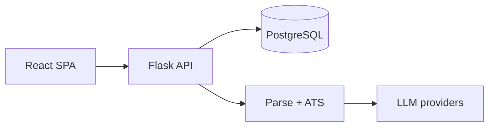
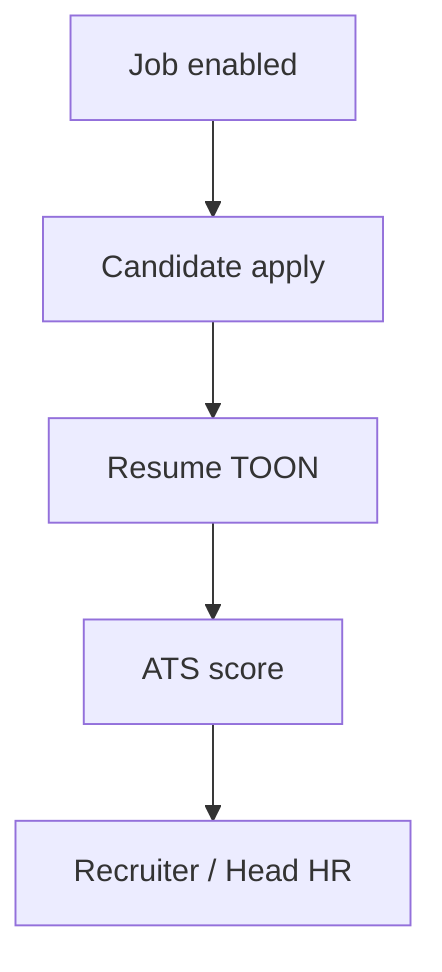

# Human Capital Intelligence Platform — Documentation

**HCIP** is an AI-native platform for understanding, acquiring, developing, and retaining talent.  
This repository’s **current product surface** is Recruitment Intelligence (jobs, apply, parsing, ATS, recruiter & Head HR portals). The documentation set below records that foundation and defines how the platform extends toward full workforce intelligence.

---

## What HCIP is

| Today | Tomorrow |
|-------|----------|
| HR Job Portal / HRMS core with AI parse & match | Human Capital Intelligence across employee lifecycle |
| Candidates, Recruiters, Head HR, CEO | + Hiring managers, interviewers, employees, AI agents |
| TOON parse artifacts + weighted ATS | Ontology, knowledge repo, interview AI, Copilot, analytics |

**Constitutional source of truth:** [01-Product-Constitution.md](01-Product-Constitution.md)

---

## Where to start

| If you are… | Read this first |
|-------------|-----------------|
| New to the product | [01-Product-Constitution.md](01-Product-Constitution.md) |
| Engineer joining the repo | [DEVELOPMENT.md](DEVELOPMENT.md) → [03-System-Architecture.md](03-System-Architecture.md) → [04-Workflow.md](04-Workflow.md) |
| Working on apply / parse / match | [04-Workflow.md](04-Workflow.md) · [06-AI.md](06-AI.md) |
| Designing future AI | [01-Product-Constitution.md](01-Product-Constitution.md) · [06-AI.md](06-AI.md) · [05-Ontology.md](05-Ontology.md) |
| Media files & backups | [MEDIA_AND_BACKUPS.md](MEDIA_AND_BACKUPS.md) |
| Security / compliance | [09-Security.md](09-Security.md) |
| Planning releases | [10-Roadmap.md](10-Roadmap.md) |
| Document intelligence notes | [document_intelligence/](document_intelligence/) |

Local runbook: root [README.md](../README.md) · [DEVELOPMENT.md](DEVELOPMENT.md)

---

## Documentation structure (required set)

```text
docs/
  README.md                     ← you are here
  01-Product-Constitution.md
  02-Domain-Model.md
  03-System-Architecture.md
  04-Workflow.md
  05-Ontology.md
  06-AI.md
  07-API.md
  08-Database.md
  09-Security.md
  10-Roadmap.md
  DEVELOPMENT.md                ← local setup
  MEDIA_AND_BACKUPS.md          ← durable media + backup commands
  document_intelligence/        ← parsing / DI notes
  legacy/                       ← archived narrative (optional reading)
```

---

## Architecture (snapshot)



Detail: [03-System-Architecture.md](03-System-Architecture.md)

---

## Workflows (snapshot)



Detail: [04-Workflow.md](04-Workflow.md)

---

## Document conventions

1. **One file per topic area** — use the Contents list at the top of each file.  
2. **Current vs Future** — always labeled when aspirational.  
3. **Mermaid** — flowcharts, sequence, and ER diagrams.  
4. **Runtime wins** — APIs/tables marked Current must match `create_app.py` / `schema_pg/`.  
5. **Amend the constitution deliberately** — see [01-Product-Constitution.md](01-Product-Constitution.md).

---

## Documentation index

| # | Document | Covers |
|---|----------|--------|
| 01 | [Product Constitution](01-Product-Constitution.md) | Vision, mission, principles, AI philosophy, design, NFRs |
| 02 | [Domain Model](02-Domain-Model.md) | Actors, organization, recruitment, employee, intelligence, ER |
| 03 | [System Architecture](03-System-Architecture.md) | Overall, backend, frontend, database, AI, deployment |
| 04 | [Workflows](04-Workflow.md) | Platform, candidate, recruiter, employee, admin, resume, JD, matching |
| 05 | [Ontology](05-Ontology.md) | Human capital ontology, knowledge repository, taxonomy |
| 06 | [AI](06-AI.md) | Resume/JD parsers, matching, interview AI, copilot, evaluation |
| 07 | [API](07-API.md) | Overview, public API, staff API |
| 08 | [Database](08-Database.md) | Current schema, relationships, scaling |
| 09 | [Security](09-Security.md) | Authentication, authorization, compliance |
| 10 | [Roadmap](10-Roadmap.md) | Phases 1–10 |
| — | [DEVELOPMENT.md](DEVELOPMENT.md) | Local setup |
| — | [MEDIA_AND_BACKUPS.md](MEDIA_AND_BACKUPS.md) | Durable media + backup commands |

### Source-of-truth order

1. **Product / process:** [01-Product-Constitution.md](01-Product-Constitution.md)  
2. **Current system behavior:** `02`–`09` (especially [04-Workflow.md](04-Workflow.md), [07-API.md](07-API.md), [08-Database.md](08-Database.md))  
3. **Runtime:** `apps/backend/app/bootstrap/create_app.py`, domain routes, `apps/backend/schema_pg/`  
4. **Legacy archive (optional):** [legacy/](legacy/README.md)

### Legacy archive

| Document | Path |
|----------|------|
| Old architecture mega-doc | [legacy/ARCHITECTURE.md](legacy/ARCHITECTURE.md) |
| Old engineering narrative | [legacy/ENGINEERING.md](legacy/ENGINEERING.md) |
| Sprint / migration history | [legacy/HISTORY.md](legacy/HISTORY.md) |

---

## Keeping docs up to date (automatic + required)

HCIP docs stay current through **two layers**:

### 1. Cursor agent rule (always on)

`.cursor/rules/documentation-sync.mdc` tells the AI: when you change product/code, update the matching `docs/01`–`10` file in the same change.  
`.cursor/rules/code-docs-coupling.mdc` reinforces this when editing `apps/backend` or `apps/frontend`.

### 2. Code → inventory sync script

Regenerates the **route table** and **schema file list** from the live backend:

```bash
python scripts/sync_docs_from_code.py
```

| Updates | Marker region |
|---------|----------------|
| [07-API.md](07-API.md) | `GENERATED-API-ROUTES` |
| [08-Database.md](08-Database.md) | `GENERATED-SCHEMA-FILES` |

Run this after adding/removing Flask routes or `schema_pg/*.sql` files. Narrative sections (workflows, constitution) are still updated by the agent/human using the Cursor rule — they cannot be fully invented from code alone.

---

## Document control

| Item | Value |
|------|-------|
| Platform name | Human Capital Intelligence Platform (HCIP) |
| Required docs | `README` + `01`–`10` + `DEVELOPMENT` |
| Legacy | `docs/legacy/` only |
| Doc sync script | `scripts/sync_docs_from_code.py` |
| Cursor rules | `.cursor/rules/documentation-sync.mdc` |
