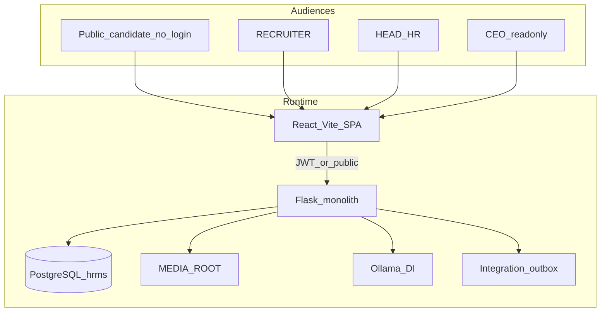
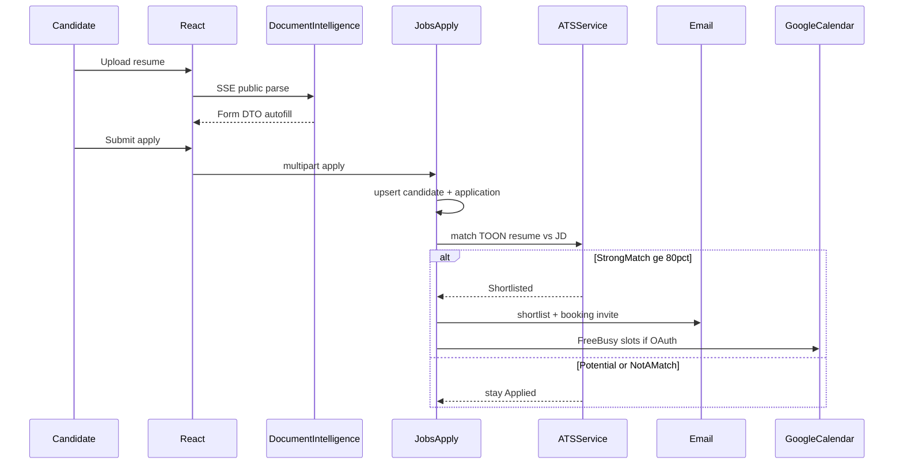
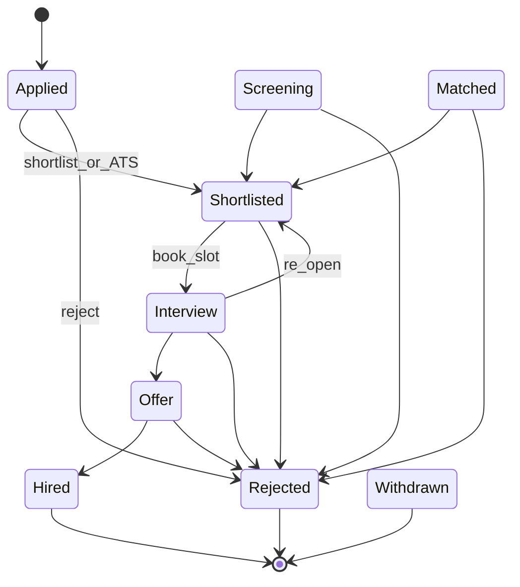
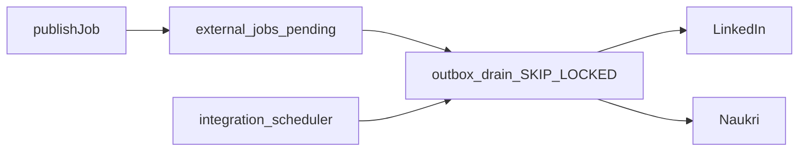

# HCIP Workflows & Logic

In-depth map of every major workflow and the business rules that drive it.

**Verdict:** Despite the product name, HCIP is a **multi-tenant recruitment / ATS platform** (public apply → AI parse → ATS score → shortlist → calendar interview → optional job-board publish). There is **no leave, attendance, payroll, or general HRMS workflow**—those labels appear only on internal feedback forms.

Prefer live code when this doc disagrees:

- Backend registration: [`apps/backend/app/bootstrap/create_app.py`](../apps/backend/app/bootstrap/create_app.py)
- Frontend routes: [`apps/frontend/src/routes/index.jsx`](../apps/frontend/src/routes/index.jsx)
- Step-by-step user journeys: [GUIDE.md](GUIDE.md#user-flows) (24 flows)
- AI / Document Intelligence detail: [AI.md](AI.md) · [DOCUMENT_INTELLIGENCE.md](DOCUMENT_INTELLIGENCE.md)

---

## 1. System shape



| Layer | Path | Role |
|-------|------|------|
| Frontend | `apps/frontend/` | Role-guarded SPA; Form DTO only from parse APIs |
| Backend | `apps/backend/` | 17 blueprints under `/api`; domain services |
| Desktop | `apps/desktop/` | Electron folder picker for bulk upload only |
| AI platform | `ai/` | Training/eval/runtime — **parallel** to production DI |
| Workers | Outbox + bulk parser threads | **No Celery** |

**Tenancy:** JWT carries `organization_id`. Jobs/staff are org-scoped. Candidates are email-identity (`candidates` + profiles); org linkage is via applications → jobs.

**Roles** ([`rbac.py`](../apps/backend/app/domains/identity/authorization/rbac.py) / [`rbac.js`](../apps/frontend/src/core/permissions/rbac.js)):

| Role | Access |
|------|--------|
| `RECRUITER` | Day-to-day jobs, applications, bulk parse |
| `HEAD_HR` | Org admin, HR user CRUD, integrations write, analytics |
| `CEO` | Same read views as Head HR; writes blocked (`is_read_only`) |

---

## 2. End-to-end hiring funnel (core product)



### 2.1 Public apply

- **UI:** `features/jobs/components/ApplyJobModal.jsx` + `shared/components/ResumeUploadWithParsing.jsx` (`publicMode`)
- **Parse:** `POST /api/parse/resume/public/stream` → `app/ai/document_intelligence/pipeline.py`
- **Submit:** `POST /api/jobs/:jobId/apply` in `domains/recruitment/api/jobs.py`
- **Logic:** Require enabled job + linked `parsed_resume`; upsert passwordless candidate (freeze shared profile if exists); load JD TOON; call ATS with `skip_narrative=True` (no Ollama wait on submit); atomic `applications` + `matches`; if auto-shortlisted, background thread for email + interview invite.

### 2.2 Document Intelligence (production)

```
raw_files (hash cache) → text extract → sections → deterministic parsers
  → coverage recovery → residual Ollama enrich → knowledge normalize
  → Form DTO (API) + TOON (DB/ATS)
```

- Contract: **React never sees TOON**; ATS consumes TOON.
- Inflight join (`parse_inflight`) shares work across Gunicorn workers when Redis is available.
- Separate from `ai/` capability packs (chat, interview-gen, ranking) which are **not** the live HRMS path.

### 2.3 ATS scoring

Source: `domains/recruitment/services/ats_service.py`

| Bucket | Weight |
|--------|--------|
| Mandatory skills | 40% |
| Preferred skills | 20% |
| Experience | 25% |
| Education/certs | 10% |
| Location | 5% |

**Decision rules (live code):**

- Mandatory skills match **&lt; 40%** → Not a Match → status stays **`Applied`** (talent pool; **not** auto-Rejected)
- Overall **≥ 80%** + mandatory gate passed → Strong Match → auto-**`Shortlisted`**
- Overall **40–79%** + gate passed → Potential Match → recruiter review
- Optional external path: `ATS_API_URL` / n8n → `POST /api/applications/ats/result`

Non-shortlisted ATS outcomes stay `Applied` (talent pool). Helper: `status_after_ats()` in `app/common/application_status.py`.

### 2.4 Application status machine

Source: `app/common/application_status.py`



- **View profile** → `Screening` + PROFILE_VIEWED email (skipped if already Shortlisted/Rejected)
- **Shortlist** → email + interview invite when Calendar connected
- **Reject** → cancel open interviews; **no** reject email (talent pool)
- Terminal: `Hired`, `Withdrawn`; `Rejected` has no outbound transitions
- Transitions enforced by `can_transition()`

### 2.5 Interview scheduling (Calendar booking — Current)

- Staff: Google OAuth in Integrations (`calendar_oauth_service.py`)
- On shortlist: FreeBusy → `interviews` (Invited) + `interview_slots` + magic token → email
- Candidate: `/book/:token` → claim slot → Calendar + Meet → interview **Scheduled**, application → **Interview**
- If Calendar not connected: shortlist email still sends; scheduling skipped gracefully
- Blueprint: `/api/interviews` registered in `create_app.py`

**Not the same as AI Interview Intelligence** (question generation / AI sessions) — that capability pack under `ai/capabilities/` is Future. See [AI.md](AI.md#interview-intelligence).

---

## 3. Staff workflows by role

### Identity & session

| Flow | Logic highlights | Key files |
|------|------------------|-----------|
| Signup + OTP | Pending `hr_signup` → verify → attach org → JWT pair | `domains/identity/api/hr_auth.py` |
| Login | bcrypt, rate limit, role redirect | CEO→`/ceo`, HEAD_HR→`/head-hr`, else→`/dashboard` |
| Refresh / logout | Rotate/revoke `auth_refresh_tokens` | `tokenService.js`, `api.js` |
| Password reset | Domain-gated OTP chain | Forgot-password pages; `variant=admin` only |
| Platform provision | `X-Platform-Key` creates org + HEAD_HR | `domains/administration/api/platform.py` |

Self-signup UI is effectively **closed**; production staff come from Head HR or platform key.

### Recruiter

1. Create/edit job (+ optional JD SSE parse) → enable toggle (DB trigger syncs `jobs.status` ↔ `enabled`)
2. Optional publish to LinkedIn/Naukri via outbox
3. Review applications: match explanation UI, shortlist/reject, resume preview
4. Bulk resume parse session → Excel download

### Head HR

- Org KPIs, all candidates/jobs/applications/interviews/emails
- Recruiter admin CRUD (`hr_users:manage`)
- Integrations credentials + Calendar
- Developer performance dashboard when `DEVELOPER_MODE` / UI toggle

### CEO

- Same org pages under `/ceo/*` with `readOnly` (`PanelShell`)
- Analytics emphasized; no writes

---

## 4. Integrations & background orchestration



| Mechanism | Purpose | Entry |
|-----------|---------|-------|
| Postgres outbox | Durable job-board publish/close/retry | `integrations/service/publish_service.py`, worker module |
| Auto-sync scheduler | Periodic sync tick | `python -m app.domains.integrations.scheduler` |
| Bulk parser threads | Parallel resume→Excel | `workers/bulk_parser.py` |
| Apply side-effect thread | Post-response email/interview | `jobs.py` apply handler |
| Parse SSE executor | Stream DI stages | `domains/recruitment/api/parsing.py` |

**No BPMN / Temporal / Celery.** Optional n8n is an external ATS hook only.

Other integrations: SMTP (Flask-Mail), MEDIA_ROOT files, Ollama, Redis (rate limits / OAuth state / multi-worker parse join), Google Calendar OAuth (not staff SSO).

---

## 5. Frontend orchestration patterns

- **State:** `AppContext` + local feature state — no Redux/React Query
- **Guards:** `RecruiterGuard` / `HeadHrGuard` / `CeoGuard` (route-level); permission matrix exists but UI mostly uses role helpers + `readOnly`
- **API:** Bearer JWT, proactive refresh, logout on hard 401
- **Parse UX:** SSE progress → Form DTO autofill only (`parsingApi.js`)
- **Theme:** Central `themeConfig.js`; landing `/` dark-only

---

## 6. Peripheral workflows

| Flow | Nature |
|------|--------|
| Support contact | Ticket submit/status — not recruiting core |
| Employee feedback | Bug/Feature labels include Leave/Payroll/Attendance — **reporting only** |
| Hero video / media | Public media catalog under MEDIA_ROOT |
| Career page partner API | [external/Techberry_Careers_API.md](external/Techberry_Careers_API.md) |
| `ai/` dataset factory | Engineering lake (extract/proposals); DAG runner still planned |

---

## 7. What is not in the product

- Leave / attendance / payroll / employee onboarding HRMS
- Candidate login accounts / SSO for staff
- General-purpose approval engine (only application `can_transition`)
- Celery / BPMN workflow engine
- AI Interview Intelligence as a live product surface (calendar booking **is** live)

---

## 8. Blueprint / domain index

| Blueprint | Prefix | Domain |
|-----------|--------|--------|
| auth | `/api` | Identity — signup, login, OTP, password |
| companies | `/api/companies` | Public org list |
| platform | `/api/platform` | Tenant provisioning |
| jobs | `/api/jobs` | Jobs, apply, status, viewed |
| candidate | `/api/candidate` | Staff profile read |
| applications | `/api/applications` | ATS webhook callback |
| sessions | `/api/sessions` | Refresh-token sessions |
| parsing | `/api` | Resume/JD Document Intelligence |
| interviews | `/api/interviews` | Magic-link booking |
| admin | `/api/admin` | Bulk parse |
| head_hr | `/api/head-hr` | Org analytics + HR users |
| integrations | `/api/integrations` | Job boards + Calendar OAuth |
| support / media / feedback | `/api/support`, `/media`, `/feedback` | Peripheral |
| developer | `/api/admin/developer` | Timing (when enabled) |

---

## 9. Analysis gaps (resolved)

Items flagged during the workflows analysis and closed in-repo:

| Gap | Resolution |
|-----|------------|
| Missing `WORKFLOWS.md` (broken DI link) | This document + index in [README.md](README.md) / [GUIDE.md](GUIDE.md) |
| `AI.md` ATS thresholds (60%/75%) stale | Aligned to code: 40% mandatory gate, ≥80% Strong Match |
| Interview booking vs AI Interview Intelligence | Calendar `/api/interviews` documented as Current; AI pack as Future |
| Cache tag defaults drift | Docs + `.env.example` use `canonical-v9-exp-date-rail` (resume default) |
| `status_after_ats` → Rejected | Returns `Applied` when not shortlisted (talent pool) |

Interactive walkthrough: Cursor canvas `hcip-workflows-logic.canvas.tsx` (workspace canvases folder).

---

## Related

- [GUIDE.md](GUIDE.md) — architecture, 24 user flows, API, data model
- [AI.md](AI.md) — Document Intelligence, ATS matching, capability packs
- [DEVELOPMENT.md](DEVELOPMENT.md) — local/production process roles (web / scheduler / outbox)
- [OPERATIONS.md](OPERATIONS.md) — media + backup
