# Data Flows

**Document ID:** ARCH-08  
**Status:** Constitutional — defines canonical workflow sequences  
**Related:** [06_DATA_MODEL.md](06_DATA_MODEL.md) · [07_SYSTEM_ARCHITECTURE.md](07_SYSTEM_ARCHITECTURE.md) · [03_CAPABILITY_MAP.md](03_CAPABILITY_MAP.md)

---

## Purpose

This document defines the **canonical data flows** for all platform workflows. Each flow is documented as a sequence diagram with actors, systems, data artifacts, and state transitions. These flows are the authoritative reference for API design, error handling, and async behavior.

---

## Flow Index

| # | Flow | Status | Domain |
|---|------|--------|--------|
| 1 | [Candidate Registration](#1-candidate-registration) | Active | Administration |
| 2 | [Resume Upload & Parsing](#2-resume-upload--parsing) | Active | Recruitment |
| 3 | [Bulk Resume Parsing](#3-bulk-resume-parsing) | Active | Recruitment |
| 4 | [Job Creation](#4-job-creation) | Active | Recruitment |
| 5 | [Application Submission](#5-application-submission) | Active | Recruitment |
| 6 | [Candidate Matching (ATS)](#6-candidate-matching-ats) | Active | Recruitment |
| 7 | [Interview Generation](#7-interview-generation) | Active | Hiring |
| 8 | [Offer Management](#8-offer-management) | Planned | Hiring |
| 9 | [Hiring Confirmation](#9-hiring-confirmation) | Planned | Hiring |
| 10 | [Employee Onboarding](#10-employee-onboarding) | Planned | Employee |
| 11 | [Performance Review](#11-performance-review) | Planned | Performance |
| 12 | [Learning Enrollment](#12-learning-enrollment) | Planned | Learning |
| 13 | [AI Copilot (HR Chat)](#13-ai-copilot-hr-chat) | Active | AI |

---

## 1. Candidate Registration

**Actors:** Candidate, Frontend, Backend, Email (SMTP)  
**Preconditions:** None  
**Postconditions:** Candidate Account in Active state with valid JWT

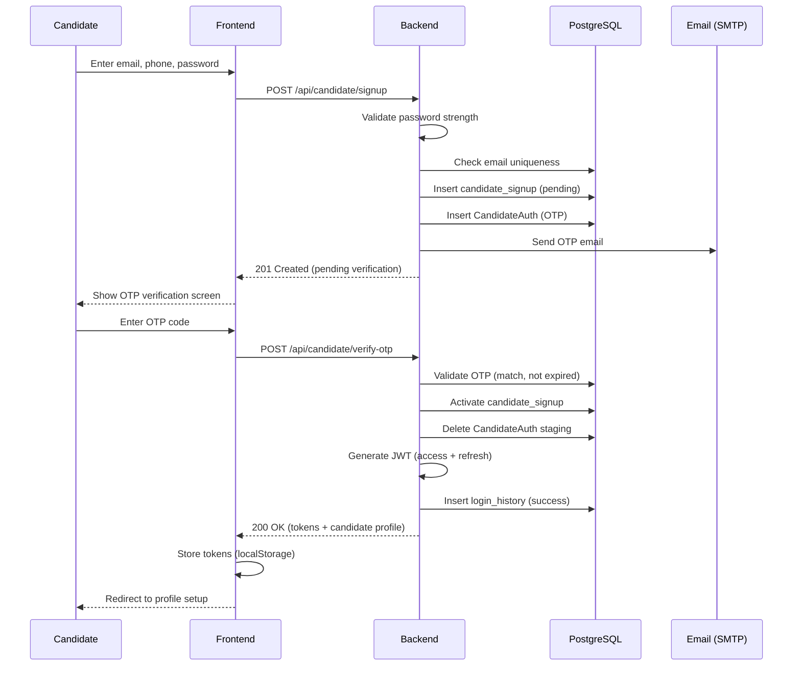

**Error paths:**
- Duplicate email → 409 Conflict
- Invalid OTP → 400 Bad Request (3 attempts before lockout)
- Expired OTP → 400 with resend option
- Weak password → 400 with requirements

---

## 2. Resume Upload & Parsing

**Actors:** Candidate, Frontend, Backend, LLM Provider  
**Preconditions:** Authenticated candidate  
**Postconditions:** Parsed Resume (TOON) stored; profile updated  
**Capability:** `resume_parsing`

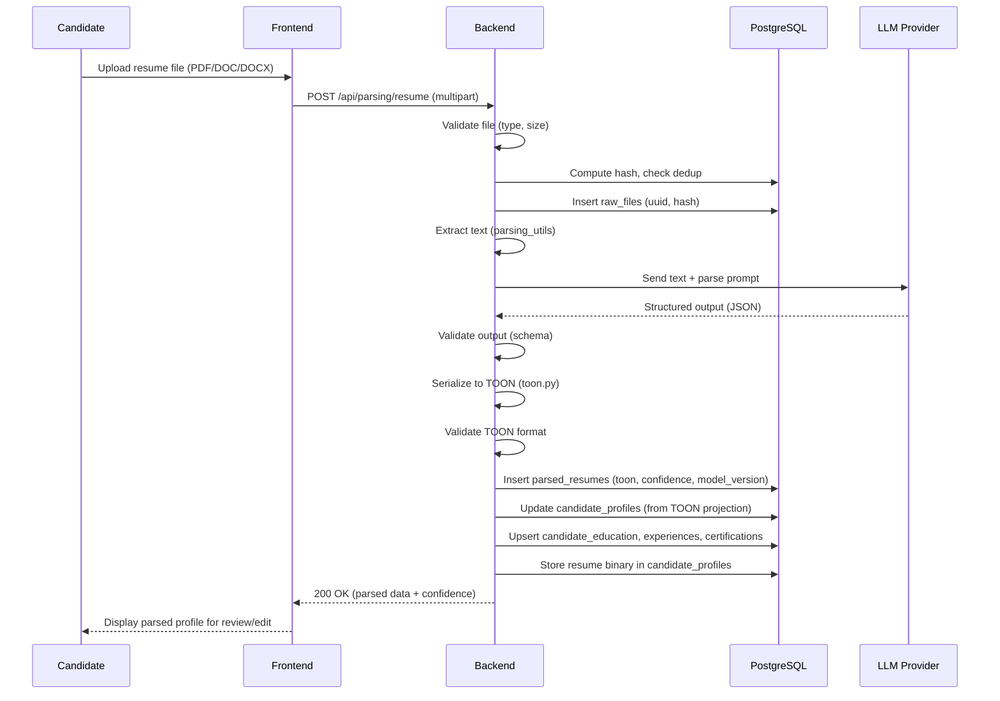

**Error paths:**
- Invalid file type → 400 Bad Request
- Text extraction failure → 422 with message
- LLM failure → Retry with fallback provider; if all fail → 503
- TOON validation failure → Retry; if persistent → 422 with partial data
- Duplicate file (same hash) → Reference existing parse

---

## 3. Bulk Resume Parsing

**Actors:** HR Admin, Frontend, Electron (optional), Backend, Bulk Parser  
**Preconditions:** Authenticated HR with admin access  
**Postconditions:** Batch results available for Excel download  
**Capability:** `bulk_resume_parsing`

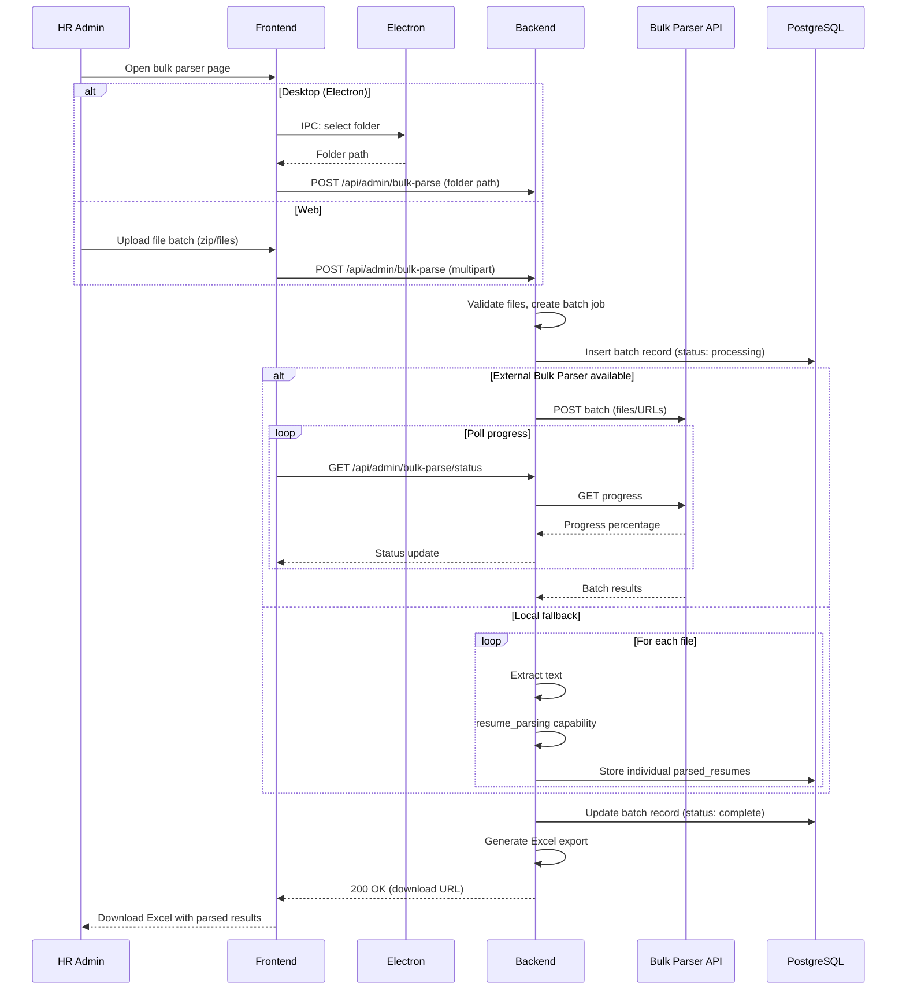

**Error paths:**
- Individual file failure → Logged; batch continues; failure noted in export
- Batch timeout → Status: partial; completed files available
- External API unavailable → Automatic fallback to local processing

---

## 4. Job Creation

**Actors:** HR, Frontend, Backend, LLM Provider (optional)  
**Preconditions:** Authenticated HR  
**Postconditions:** Job created; optional Parsed JD stored  
**Capability:** `jd_parsing` (if JD document uploaded)

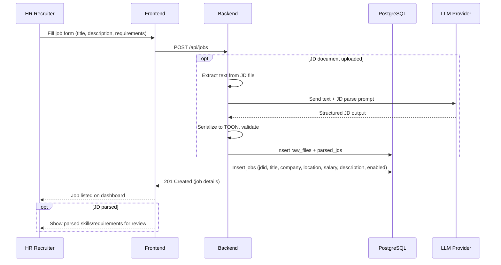

**State after creation:** Job → Active (enabled=true), visible to candidates.

---

## 5. Application Submission

**Actors:** Candidate, Frontend, Backend  
**Preconditions:** Authenticated candidate with completed profile and parsed resume  
**Postconditions:** Application created; ATS triggered asynchronously  
**Capability:** `candidate_matching` (triggered async)

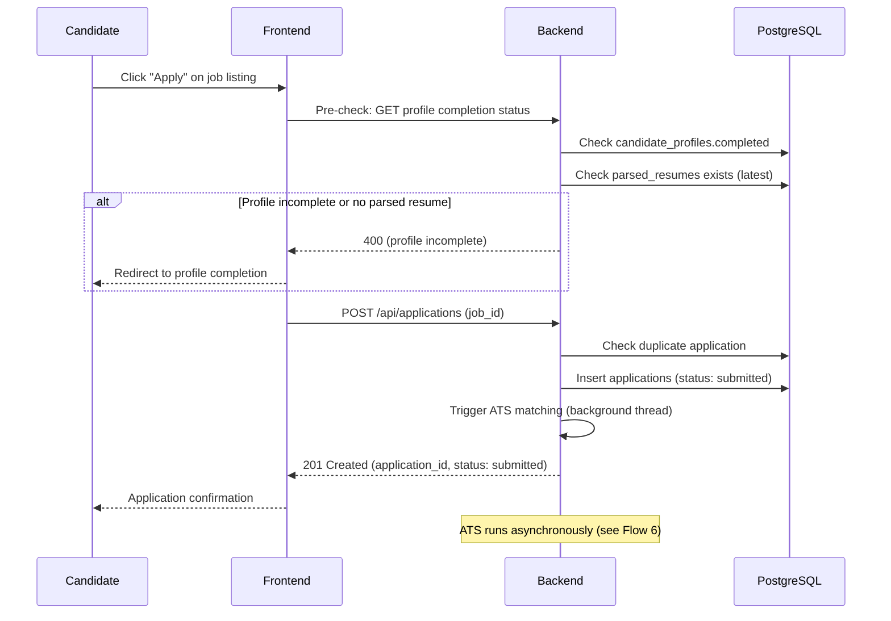

**Business rules:**
- One application per candidate per job
- Profile must be marked complete
- Latest parsed resume used at time of apply

---

## 6. Candidate Matching (ATS)

**Actors:** Backend (background), LLM/ATS Service, n8n (optional)  
**Preconditions:** Application in submitted state; parsed resume and JD exist  
**Postconditions:** Application scored with match_score, shortlist tier, and reasoning  
**Capability:** `candidate_matching`

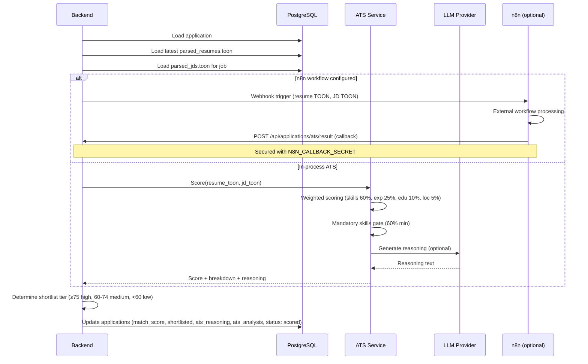

**Scoring weights:**
- Skills: 60% (mandatory 40%, preferred 20%)
- Experience: 25%
- Education: 10%
- Location: 5%

---

## 7. Interview Generation

**Actors:** HR, Frontend, Backend, LLM Provider  
**Preconditions:** Application with parsed resume and JD  
**Postconditions:** Interview questions generated (transient or stored)  
**Capability:** `interview_generation`

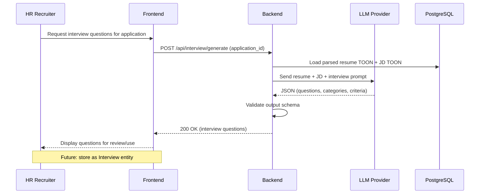

---

## 8. Offer Management

**Status:** Planned  
**Domain:** Hiring  
**Capability:** `offer_intelligence` (future)

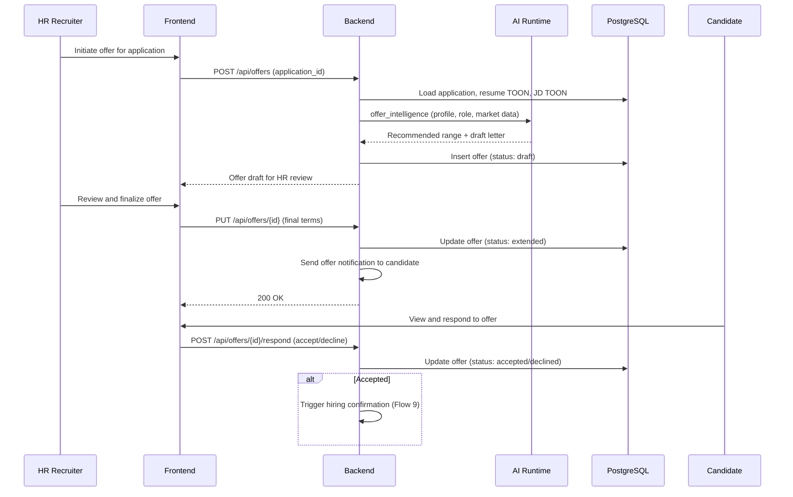

---

## 9. Hiring Confirmation

**Status:** Planned  
**Domain:** Hiring → Employee  
**Trigger:** Offer accepted

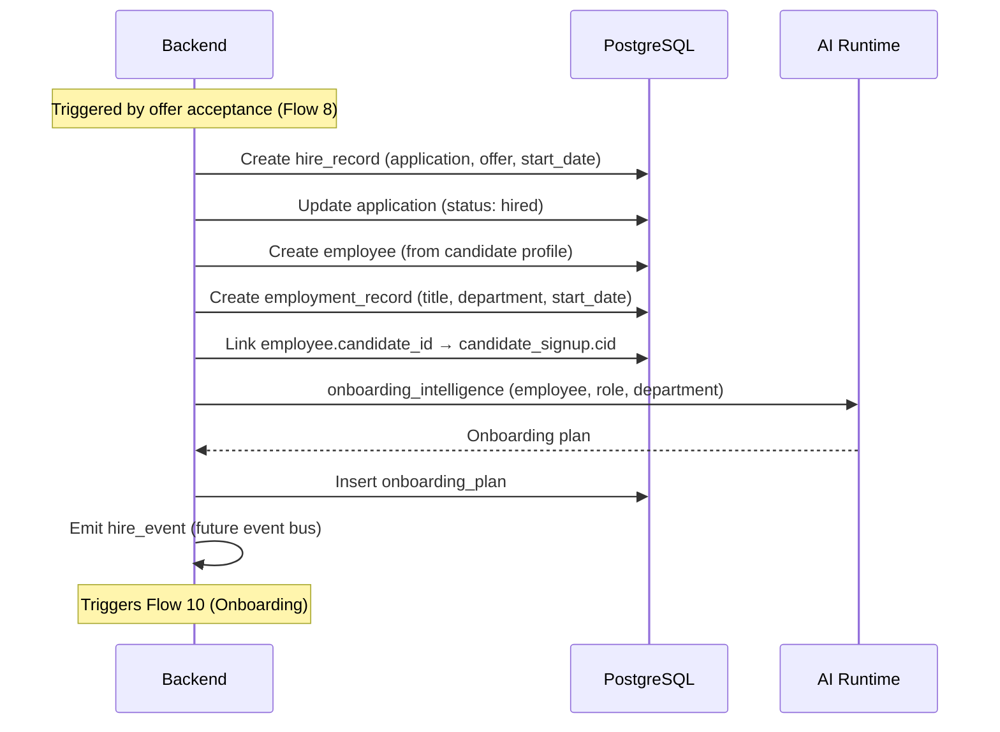

---

## 10. Employee Onboarding

**Status:** Planned  
**Domain:** Employee  
**Capability:** `onboarding_intelligence`

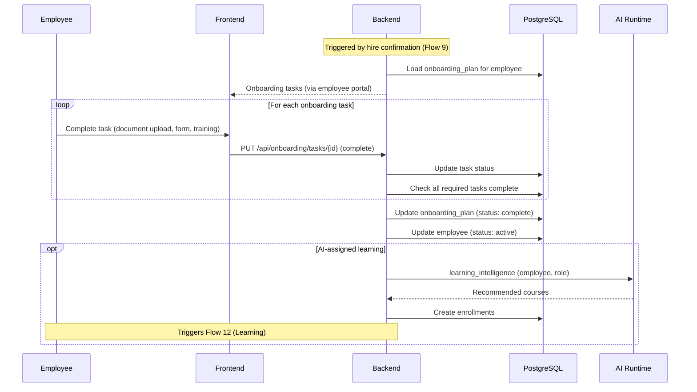

---

## 11. Performance Review

**Status:** Planned  
**Domain:** Performance  
**Capability:** `performance_intelligence`

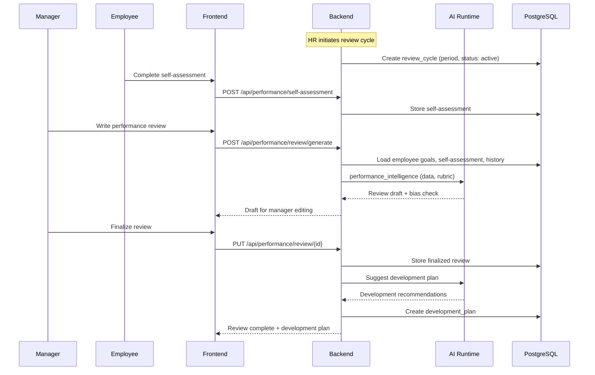

---

## 12. Learning Enrollment

**Status:** Planned  
**Domain:** Learning  
**Capability:** `learning_intelligence`

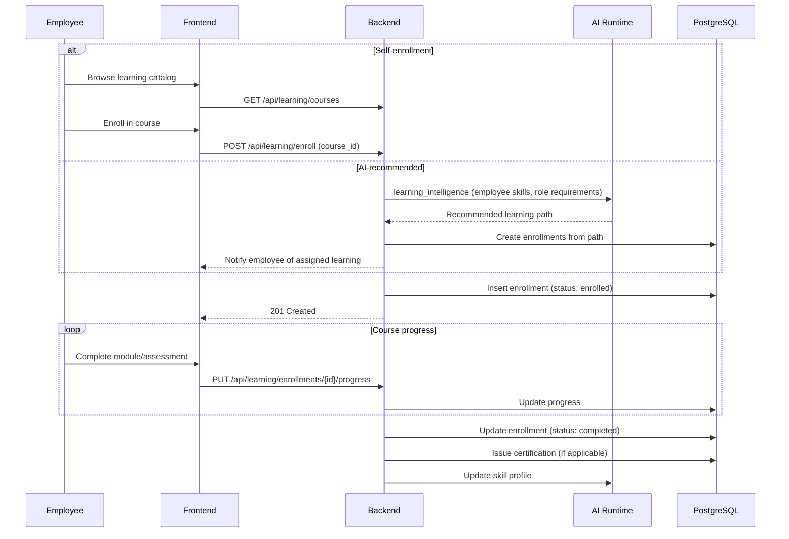

---

## 13. AI Copilot (HR Chat)

**Actors:** HR, Frontend, Backend, LLM Provider  
**Preconditions:** Authenticated HR  
**Postconditions:** Conversational response (transient)  
**Capability:** `hr_chat`

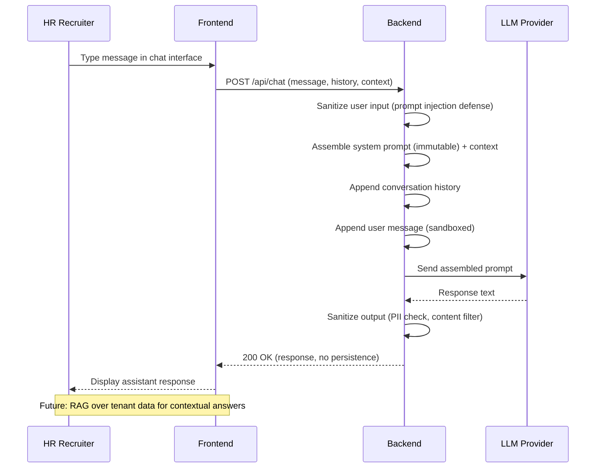

**Security controls:**
- System prompt immutable at runtime
- User content sandboxed in template
- Output sanitized before display
- No conversation persistence (future: opt-in with audit)

---

## Cross-Flow Dependencies

```
Registration (1) ──► Profile + Resume Parse (2) ──► Application (5) ──► ATS (6)
                                                                          │
Job Creation (4) ─────────────────────────────────────────────────────────┘
                                                                          │
                                    Interview Gen (7) ◄───────────────────┘
                                          │
                                    Offer (8) ──► Hire (9) ──► Onboard (10)
                                                                    │
                                              Performance (11) ◄────┤
                                              Learning (12) ◄───────┘

Bulk Parse (3) ── independent (admin workflow)
HR Chat (13) ── independent (conversational)
```

---

## Cross-References

| Topic | Document |
|-------|----------|
| Entity lifecycle states | [06_DATA_MODEL.md](06_DATA_MODEL.md) |
| System components | [07_SYSTEM_ARCHITECTURE.md](07_SYSTEM_ARCHITECTURE.md) |
| AI capabilities | [03_CAPABILITY_MAP.md](03_CAPABILITY_MAP.md) |
| Security controls | [09_SECURITY_MODEL.md](09_SECURITY_MODEL.md) |
| API catalog | `docs/TECHNICAL_DOCUMENTATION.md` |
