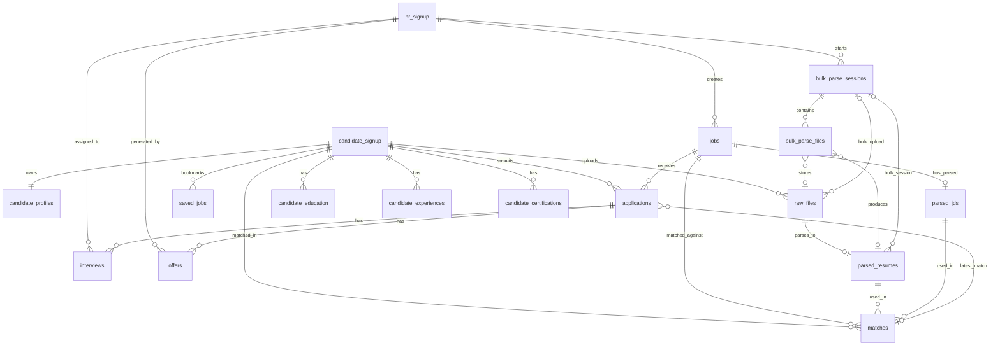

# Database Freeze Report — Sprint 1.2

**Document ID:** ARCH-12  
**Status:** FROZEN — core platform foundation for all future AI modules  
**Date:** 2026-06-29  
**Related:** [06_DATA_MODEL.md](06_DATA_MODEL.md) · [02_DOMAIN_MODEL.md](02_DOMAIN_MODEL.md) · `backend/schema_pg/04_domain_freeze.sql`

---

## Executive summary

Sprint 1.2 finalizes the PostgreSQL core domain model before AI module development. The schema now provides:

- Central RBAC via `hr_signup.role` (CEO, HEAD_HR, RECRUITER)
- Standard status enums on jobs, applications, bulk sessions, interviews, offers
- Ownership columns (`created_by`, `assigned_to`, `generated_by`)
- Audit timestamps on all core business tables
- Persistent bulk parsing sessions
- Normalized `matches` table decoupled from applications
- Scaffold tables for Interview AI and Offer AI

**No authentication, API, or frontend redesign was performed.** Legacy columns remain for backward compatibility.

---

## 1. Final ER diagram



---

## 2. Final entity list (24 tables)

| # | Table | Domain | Purpose |
|---|-------|--------|---------|
| 1 | `hr_signup` | Administration | HR staff accounts with central `role` |
| 2 | `candidate_signup` | Administration | Candidate accounts |
| 3 | `candidate_profiles` | Recruitment | Extended profile + resume blob |
| 4 | `candidate_education` | Recruitment | Education projection from TOON |
| 5 | `candidate_experiences` | Recruitment | Experience projection from TOON |
| 6 | `candidate_certifications` | Recruitment | Certification projection |
| 7 | `jobs` | Recruitment | Job postings with `status` enum |
| 8 | `applications` | Recruitment | Candidate–job pipeline |
| 9 | `matches` | Recruitment | Versioned match/ATS records |
| 10 | `saved_jobs` | Recruitment | Candidate bookmarks |
| 11 | `raw_files` | Intelligence | Uploaded documents |
| 12 | `parsed_resumes` | Intelligence | AI-parsed resume TOON |
| 13 | `parsed_jds` | Intelligence | AI-parsed JD TOON |
| 14 | `bulk_parse_sessions` | Intelligence | Persistent bulk parse jobs |
| 15 | `bulk_parse_files` | Intelligence | Per-file bulk parse tracking |
| 16 | `interviews` | Hiring | Interview scaffold |
| 17 | `offers` | Hiring | Offer scaffold |
| 18 | `hr_login` | Administration | HR login audit |
| 19 | `candidate_login` | Administration | Candidate login audit |
| 20 | `login_history` | Administration | Auth attempt audit |
| 21 | `"HRAuth"` | Administration | OTP staging (HR signup) |
| 22 | `"CandidateAuth"` | Administration | OTP staging (candidate signup) |
| 23 | `support_requests` | Administration | Help desk tickets |
| 24 | `employee_feedback` | Administration | Internal HRMS feedback |

---

## 3. Relationship map

| From | Relationship | To | Cardinality | FK column |
|------|-------------|-----|-------------|-----------|
| `hr_signup` | creates | `jobs` | 1:N | `jobs.created_by` / `posted_by` |
| `candidate_signup` | owns | `candidate_profiles` | 1:1 | `candidate_profiles.candidate_id` |
| `candidate_signup` | uploads | `raw_files` | 1:N | `raw_files.uploader_id` |
| `raw_files` | parses to | `parsed_resumes` | 1:1 | `parsed_resumes.raw_file_id` |
| `raw_files` | parses to | `parsed_jds` | 1:1 | `parsed_jds.raw_file_id` |
| `jobs` | has parsed | `parsed_jds` | 0:1 | `jobs.parsed_jd_id` |
| `candidate_signup` + `jobs` | match | `matches` | N:M | `matches.candidate_id`, `matches.job_id` |
| `candidate_signup` + `jobs` | apply via | `applications` | N:M | `applications.candidate_id`, `applications.job_id` |
| `applications` | latest match | `matches` | N:1 | `applications.latest_match_id` |
| `applications` | has | `interviews` | 1:N | `interviews.application_id` |
| `applications` | has | `offers` | 1:N | `offers.application_id` |
| `hr_signup` | starts | `bulk_parse_sessions` | 1:N | `bulk_parse_sessions.created_by` |
| `bulk_parse_sessions` | contains | `bulk_parse_files` | 1:N | `bulk_parse_files.session_id` |
| `candidate_signup` | bookmarks | `saved_jobs` | N:M | `saved_jobs.candidate_id`, `saved_jobs.job_id` |

---

## 4. Ownership map

| Entity | Owner | Owner column | FK target |
|--------|-------|-------------|-----------|
| Job | Recruiter | `created_by` | `hr_signup(hrid)` |
| Candidate Profile | Candidate | `candidate_id` (PK) | `candidate_signup(cid)` |
| Resume (raw) | Candidate or Recruiter | `uploader_id` | `candidate_signup` or `hr_signup` |
| Application | Candidate | `candidate_id`, `created_by` | `candidate_signup(cid)` |
| Match | Candidate + Job | `candidate_id`, `job_id` | `candidate_signup`, `jobs` |
| Bulk Session | Recruiter | `created_by` | `hr_signup(hrid)` |
| Interview | Recruiter (assigned) | `assigned_to` | `hr_signup(hrid)` |
| Offer | Recruiter | `generated_by` | `hr_signup(hrid)` |

---

## 5. RBAC migration plan

### Canonical roles (database)

| DB `hr_signup.role` | JWT `role` (API) | Permissions |
|---------------------|------------------|-------------|
| `CEO` | `ceo` | Read-only analytics |
| `HEAD_HR` | `head_hr` | Full org access |
| `RECRUITER` | `HR` (alias) | Own jobs/applications |
| *(candidate_signup)* | `candidate` | Own profile/applications |

### Four-phase migration

| Phase | Sprint | Action |
|-------|--------|--------|
| **1** | 1.2 (this sprint) | Add `role` column; sync trigger `trg_hr_signup_role_sync`; backfill from flags |
| **2** | 1.2 | App reads `role` via `resolve_hr_role()` with flag fallback |
| **3** | Future | Stop writing legacy flags; derive API flags from `role` only |
| **4** | Future | Drop `is_ceo`, `is_head_hr`, `is_super_admin` columns |

---

## 6. Tables modified (16 existing)

| Table | Modifications |
|-------|---------------|
| `hr_signup` | `role`, `updated_at`, `updated_by`, role sync trigger |
| `candidate_signup` | `updated_at` |
| `candidate_profiles` | `created_at`, `created_by` |
| `jobs` | `status`, `created_by`, `updated_at`, `updated_by`, `parsed_jd_id`, status↔enabled trigger |
| `applications` | `latest_match_id`, `created_at`, `updated_at`, `updated_by`, `created_by`, status CHECK |
| `raw_files` | `updated_at`, `bulk_session_id`, extended `uploader_role` |
| `parsed_resumes` | `bulk_session_id`, `parse_status`, `updated_at`, `embedding_metadata` |
| `parsed_jds` | `parse_status`, `updated_at`, `embedding_metadata` |
| `candidate_education` | `id` SERIAL PK |
| `candidate_certifications` | `id` SERIAL PK |
| `candidate_experiences` | `id` SERIAL PK |
| `hr_login` | `id` SERIAL PK |
| `candidate_login` | `id` SERIAL PK |
| `login_history` | `user_id` |
| `support_requests` | `created_by`, `updated_by` |
| `employee_feedback` | `updated_at`, `submitted_by` |

---

## 7. New tables (6)

| Table | Purpose |
|-------|---------|
| `matches` | Versioned candidate–job match records with AI lineage |
| `bulk_parse_sessions` | Persistent bulk parse job sessions |
| `bulk_parse_files` | Per-file status, retries, errors |
| `interviews` | Interview AI scaffold |
| `offers` | Offer AI scaffold |
| `saved_jobs` | Candidate job bookmarks |

---

## 8. Columns added (manifest)

### `hr_signup`
- `role VARCHAR(20) NOT NULL DEFAULT 'RECRUITER'`
- `updated_at TIMESTAMPTZ`
- `updated_by VARCHAR(20) FK hr_signup`

### `jobs`
- `status VARCHAR(20)` — Draft, Published, Paused, Closed, Archived, Expired
- `created_by VARCHAR(20) FK hr_signup`
- `updated_at`, `updated_by`
- `parsed_jd_id UUID FK parsed_jds`

### `applications`
- `latest_match_id UUID FK matches`
- `created_at`, `updated_at`, `updated_by`, `created_by`

### `parsed_resumes` / `parsed_jds`
- `parse_status`, `updated_at`, `embedding_metadata JSONB`
- `parsed_resumes.bulk_session_id`

### `matches` (full table — see `04_domain_freeze.sql`)

### `bulk_parse_sessions` / `bulk_parse_files` (full tables)

### `interviews` / `offers` / `saved_jobs` (full tables)

---

## 9. Columns deprecated (retained, do not use in new code)

| Table | Deprecated column | Replacement |
|-------|-------------------|-------------|
| `hr_signup` | `is_ceo`, `is_head_hr`, `is_super_admin` | `role` |
| `jobs` | `enabled` | `status` (synced via trigger) |
| `jobs` | `posted_by` | `created_by` |
| `applications` | `shortlisted` | `status = 'Shortlisted'` |
| `applications` | `ats_reasoning`, `ats_analysis` | `matches.rationale`, `matches.analysis_toon` |
| `applications` | `match_score`, `matching_percentage` | `matches` (via `latest_match_id`) |

---

## 10. Index recommendations (implemented)

| Table | Index | Purpose |
|-------|-------|---------|
| `hr_signup` | `(role)` | RBAC listing |
| `jobs` | `(status, posted_on DESC)` | Public job feed |
| `jobs` | `(created_by, status)` | Recruiter dashboard |
| `applications` | `(job_id, status)` | Pipeline by job |
| `applications` | `(candidate_id, status)` | Candidate applications |
| `applications` | `(latest_match_id)` | Match join |
| `matches` | `(candidate_id, job_id, is_latest)` | Latest match lookup |
| `matches` | `(job_id, match_score DESC)` | Ranking |
| `bulk_parse_sessions` | `(created_by, status, created_at DESC)` | Session history |
| `bulk_parse_files` | `(session_id, status)` | Per-file progress |
| `parsed_resumes` | `(bulk_session_id)` | Bulk audit |
| `interviews` | `(application_id)`, `(assigned_to, scheduled_at)` | Scheduling |
| `offers` | `(application_id)`, `(status, expires_at)` | Offer pipeline |
| `saved_jobs` | `(candidate_id, saved_at DESC)` | Bookmarks |

---

## 11. Migration safety plan

### Execution order (`04_domain_freeze.sql`)

1. Create `set_updated_at()` function
2. Add nullable/defaulted columns to existing tables
3. Backfill data (role, job status, application status, created_by)
4. Create new tables (`matches` first, then dependent FKs)
5. Backfill `matches` from `applications` ATS fields; set `latest_match_id`
6. Add CHECK constraints after data normalization
7. Create indexes and triggers
8. Run seed scripts (`06_seed_admin_accounts`, `03_employee_feedback`, `07_seed_ceo`)

### Idempotency

- All DDL uses `IF NOT EXISTS` / conditional `DO $$` blocks
- `db.py` ensures `role` column on startup
- Seed scripts use upsert patterns

### Rollback

Each change is additive. Rollback = drop new tables/columns (not automated; manual only).

### File ordering fix

- `03_seed_ceo_account.sql` renamed to `07_seed_ceo_account.sql`; admin seed renamed to `06_seed_admin_accounts.sql` so DDL runs before seeds.

---

## 12. Backward compatibility verification

| Check | Expected | Status |
|-------|----------|--------|
| CEO login → JWT `ceo` | `resolve_hr_role()` reads `role='CEO'` | Verified |
| HEAD_HR login → JWT `head_hr` | `role='HEAD_HR'` or legacy flags | Verified |
| Recruiter login → JWT `HR` | `role='RECRUITER'` maps to `HR` | Verified |
| Login response `isCeo`/`isHeadHr`/`isSuperAdmin` | Derived from JWT role | Unchanged |
| Jobs with `enabled=true` visible | `status='Published'` via trigger | Verified |
| Application statuses in UI | Legacy lowercase mapped to Title Case | Verified (DB) |
| Single resume parse | `raw_files` / `parsed_resumes` unchanged | Unchanged |
| Bulk parse | In-memory + DB persistence | Implemented |
| Seed scripts idempotent | Re-run safe | Verified |

### Validation queries (appendix)

```sql
-- Role distribution
SELECT role, COUNT(*) FROM hr_signup GROUP BY role;

-- Application status compliance
SELECT status, COUNT(*) FROM applications
WHERE status NOT IN ('Applied','Screening','Matched','Shortlisted','Interview','Rejected','Offer','Hired','Withdrawn')
GROUP BY status;

-- Matches backfill
SELECT COUNT(*) AS apps_with_match FROM applications WHERE latest_match_id IS NOT NULL;

-- Job status vs enabled
SELECT status, enabled, COUNT(*) FROM jobs GROUP BY status, enabled;
```

---

## 13. Future AI compatibility assessment

| AI Module | Schema readiness | Notes |
|-----------|-----------------|-------|
| **Resume Intelligence** | Ready | `parse_status`, `embedding_metadata`, `model_version` on `parsed_resumes` |
| **JD Intelligence** | Ready | `parsed_jds` + `jobs.parsed_jd_id` link |
| **Semantic Matching** | Ready | `matches.semantic_score`, `match_type='semantic'`, artifact FKs |
| **Bulk Resume Intelligence** | Ready | `bulk_parse_sessions/files`; `parsed_resumes.bulk_session_id` |
| **Interview Intelligence** | Scaffold ready | `interviews.feedback_toon`, status enum, `assigned_to` |
| **Offer Intelligence** | Scaffold ready | `offers.compensation_json`, `letter_toon`, status enum |
| **Employee Onboarding** | Partial | `employee_feedback` extended; `employees` table future sprint |
| **Performance Review AI** | Partial | `employee_feedback`; `performance_reviews` table future sprint |
| **Analytics** | Ready | Indexed `status`, `role`, `created_at`; CEO read-only RBAC unchanged |

### Optional future extension (not in Sprint 1.2)

- `pgvector` embedding columns on `parsed_resumes` / `parsed_jds`
- `inference_records` table for full AI lineage
- `audit_log` table for mutation history
- `employees` table post-hire transition

---

## Cross-references

| Resource | Path |
|----------|------|
| DDL migration | `backend/schema_pg/04_domain_freeze.sql` |
| RBAC resolution | `backend/rbac.py` → `resolve_hr_role()` |
| Bulk persistence | `backend/services/bulk_session_db.py` |
| Conceptual model | [06_DATA_MODEL.md](06_DATA_MODEL.md) |

---

**This schema is FROZEN.** Future AI modules must extend via new columns or child tables — not redesign core entities.
